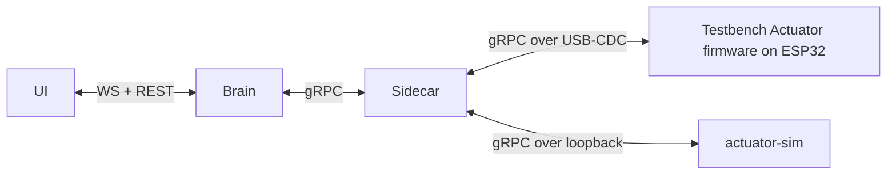
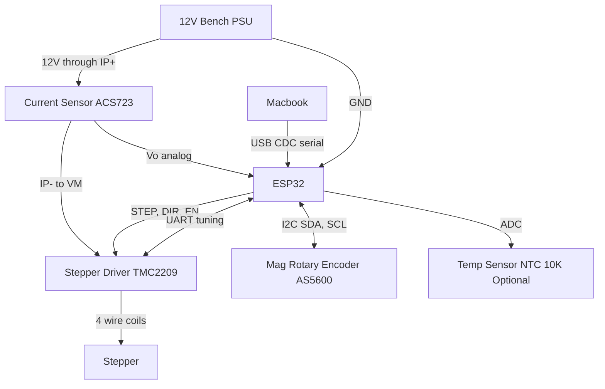
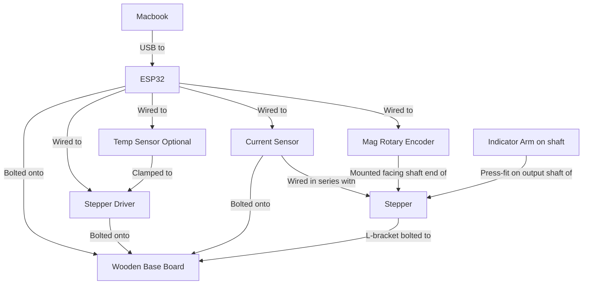

# RFD-10: The Testbench Actuator
Author: Jose Catarino

## Why this RFD

[RFD-8](RFD-8.md) calls J6 the **architecture validation journey**:
one real actuator and one simulated actuator bound into the same
machine, indistinguishable to the Brain and UI except for a `SIM`
badge. The whole sim/real abstraction from [RFD-2](RFD-2.md) and
[RFD-3](RFD-3.md) lives or dies on that journey.

This RFD pins down the **physical thing** that plays the role of
"real actuator" in J6. It is deliberately not the final Smart
Actuator product — that is firmware-and-PCB work covered elsewhere.
The Testbench Actuator is the minimum hardware rig that can:

1. Speak the same `actuator.proto` gRPC surface as `actuator-sim`,
   over a host-side serial/USB bridge.
2. Close a position loop tightly enough that J6's "real joint tracks
   target within tolerance" exit criterion is reachable.
3. Be built on a wooden base board in an afternoon with off-the-shelf
   parts, so anyone on the team can replicate it.

If the abstraction is right, swapping `actuator-sim` for this rig
should require zero changes in the Brain or the UI. That is the
test.

## Bill of materials

| Role | Part (suggested) | Why this part |
|---|---|---|
| MCU | ESP32-WROOM-32 dev board | dual-core, USB-serial onboard, cheap, has enough pins for stepper + encoder + sensors |
| Stepper motor | NEMA 17, 1.8°/step, ~0.4 Nm | small enough for a desk rig, plenty of torque for a single joint |
| Stepper driver | TMC2209 (StealthChop / UART) | quiet, current-tunable over UART, integrated diag flag for stall |
| Magnetic rotary encoder | AS5600 (I²C, 12-bit absolute) | absolute angle on the output shaft, no homing dance, no quadrature counting |
| Current sensor | SparkFun ACS723 breakout (SEN-13679, Hall-effect, analog out) | electrically isolated from the 12V rail; analog Vo read by ESP32 ADC; no I²C address conflicts |
| Temperature sensor (optional) | NTC 10K thermistor on ADC, or DS18B20 | clamp-mounted to the stepper driver heat sink |
| Host | MacBook (any dev machine) | runs the Brain + Sidecar + UI; talks to the ESP32 over USB-CDC serial |
| Mechanical | wooden base board (~30×20 cm), L-bracket for the stepper, M3 hardware, magnet glued to shaft for the AS5600 | one fixed reference plane keeps the encoder/shaft alignment honest |
| Power | 12 V / 2 A bench supply for the stepper rail; ESP32 powered from USB | separates motor noise from the MCU logic rail |

**Cost target:** under $80 for one rig, excluding the laptop and
bench supply. If a rig costs more than that, we are probably building
the wrong thing.

## Role inside the J6 system



From the Sidecar's perspective the Testbench is just another
`actuator.proto` peer. The transport differs (USB-CDC framed gRPC
vs. loopback TCP), but discovery and control are the same. That is
the property J6 is testing.

## Electrical



### Signal table

| Net | ESP32 pin (suggested) | Notes |
|---|---|---|
| STEP | GPIO 25 | high-speed timer-driven; ≥ 1 µs pulse width |
| DIR | GPIO 26 | latched before STEP edge |
| EN | GPIO 27 | active-low; default high (driver disabled) until firmware ready |
| UART TX → driver RX | GPIO 17 | configure run/hold current at boot, read DIAG |
| UART RX ← driver TX | GPIO 16 | |
| I²C SDA | GPIO 21 | AS5600 (0x36) only |
| I²C SCL | GPIO 22 | 400 kHz |
| ACS723 Vo (current sense) | GPIO 35 | input-only ADC1_CH7; analog voltage proportional to motor rail current |
| Thermistor ADC | GPIO 34 | input-only ADC1_CH6; voltage divider to 3V3 |
| Common GND | — | star ground at the PSU side to keep encoder I²C clean |

### Notes the wiring diagram is not allowed to lie about

- The ACS723 is a Hall-effect sensor, so the sensed circuit (12V motor
  rail) and the sensing circuit (ESP32 ADC) are **electrically isolated**.
  Current flows in through `IP+` and out through `IP-`; the `Vo` pin
  outputs a voltage proportional to current without any galvanic
  connection to the motor rail. This means unlike a shunt-based sensor
  the ACS723 can sit anywhere in series with the motor rail without
  aliasing concerns from the driver's PWM chopping.
- The ACS723 `VCC` sets the Vo midpoint: at 3.3V VCC, Vo at 0A is
  1.65V and sensitivity is ≈ 264 mV/A (scales linearly with VCC).
  The ESP32's ADC range is 0–3.3V, so 3.3V VCC is the natural choice.
- The AS5600 needs the diametric magnet centered on the shaft axis,
  ~1–3 mm from the IC face. Mount it on the shaft end opposite the
  load to keep the magnetic field away from the stepper coils.
- The ESP32 ground and the PSU ground must be tied together, but the
  ESP32 should be USB-powered, not from the 12 V rail. Cheap bench
  supplies inject enough noise to crash the MCU mid-run.

### Pin-to-pin wiring reference

#### Power rails

| From | To | Wire gauge | Notes |
|---|---|---|---|
| 12V PSU (+) | ACS723 `IP+` | 18–20 AWG | Motor rail current flows through the sensor |  
| ACS723 `IP-` | TMC2209 `VM` (both VM pins) | 18–20 AWG | After sensor; feeds driver motor rail; tie both VM pins together |
| 12V PSU (−) | TMC2209 `GND` | 18–20 AWG | Star ground point on PSU side |
| TMC2209 `GND` | ESP32 `GND` | 22 AWG | Single cross-domain ground tie |
| MacBook USB | ESP32 USB port | USB cable | Powers ESP32; do **not** power from 12V rail |
| ESP32 `3V3` | TMC2209 `VIO` | 22 AWG | Logic supply for driver |
| ESP32 `3V3` | AS5600 `VCC` | 22 AWG | |
| ESP32 `3V3` | ACS723 `VCC` | 22 AWG | Sets Vo midpoint to 1.65V at 0A; sensitivity ≈ 264 mV/A |
| ESP32 `GND` | AS5600 `GND` | 22 AWG | |
| ESP32 `GND` | ACS723 `GND` | 22 AWG | |

#### ESP32 → TMC2209

| ESP32 pin | Signal | TMC2209 pin | Notes |
|---|---|---|---|
| GPIO 25 | STEP | `STEP` | High-speed pulse; ≥ 1 µs pulse width |
| GPIO 26 | DIR | `DIR` | Latch before each STEP rising edge |
| GPIO 27 | EN (active-LOW) | `EN` | Add 10 kΩ pull-up from `EN` to `VIO` (3.3V) so driver starts disabled at boot |
| GPIO 17 (UART2 TX) | UART → driver | `PDN_UART` via **1 kΩ** | Resistor prevents bus fight; TX drives single-wire bus |
| GPIO 16 (UART2 RX) | UART ← driver | `PDN_UART` direct | RX reads; ties to same node after the 1 kΩ resistor |

UART single-wire topology: `GPIO17 —[1 kΩ]—┬— PDN_UART` and `GPIO16 ————————┘` (one shared node on the driver side).

Microstepping / address config:

| TMC2209 pin | Connect to | Effect |
|---|---|---|
| `MS1` | GND | UART slave address bit 0 = 0 |
| `MS2` | GND | UART slave address bit 1 = 0; slave addr = 0 |
| `SPREAD` | GND | stealthChop mode (quiet); firmware can override via UART |
| `DIAG` | GPIO 32 (optional) | Stall detection input; leave floating if unused |
| `INDEX` | leave floating | Optional pulse-per-rev output |
| `VREF` | leave floating | Current is set via UART; VREF only matters without UART current config |

#### TMC2209 → NEMA 17 stepper motor

Use a multimeter in resistance mode to identify the two coil pairs before connecting — resistance across a coil pair is 1–5 Ω, resistance across coils from different windings is ∞.

| TMC2209 pin | NEMA 17 wire | Typical color (verify per motor datasheet) |
|---|---|---|
| `1A` (Coil 1+) | Coil A, wire 1 | Black |
| `1B` (Coil 1−) | Coil A, wire 2 | Green |
| `2A` (Coil 2+) | Coil B, wire 1 | Red |
| `2B` (Coil 2−) | Coil B, wire 2 | Blue |

If the motor runs backward after the open-loop bring-up test, swap `1A` ↔ `1B` **or** `2A` ↔ `2B` (not both). The calibration service can also correct sign in firmware, but fix it in wiring first.

#### ESP32 → AS5600 (I²C address 0x36)

| ESP32 pin | Signal | AS5600 pin | Notes |
|---|---|---|---|
| GPIO 21 | I²C SDA | `SDA` | Shared bus with INA219; most breakouts have 4.7 kΩ pull-up onboard |
| GPIO 22 | I²C SCL | `SCL` | Shared bus; 400 kHz |
| 3V3 | Power | `VCC` | |
| GND | Ground | `GND` | |
| GND | Direction | `DIR` | Pull to GND → CW = increasing angle. Swap to 3V3 to invert |
| — | Not connected | `OUT` | PWM/analog output; not used in I²C mode; leave floating |

#### ESP32 → ACS723 (Hall-effect current sensor, analog output)

| ESP32 pin | Signal | ACS723 pin | Notes |
|---|---|---|---|
| GPIO 35 | ADC in ← Vo | `Vo` | Analog voltage output; ADC1_CH7, input-only pin |
| 3V3 | Sensor power | `VCC` | Sets Vo(0A) = 1.65V and sensitivity ≈ 264 mV/A |
| GND | Ground | `GND` | |
| 12V PSU (+) | Motor rail in | `IP+` | 12V motor current flows through the sensor |
| TMC2209 `VM` | Motor rail out | `IP-` | Feeds driver; current flows IP+ → IP- → VM |

#### ESP32 → NTC 10 kΩ thermistor (optional)

Mount thermistor body against the TMC2209 heatsink and secure with a cable tie or thermal epoxy.

```
3.3V ──[10 kΩ 1% fixed]──┬── GPIO 34
                          │
                     [NTC 10 kΩ]
                          │
                         GND
```

GPIO 34 is input-only ADC1_CH6 — safe with Wi-Fi, no boot-time concerns.

#### I²C bus notes

Only the AS5600 is on the I²C bus (the ACS723 is analog, not I²C). The AS5600 breakout typically has onboard 4.7 kΩ pull-ups — do not add more.

| Device | I²C address | Onboard pull-ups |
|---|---|---|
| AS5600 | 0x36 | 4.7 kΩ (most breakouts) |

#### Ground star point

All grounds converge at the 12V PSU negative terminal:

```
12V PSU (−) ──┬── TMC2209 GND (both pins)
              ├── ESP32 GND (one wire)
              ├── AS5600 GND
              └── INA219 GND
```

Do not create a ground loop by running a separate return through the USB cable shield. The single ESP32 GND → PSU (−) wire is the only cross-domain ground connection needed.

## Physical



### Mounting notes

- The stepper is the **only** part that moves. Everything else bolts
  flat to the base board so that vibration from the stepper doesn't
  loosen the encoder alignment over a session.
- The L-bracket holding the stepper is the single mechanical
  reference. If the bracket flexes, the encoder reads angle the load
  doesn't actually have. Use a thick aluminum bracket, not 3D
  printed.
- The indicator arm (a printed pointer or a piece of stiff wire)
  press-fits on the output shaft. It exists for two reasons:
  (1) a human standing next to the rig can immediately see whether
  the motor moved at all, and (2) it gives J6's "real joint tracks
  target" exit criterion a visual confirmation independent of the
  encoder.

## Firmware split

The ESP32 firmware lives in
[smart-actuator/crates/actuator-firmware](smart-actuator/crates/actuator-firmware/),
the stub crate already in the workspace. It is divided into three
layers, smallest to largest:

1. **Hardware driver layer.** Step pulse generation (RMT or LEDC
   peripheral), I²C drivers for AS5600 and INA219, UART config of
   the TMC2209. Pure embedded code; no gRPC.
2. **Control layer.** A PD loop at 1 kHz: target position → step
   rate, with current and temperature read out as state for the
   protocol layer. Limits enforced here: max current, max
   temperature, max step rate.
3. **Protocol layer.** Framed gRPC over USB-CDC, implementing exactly
   the same `actuator.proto` server surface as `actuator-sim`. This
   is the layer the Sidecar talks to.

The control loop runs on one core; the protocol layer runs on the
other. The hand-off between them is a single shared `JointTarget` /
`JointState` pair behind a critical section. No queues, no
allocations on the hot path.

## Calibration & home

Because the AS5600 is **absolute**, there is no homing dance in the
mechanical sense — power-on already gives you a real angle.
"Calibration" for this rig means two things:

1. **Zero offset.** The user puts the indicator arm at the visually
   "home" pose, then sends a `set_home` RPC. The firmware records
   the current AS5600 reading as the zero offset in flash.
2. **Encoder-to-output direction.** Sign convention has to match
   what the kinematics layer in the Brain expects. The Brain's
   calibration service ([RFD-3](RFD-3.md)) handles this by
   commanding a small positive motion and confirming the sign of
   the resulting encoder delta. If it is negative, the firmware
   flips its sign convention and persists that too.

Both of these belong in flash, not RAM. Power-cycling the rig must
not require redoing them.

## Safety

The Testbench is small enough that an out-of-control motion mostly
just makes noise. But J6 also exercises the safety hot path, so the
rig has to respect it:

- **Driver `EN` is wired to the E-stop chain.** Pulling E-stop on
  the Brain side propagates through the Sidecar to a gRPC call that
  the firmware honors by deasserting `EN` within one control tick.
- **Current limit in firmware, not just driver.** The TMC2209's
  current setting protects the silicon. The firmware also clamps
  commanded current against the value declared in the actuator's
  capability descriptor, so a buggy program cannot overdrive the
  motor via "valid" gRPC commands.
- **Temperature watchdog.** If the optional NTC is present and
  reads above the configured threshold, firmware refuses further
  motion and emits a fault on the next state frame. The Brain
  surfaces this the same way it surfaces any sim-side fault — the
  abstraction does not leak.

## Bring-up checklist

The first time a freshly-built rig is plugged in, in order:

1. **Power-on with `EN` high (driver disabled).** Confirm the ESP32
   enumerates as a USB-CDC device on the laptop.
2. **I²C sweep.** Firmware logs detected addresses; expect 0x36
   (AS5600) and 0x40 (INA219). If either is missing, stop — wiring
   is wrong.
3. **Spin-by-hand test.** Rotate the shaft by hand; AS5600 readings
   should sweep monotonically. If they jump, the magnet is off-axis.
4. **Open-loop step test.** Issue a slow constant step rate at very
   low current; confirm the encoder follows. Catches reversed coil
   pairs.
5. **Closed-loop step.** Enable the PD loop, command +1 rad, observe
   the indicator arm rotate roughly 57°. Catches sign errors and
   gross gear-ratio bugs.
6. **Sidecar handshake.** Start the Sidecar with the rig's serial
   port in its discovery config; confirm the rig appears in
   `discovered-but-unbound`.
7. **End-to-end.** Bind the rig as the `real` slot in J6's mixed
   machine and run a J5 program. Real joint tracks target; sim
   joint tracks target; no special cases anywhere.

## What this RFD does not cover

- **PCB design.** The Testbench is jumper-wire and breadboard-grade
  on purpose. A proper PCB belongs in the Smart Actuator product
  RFD, not here.
- **Multiple-joint rigs.** A two-joint Testbench is a natural next
  step for shared-world physics validation (J7), but it does not
  block J6. Out of scope.
- **The actuator gRPC surface itself.** That is
  [RFD-9](RFD-9.md)'s job.

## Open questions

1. **Driver choice: TMC2209 vs. closed-loop step driver.** A
   closed-loop driver (e.g. iHSS57) would do the position loop in
   hardware and we'd lose the encoder/PD work in firmware. Trade-off
   is cost (~4×) and obscured failure modes. Lean: TMC2209 + AS5600
   for visibility now; revisit when the rig becomes a permanent
   fixture.
2. **Transport: USB-CDC framed gRPC vs. WiFi gRPC.** USB is simpler,
   has known latency, and survives wifi being down. WiFi removes
   the cable. Lean: USB for J6; WiFi is a "nice to have" later and
   does not affect the abstraction test.
3. **Where firmware-side fault codes live.** Probably alongside the
   actuator capability descriptor in [RFD-9](RFD-9.md). Flagged
   here because the Testbench is the first thing that will actually
   emit one.