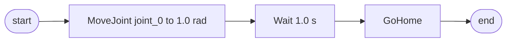
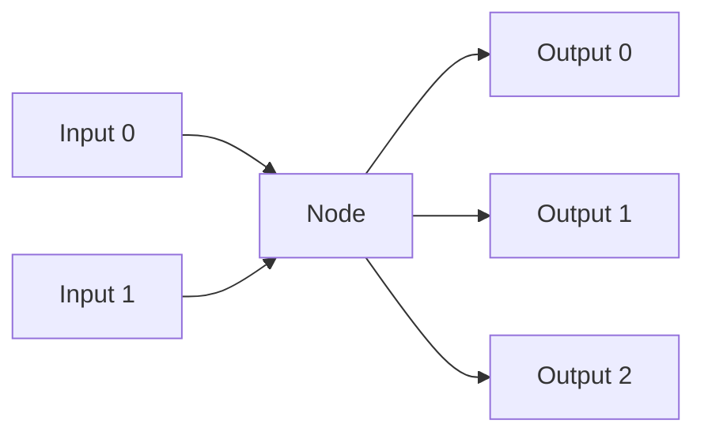
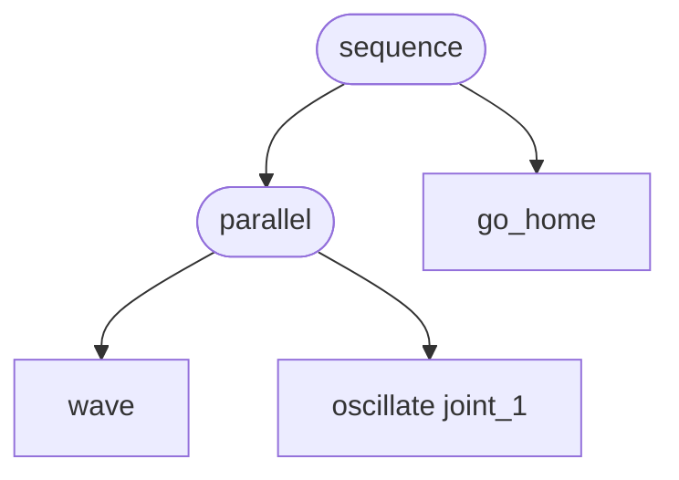

# RFD-11: The Smart Actuator AST
Author: Jose Catarino

## Why this RFD

Programs in the Smart Actuator world need to be authored by humans (in
the UI), executed by the Brain, persisted to disk, replayed for
debugging, diffed in code review, and — eventually — emitted by
external agents (LLMs, scripts, ROS bridges). A single shared
representation has to carry all of those use cases without forcing the
UI to ship Python or forcing the runtime to parse blockly XML.

An Abstract Syntax Tree (AST) is that representation. This RFD
defines the node taxonomy, the connection rules between nodes, and
the wire format. It does **not** define the runtime interpreter — that
lives in [RFD-3](RFD-3.md) under the Program Service — but it
constrains what the interpreter must accept.

The contract this RFD locks down:

1. **One canonical JSON form.** The UI block editor, the persisted
   program in SQLite, and the gRPC `SubmitProgram` payload are all
   views of the same tree.
2. **Static-checkable.** A program can be validated against a
   `machine_id` without executing it: joint names resolve, pose
   targets are reachable, types match at edges.
3. **Forward-compatible.** New node kinds can be added without
   breaking old programs; unknown kinds fail closed, not silently.

## A worked example: "Hello, joint"

The simplest non-trivial program: move joint 0 to 1 rad, wait one
second, return home.



The on-the-wire equivalent:

```json
{
  "meta": { "program_id": "p_001", "name": "hello-joint" },
  "machine_id": "two_dof_planar_arm",
  "root": {
    "kind": "sequence",
    "children": [
      { "kind": "move_joint", "attributes": { "joint": "joint_0", "target_rad": 1.0 } },
      { "kind": "wait",       "attributes": { "duration_s": 1.0 } },
      { "kind": "go_home",    "attributes": {} }
    ]
  }
}
```

Two properties to notice. First, every node is `{ kind, attributes,
children }` — uniform shape, no per-kind schema in the outer
envelope. Second, ordering is **structural**: `sequence.children` is
the only thing that says "do A then B." There are no edge arrays.

## Nodes

The Node is the building block of the AST. A node represents an
action, intent, or decision. I propose three categories to start.
The categories are a **conceptual** grouping — at the wire level every
node is just a `kind` string — but they constrain where a node may
appear in the tree (see [Composition rules](#composition-rules)).

### 1. Motion Atoms

Direct, single-step commands to the machine. Each one maps to at most
one `MoveCommand` ([brain/brain/models/motion.py](brain/brain/models/motion.py))
or one trajectory submission to the Sidecar. These are the primitives;
everything else is built on top.

| Node | Attributes | Notes |
|---|---|---|
| `move_joint`  | `joint: str`, `target_rad: float`, `speed_scale?: float` | One joint, one target. Maps to `MOVE_J`. |
| `move_pose`   | `pose: Pose`, `speed_scale?: float` | Inverse-kinematic solve to a Cartesian target. |
| `move_linear` | `pose: Pose`, `speed_scale?: float` | Straight-line Cartesian motion. Maps to `MOVE_L`. |
| `wait`        | `duration_s: float` | No motion; advances program clock. |
| `go_home`     | `speed_scale?: float` | Move to the machine's calibrated home pose. |
| `hold_pose`   | `duration_s?: float` | Servo-hold the current pose; infinite if `duration_s` omitted. |
| `stop_motion` | `mode: "soft" or "hard"` | Cancel any active trajectory. Distinct from E-stop, which bypasses the AST. |

**Why this set:** these correspond 1:1 with the motion primitives
already defined for the Sidecar contract. If a motion atom needs
something the Sidecar can't express, we change the Sidecar contract
first and the AST second — not the other way around.

### 2. Gestures

Composite, parameterized motion patterns. A gesture is a node the
UI shows as a single block, but at execution time the Program Service
**expands** it into a subtree of motion atoms before dispatch.
Gestures exist so that common patterns (sweeping, oscillating,
patrolling) don't have to be hand-assembled out of atoms every time.

| Node | Sketch of expansion | Key attributes |
|---|---|---|
| `sweep`     | A to B to A, configurable arc | `from_pose`, `to_pose`, `cycles` |
| `oscillate` | sinusoidal joint motion | `joint`, `amplitude_rad`, `frequency_hz`, `duration_s` |
| `wave`      | choreographed multi-joint greeting | `count`, `amplitude_rad` |
| `nod`       | pitch axis plus/minus | `count`, `amplitude_rad` |
| `shake`     | yaw axis plus/minus | `count`, `amplitude_rad` |
| `trace`     | follow a parametric path | `path_id` or inline `waypoints[]` |
| `patrol`    | cycle a list of poses indefinitely | `waypoints[]`, `dwell_s`, `cycles?` |
| `scan`      | raster a 2-D region with the end-effector | `region`, `step_rad` |
| `follow`    | track a moving target source | `target_topic`, `gain` |
| `mirror`    | reflect another actuator's motion | `source_actuator_id` |
| `record_and_replay` | replay a previously recorded trajectory | `recording_id` |

**Expansion happens server-side.** The UI sends `sweep`, the Brain
records `sweep` to disk, and the Program Service expands it at run
time. This means gesture semantics can be improved (better easing,
smarter IK fallback) without rewriting saved programs.

**Open question:** should gestures be persisted as opaque blocks, or
as a sequence of atoms with a "synthesized from" tag? Opaque blocks
keep programs small and let us change semantics. Expanded atoms let
the user inspect what actually ran. My lean: opaque on disk,
expanded into the run log at execution time, so both views exist.

### 3. Interactive (Triggers and Conditions)

Nodes that gate execution on the outside world — sensors, buttons,
faults, time. These are the only nodes that introduce non-determinism
into a program. Everything else is a pure function of its attributes
and the machine state at start.

| Node | Purpose | Key attributes |
|---|---|---|
| `on_button_pressed`   | trigger subtree when a UI/hardware button fires | `button_id` |
| `on_signal_threshold` | trigger when a sensor crosses a value | `sensor_id`, `op`, `value` |
| `wait_until_joint_at` | block until a joint reaches a position within tolerance | `joint`, `target_rad`, `tolerance_rad`, `timeout_s` |
| `if_fault`            | branch on actuator fault | `actuator_id?`, `then`, `else?` |
| `if_object_detected`  | branch on perception event | `class`, `region?`, `then`, `else?` |
| `while`               | loop while a condition holds | `condition`, `body`, `max_iterations?` |
| `on_program_complete` | run a subtree after main body exits (success or fault) | `body` |

Triggers raise two design questions worth flagging now:

1. **Event source binding.** A trigger references e.g. `button_id =
   "estop"`. Who owns that namespace? My lean: the Machine
   description ([RFD-2](RFD-2.md)) declares named inputs, and
   programs reference them by name. Static validation catches
   typos before run time.
2. **Timeout default.** `wait_until_joint_at` with no timeout is a
   trap. Validation rejects programs where any blocking node lacks
   either an explicit `timeout_s` or an enclosing `while` with
   `max_iterations`. Better a noisy error than a hung machine.

### Anatomy of a Node



A Node is a value with named ports:

1. A Node can have many inputs and many outputs.
2. Inputs can be optional (have a default, or be unconnected).
3. Outputs do not have to be consumed; an unconsumed output is not
   an error.
4. Outputs can be consumed by more than one downstream node (fan-out
   is allowed).

**Port types.** Each port has a static type drawn from a small set:
`trigger` (control flow), `scalar`, `pose`, `joint_state`,
`trajectory`, `boolean`. The validator rejects any edge where the
producer's output type does not match the consumer's input type.
Type information lives in the node-kind registry, not in the wire
format — the JSON only carries `kind` and attributes; types are
looked up.

**Why ports at all, if the JSON is a tree?** Because gestures and
triggers fan out: a `sweep` produces both a `trajectory` (for the
motion stack) and a `progress` scalar (for UI rendering). Modeling
that as ports keeps the data dependency explicit. In the JSON,
fan-out is represented by a `bindings` map on the parent — see
[Wire format](#wire-format).

## Flows

We do **not** support generic graphs with arbitrary `nodes[]` and
`edges[]`. Instead, we support one-way communication and explicit
parallelism. A Node **cannot** receive input from a node ahead of
it or parallel to it in the tree.

This is the most important design constraint in this RFD, so it
deserves justification.

**What we give up:** feedback loops expressed in the AST itself
(e.g., an oscillator whose output drives its own input). Cycles like
that have to be modeled as a `while` body or a dedicated control-flow
node.

**What we get:**

1. **Validation is decidable.** Topological order exists by
   construction. We can statically check that every consumed input
   has a producer and that types match, in linear time.
2. **Execution is straightforward.** A tree walker with a small set
   of node handlers is enough; no scheduler, no fixed-point
   iteration, no cycle-breaking heuristics.
3. **Determinism is easy to reason about.** Two runs of the same
   program against the same machine state produce the same
   trajectory, modulo explicit Interactive nodes.
4. **The UI stays sane.** Block editors handle trees well and graphs
   poorly. Forcing tree shape now avoids an editor rewrite later.

### Composition rules

These are the rules the validator enforces:

1. **Root must be a `sequence`, `loop`, or single atom.** A bare
   trigger at root is rejected — triggers gate subtrees, they are
   not subtrees themselves.
2. **Triggers may only appear as direct children of control-flow
   nodes** (`sequence`, `parallel`, `loop`, `conditional`). You
   cannot pass a trigger as the `target_pose` of a `move_pose`.
3. **Parallelism is explicit.** A `parallel` node runs all children
   concurrently and joins when all children have completed (or any
   child has faulted). There is no implicit concurrency.
4. **No back-edges.** A child cannot reference an ancestor's output
   except via shared machine state (which is read at the point of
   evaluation, not wired through the tree).
5. **Unknown `kind` fails closed.** Loading a program that references
   a `kind` the runtime does not know is an error at load time, not
   a silent no-op at run time. This is what makes forward compat
   safe: old runtimes refuse new programs explicitly.

### Parallelism, briefly



`parallel` is the only way to express "do these at the same time."
Two motion atoms inside `parallel` that target the same joint is a
**validation error**: there is exactly one writer per joint at a time.
Two motion atoms that target disjoint joint sets are fine. Two
non-motion nodes (a wait and a sensor read) inside `parallel` are
always fine.

## Wire format

The persisted shape is the existing `Program` model in
[brain/brain/models/program.py](brain/brain/models/program.py),
generalized:

```json
{
  "meta": {
    "program_id": "string",
    "name": "string",
    "description": "string"
  },
  "machine_id": "string",
  "root": {
    "kind": "sequence|parallel|loop|move_joint|wait|...",
    "attributes": { },
    "children": [ ],
    "bindings": { }
  }
}
```

`bindings` is the escape hatch for the fan-out case described above.
It is absent on the common path (pure control-flow / motion-atom
trees), and the validator only consults it when a node-kind declares
non-trivial input ports.

**Migration from today's model.** The current `NodeKind` enum carries
`SEQUENCE | CONDITIONAL | LOOP | MOVE | WAIT | SENSOR_READ |
MODE_TRANSITION | SUB_PROGRAM`. Mapping:

- `MOVE` splits into `move_joint`, `move_pose`, `move_linear`,
  `go_home`, `hold_pose`. The old generic `MOVE` is deprecated;
  loaders translate it for one release, then reject it.
- `SENSOR_READ` becomes the trigger family (`on_signal_threshold`,
  `wait_until_joint_at`, etc.).
- `MODE_TRANSITION` stays as-is; it is a runtime concern, not a
  motion concern.
- `SUB_PROGRAM` stays as-is; it is how saved programs are reused as
  building blocks.

## What this RFD does not cover

- **Execution semantics.** Step ordering, fault propagation, and run
  state machine live in [RFD-3](RFD-3.md) under the Program Service.
- **Editor UX.** Block layout, drag-and-drop rules, and undo/redo
  are UI concerns.
- **External agent surface.** How LLMs or ROS bridges submit programs
  is the gRPC `SubmitProgram` shape — defined in
  [smart-actuator/proto/brain.proto](smart-actuator/proto/brain.proto)
  — not the AST itself.
- **Versioning.** Programs will need schema versions eventually
  (`schema_version: 1`). Deferred until we have a second
  incompatible version to migrate from.

## Open questions

1. **Gesture parameterization depth.** How many knobs does `wave`
   need before it is two gestures? Lean: ship with minimal knobs,
   add `parameter` overrides via attributes, split only when a
   parameter changes the expansion shape.
2. **Are triggers nodes or edges?** Modeled here as nodes. Edge-style
   would be cleaner for "when X, do Y" but harder to validate. Tree
   shape wins for now.
3. **Sub-program scoping.** Does a `sub_program` reference inherit
   the parent's `machine_id`, or carry its own? Lean: inherit, and
   reject loading if the referenced program's `machine_id` does not
   match the parent's.
4. **Recording format.** `record_and_replay` references a
   `recording_id`. Where do recordings live, and are they ASTs or
   raw trajectories? Likely raw trajectories — a separate RFD.
