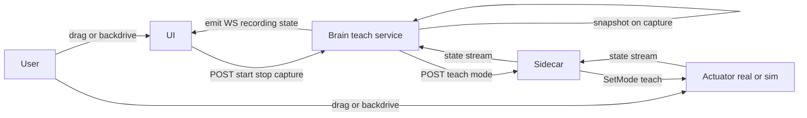

# RFD-13: Teach Mode — Record-and-Replay and Drag-to-Pose
Author: Jose Catarino

## Why this RFD

Every programming surface the Smart Actuator ships today asks the
user to think in coordinates. The jog panel is buttons next to joint
angles. The G-code pipeline is a text file. The program list view
(and the future node graph from [RFD-8](RFD-8.md) J5.5) is forms
with numeric targets. All of that is necessary, none of it is
*delightful*, and none of it is what makes a robot feel like a tool
instead of a CNC program.

The single most magical thing a robot can do, for the maker audience,
is **let you move it with your hands and play that motion back.**
This RFD scopes that capability across two surfaces:

1. **Live teach** — backdrive the real arm (or hold-and-record on a
   stiff one), step through poses, save them as a program.
2. **Drag teach** — click and drag the on-screen arm to pose it,
   capture the pose, repeat. The simulator equivalent of live teach.

Both produce the same artefact: a `Program` whose root is a SEQUENCE
of `MOVE_JOINT` (or `MOVE_POSE`) nodes. The runner from
[RFD-8](RFD-8.md) J5 plays it back unchanged. The AST node
`record_and_replay` already exists in [RFD-11](RFD-11.md) as a
gesture; this RFD is its concrete implementation.

The pitch in one sentence: **two buttons (Record / Stop), the user
moves the arm, and they have a program.** That is the demo.

## Non-goals

- Continuous trajectory capture at sensor rate. v1 captures
  **waypoints** — discrete poses the user explicitly marks. Smooth
  replay between them is the runner's job, not the recorder's.
- Force-controlled teaching ("apply this much force here"). This is
  a separate compliant-control RFD; v1 is position-only.
- Skill learning / generalisation. Recorded programs are literal
  playback, not LFD (learning-from-demonstration) with statistical
  generalisation across instances.
- Multi-arm coordinated teach. v1 records one machine at a time.
- Recording G-code-style metadata (feed rates, coolant, tool changes).
  Pure motion only.

## The two modalities

### Modality A — live teach (backdrive)

The user puts the machine into **teach mode**. The motors are
detorqued (or set to a low-impedance compliant mode if the hardware
supports it). The user physically moves the arm to a pose, hits
**Capture** in the UI (or a hardware button on the testbench), and
the current joint state is recorded as a waypoint. Repeat. Hit
**Stop** to end the recording. The result is a `Program` ready to run.

This mode requires hardware support: the actuator must accept a
`SetMode(teach)` command that drops torque. The simulator can
trivially honour this (it just stops applying its PD loop and lets
the user write joint state directly).

### Modality B — drag teach (sim-only, click-and-drag)

For users who don't have hardware (or don't want to touch it), the
UI lets them grab a joint in the 3D viewport and drag it. The arm
deforms in real time; under the hood the UI is calling the same jog
endpoint that exists today, just driven by mouse position instead of
button clicks. When the user releases the mouse and hits **Capture**,
the pose is recorded.

For a Cartesian target (drag the end-effector), the UI calls IK and
shows the result. For a per-joint drag (grab the elbow, rotate it),
the UI commands that one joint directly.

Both modalities feed the same recording state machine; the
*input device* differs (real motor backdrive vs. mouse) but the
recorded artefact is identical.

## Architecture



The teach service owns the recording session state. It is a thin
layer over the existing state stream — when the user hits Capture,
the service grabs the most recent `JointState` snapshot and appends
it to the in-progress recording. When the user hits Save, the
service hands the recording to ProgramService, which materialises it
as a `Program`.

## Layer-by-layer build

### Brain — `teach_service.py` (new)

A service that owns one recording session per machine. State:

```
{
  session_id: str,
  machine_id: str,
  state: "idle" | "armed" | "recording" | "saved" | "aborted",
  mode: "live" | "drag",
  waypoints: list[Waypoint],
  started_at: datetime,
}
```

Each `Waypoint` is `{ joint_positions, captured_at, label? }`.

REST surface:

```
POST   /machines/{mid}/teach              { mode: "live"|"drag" }  → start session
POST   /machines/{mid}/teach/capture      → snapshot current state, append waypoint
DELETE /machines/{mid}/teach/waypoints/N  → drop a captured waypoint
POST   /machines/{mid}/teach/save         { name: str }            → materialise as Program
POST   /machines/{mid}/teach/abort        → discard session
GET    /machines/{mid}/teach              → current session state
```

WS topic `teach/{session_id}` emits state transitions and each new
waypoint as it lands. Multiple browser tabs see the same session
update live — reusing the multi-client pattern from J4/J5.

Persistence: the session lives in SQLite so it survives Brain
restart. (If you spent ten minutes posing the arm, restarting the
Brain should not erase your work.)

### Brain — actuator teach mode

A new command in `actuator.proto`:

```
rpc SetMode(SetModeRequest) returns (SetModeResponse);

message SetModeRequest {
  enum Mode {
    NORMAL = 0;
    TEACH  = 1;   // motors detorqued / compliant
  }
  Mode mode = 1;
}
```

The Sidecar passes this through unchanged. `actuator-sim` honours it
by entering a state where external position writes are accepted; the
real `actuator-firmware` drops PWM duty (or switches to a compliant
control mode if the driver supports it). The exact behaviour is
hardware-dependent; the contract is "the user can move it by hand
without fighting the motors."

When the teach session ends (save or abort), the Brain re-sends
`SetMode(NORMAL)` and the PD loop resumes. If the user runs the
recorded program, the arm springs back to the first waypoint — the
runner's job, not the recorder's.

### UI — teach panel

A new tab next to the existing jog and program panels:

- **Big Record / Stop button.** Recording, the button pulses red.
- **Waypoint list** down the side. Each waypoint shows its index,
  captured timestamp, and (for Cartesian-aware machines) its TCP
  position. Click a waypoint to highlight it in 3D; right-click to
  delete.
- **"Capture" button** (or spacebar shortcut). Snaps the current
  pose into the list.
- **Mode toggle** — Live (backdrive) vs. Drag (click-and-drag on the
  3D viewport). Live is greyed out if the machine has no real
  binding.
- **Save dialog** — name the program; on confirm, hands off to
  ProgramService and navigates to the program in the program list.

### UI — drag-to-pose interaction

In `ArmCanvas.tsx`, each joint primitive gains a drag handler:

- **Revolute joint.** Drag rotates the joint about its axis;
  the rotation amount is derived from the mouse delta projected
  onto the joint's tangential plane. UI calls `POST /move/joint`
  on drag-end (or throttled during drag).
- **End-effector handle.** A handle (sphere) at the TCP. Dragging
  it sends Cartesian targets through `POST /move/pose`; IK runs
  server-side; the arm tracks live. Falls back to "drop on
  mouse-up" if IK latency makes live tracking jittery.
- **Prismatic joint** (from [RFD-12](RFD-12.md)). Drag the carriage
  along the rail; mouse-position projected onto the rail axis.

The interaction is independent of teach mode — you can drag the arm
just to jog it. Teach mode is what makes the captured poses
*persist*.

## Worked example: pick-and-place teach

Hardware: the J6 testbench arm. The user wants to teach a
pick-and-place between two table positions.

1. Open the teach panel. Toggle to **Live**. Hit **Record**.
2. Brain sends `SetMode(TEACH)` to both actuators. The arm goes
   limp.
3. User moves the arm above position A. Hits **Capture**. Waypoint 1
   lands.
4. User moves the arm down to position A (grip pose). **Capture**.
   Waypoint 2.
5. User moves to above B. **Capture**. Waypoint 3.
6. User moves down to B. **Capture**. Waypoint 4.
7. User moves back to the home pose. **Capture**. Waypoint 5.
8. Hit **Save**. Name it `pick-and-place`.
9. Brain sends `SetMode(NORMAL)`. Arm holds last position.
10. Go to programs. Hit Run. The arm replays the five waypoints
    using the existing J5 runner.

End-to-end: no coordinates typed, no G-code, no node graph. Two
buttons and a name.

## Exit criteria

1. **Live teach end-to-end** (on the J6 testbench arm, or on a
   sim machine with `SetMode(TEACH)` honoured by the sim). Capture
   3+ waypoints. Save. Run the program. The arm visits each
   waypoint in order within ±2° per joint.
2. **Drag teach** in the UI. Drag the end-effector to three poses
   in a fully-sim 2-DOF arm. Capture each. Save. Run. Visits each
   pose.
3. **Multi-tab observation.** Two browser tabs see the same
   in-progress session; capturing in tab A causes the waypoint to
   appear in tab B within 500 ms.
4. **Session persistence.** Capture two waypoints. Restart the
   Brain. Reopen the UI. The session is still there with both
   waypoints; capture continues from waypoint 3.
5. **Abort cleanup.** Aborting always restores `SetMode(NORMAL)`,
   even if the UI tab is closed before abort is hit (server-side
   timeout fallback).
6. **Smoke test.** REST-driven: start session, capture 3 times,
   save, run program, assert final joint state matches last
   waypoint.

## Open questions

1. **What happens on E-stop during teach?** E-stop bypasses the AST
   ([RFD-11](RFD-11.md)) and should bypass teach mode too. After
   E-stop release, the session should be in an `armed` state — the
   user can resume capturing or abort. It should *not* auto-record
   the pose at E-stop time as a waypoint.

2. **Backdrive compliance per actuator type.** The testbench's
   stepper + TMC2209 ([RFD-10](RFD-10.md)) can drop current but
   cannot do true compliant control. A future BLDC actuator with FOC
   could. The contract is just "motors don't fight you"; the quality
   of compliance is per-hardware.

3. **Drag-while-recording vs. drag-then-capture.** The simplest UX is
   "drag, release, hit Capture." A more ambitious UX captures the
   intermediate trajectory of the drag itself as a smooth path. v1
   ships the simple version; the trajectory-capture variant is a
   follow-on.

4. **Recording dynamics, not just kinematics.** A long-term direction
   is to capture not just poses but velocities, accelerations, and
   forces — letting the user demonstrate not just *where* but *how*.
   That is LFD territory and out of scope; flagging here so the v1
   `Waypoint` schema is extensible (position-only today, plus a
   nullable `velocity` field reserved for later).

5. **Replay accuracy on a real arm.** Replay error depends on the
   real arm's repeatability, not on the AST. The exit criteria use
   sim tolerances; real-hardware tolerances need to be calibrated
   against the testbench actuator's measured repeatability.

## Relationship to other RFDs

- **[RFD-4](RFD-4.md):** the teach service is a new C-component
  (call it C12); follows the same lifecycle and persistence pattern
  as the calibration service.
- **[RFD-8](RFD-8.md):** this work runs in parallel with J6. The
  drag-teach modality works against an all-sim machine; the
  live-teach modality is the first user-visible feature that
  *requires* J6 hardware (or a sim that honours `SetMode(TEACH)`).
- **[RFD-9](RFD-9.md):** the `SetMode` RPC belongs in the actuator
  contract once RFD-9 is no longer a stub.
- **[RFD-11](RFD-11.md):** the AST gains nothing new; teach mode
  emits ordinary `MOVE_JOINT` (or `MOVE_POSE`) sequences. The
  `record_and_replay` gesture from RFD-11 is what teach mode
  *produces* — it is no longer a gesture but a first-class workflow.

## Status

Draft. Ready to start once [RFD-12](RFD-12.md) is in flight, or in
parallel if the team can split. Drag teach is independent of J6 and
can ship against all-sim machines today; live teach is gated on the
testbench actuator from [RFD-10](RFD-10.md).
