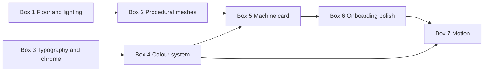

# RFD-14: Aesthetic Pass — A Teenage Engineering–Inspired UI
Author: Jose Catarino

## Why this RFD

The Smart Actuator's UI works. The 3D viewport renders a kinematic
chain, the reachability volumes shade correctly, the Cartesian jog
panel exposes the right knobs, the G-code page previews a path, and
the program list view accepts a sequence of `MovePose` steps. None
of it is *broken*. All of it looks like a research toolkit.

Compare the current state (baseline screenshots in §1) to what the
maker audience is used to seeing on a product page — Teenage
Engineering, Shaper Origin, Bambu Studio, Onshape, Fusion 360. The
gap is not feature coverage. The gap is **perceived seriousness**.
A canvas of gray cylinders on a faint blue grid reads as "demo,"
no matter how clever the IK underneath is. A canvas with considered
lighting, intentional materials, and a typographic system reads as
"product."

This RFD scopes a deliberate aesthetic pass — a Teenage Engineering
(TE)–inspired visual language applied uniformly across the canvas,
the chrome, and the chart surfaces. It is structured as **seven
timeboxed boxes** that can ship independently and in order. Each box
is a fixed-budget unit of work; if any box runs over, the *scope*
is cut, not the box. The point of timeboxing is to prevent the
aesthetic pass from quietly becoming the whole next quarter.

The companion to this RFD is [RFD-7](RFD-7.md), which defines the
product story the UI tells. RFD-14 does not change the story; it
changes how the story looks.

## Non-goals

- A new product story. The information architecture, the
  onboarding flow, the program-authoring surface — all already
  scoped in [RFD-7](RFD-7.md), [RFD-8](RFD-8.md) J3, and
  [RFD-11](RFD-11.md). This RFD restyles them; it does not
  redesign them.
- A design system shipped to npm. The tokens and components live
  in the `ui/` workspace and serve this app. Extracting them is a
  later RFD if there is ever a second app.
- A rebrand. Logo, name, marketing surfaces are out of scope.
- A full TE clone. "TE-inspired" means *the discipline*
  (deliberate type, restrained palette, machined geometry, no
  decoration without function) — not the literal OP-1 or Pocket
  Operator look.
- Animation as the headline. Motion design lands in Box 7 as
  finishing polish; it is explicitly not the centrepiece.

## 1. Baseline

What the UI looks like today (from screenshots taken on
`localhost:5173`):

- **Workspace canvas.** Dark background, faint blue grid extending
  to the horizon. The 2-DOF arm renders as three terracotta-orange
  spheres (joints) connected by two desaturated-cyan cylinders
  (links). Two translucent yellow ellipsoids overlay as
  reachability volumes; a Poisson-disc point cloud overlays as
  reachable-volume samples. A floating coordinate gizmo sits
  top-right. The left rail carries six monochrome icon buttons in a
  fixed column.
- **Cartesian jog panel.** A dark floating card with the heading
  `CARTESIAN JOG`. Translation and Rotation sections each have a
  `Step` dropdown and three rows of label/value/±buttons. A blue
  `Re-anchor` button bottom-right. Functional, generic.
- **Programs page.** Left rail of saved programs; main panel of
  ordered steps. Each step is a labelled form (`MovePose (SE3)`)
  with `Pos (m)`, `Orient (°)`, and a blue `Snap to current EE`
  button. Reorder arrows and a close button per step. Standard
  CRUD chrome.
- **G-code page.** Two left-rail sections (`1. UPLOAD G-CODE FILE`,
  `2. TRANSLATION OPTIONS`) and a right-pane 2D path preview with
  a legend. Three stacked CTAs (`Preview path`, `Save program`,
  `Run`).

What is consistent across all four screens:

- One dark background colour, one body text colour, one near-black
  accent blue for primary CTAs, terracotta-orange for joint
  primitives.
- HTML-default form controls (range inputs render as the OS
  default, number inputs as plain boxes).
- No typographic scale to speak of — three or four sizes used
  inconsistently.
- A grid floor and no other environmental cues — no shadow under
  the machine, no horizon line, no sense of scale.
- The icon rail uses an off-the-shelf icon set; spacing and
  sizing are reasonable but the icons feel imported, not
  designed.

What works and should be kept:

- The terracotta/cyan colour pairing on the machine itself.
  Aesthetically TE-adjacent; do not lose it in the pass.
- The dark canvas. TE products live in product-page light, but
  the workspace itself works dark — it is closer to a CAD tool
  than a phone app.
- The left icon rail as the primary navigation. The shape is
  right; the contents need a pass.
- The 2D G-code preview's legend convention (coloured swatches
  with labels). Keep the pattern; restyle the swatches.

## 2. The aesthetic, in one paragraph

A Teenage Engineering–inspired surface is built from four things:
**deliberate typography** (one display face, one monospace, a
tight scale, generous tracking on caps), **restrained colour** (an
off-white / charcoal / one product accent — no gradients, no
shadows that pretend to be glass), **machined geometry** (chamfered
edges, inset bands, longitudinal seams, primitives that look
intentional rather than extruded), and **functional ornament only**
(every line, every label, every band exists because it does
something — there is no decoration for decoration's sake). The
discipline is subtractive: every box of this RFD removes more than
it adds.

## 3. The seven boxes

Each box has a fixed budget (calendar days, assuming one focused
front-end engineer), a goal stated as a single sentence, an
inventory of what changes, a list of what is explicitly out of
scope for the box, and a screenshot-quality test (one sentence
describing what the *after* screenshot looks like). The boxes are
ordered by ROI per day.

### Box 1 — Workspace floor and lighting (1 week)

**Goal:** the workspace canvas reads as "product," not "research
demo," on first glance.

This is the single highest-impact change in this RFD. It changes
no geometry. It changes how the existing geometry is *seen*.

| Layer | What changes |
|---|---|
| `ArmCanvas.tsx` lighting | Replace the default R3F ambient with a deliberate three-point rig: a key light from upper-front-right, a softer fill from lower-front-left, a rim light from behind to separate the machine from the background. Soft shadows enabled with a low-res shadow map (perf budget: < 1 ms/frame on M1). |
| Floor | Replace the infinite blue grid with a procedural shader floor: a soft radial gradient under the machine (subtle vignette / fake AO) that fades to the background colour at distance; an optional very-faint grid that fades with distance (so close-up users still get scale cues but the grid does not dominate the frame). |
| Background | One flat colour (charcoal, not pure black); a subtle vertical gradient at the horizon line so the floor reads as a floor, not as a hole. |
| Tone-mapping | Enable ACESFilmic tone mapping; tweak exposure so the terracotta joints render warm without clipping. |
| Reachability volumes | Reduce default opacity (currently dominates the frame). |
| Poisson-disc samples | Move the Poisson-disc samples behind a toggle that is **off by default**. The discs are debug tooling; they should not be in the hero shot. |

**Out of scope for Box 1:** changing the joint/link meshes (Box 2),
changing any UI chrome (Box 3), changing the icon rail's icons
(Box 3 / Box 4).

**Screenshot test:** with reachability overlays off, the workspace
shows a single illuminated machine sitting on a soft pad of light
against a dark stage — readable as a beauty shot of a hardware
product, not a debug viewport.

### Box 2 — Procedural link/joint meshes and machine design tokens 1–2 weeks

Goal: replace primitive cylinders and spheres with parametric, token-driven “machined” geometry that looks intentional at any link length, any joint type, and any future robot template.

Today Joint.tsx renders every joint as a sphere and every link as a cylinder. That works for FK correctness; it does not look machined. TE’s visual language is built on chamfered primitives, inset bands, visible seams, restrained materials, and repeated proportional rules. The same discipline applied to Jog Actuator gives every robot part a product-family identity instead of a demo-viewport identity.

Box 2 does two things at once:

1. introduces the first procedural mesh generators for links, revolute joints, prismatic joints, and end-effectors;
2. introduces the machine design-token layer those generators consume.

The token layer is the important part. Geometry should not hardcode arbitrary radii, bevels, seam widths, colors, material roughness, or bolt sizes. Mesh functions should consume semantic tokens like machine.geometry.bevel.sm, machine.geometry.seam.width, machine.proportions.linkThicknessToWidth, and machine.materials.revolute. This keeps every generated part inside the same visual grammar even as new robot templates are added.

Layer	What changes
New ui/src/design/tokens.ts	Adds the base design-token object used by both 2D chrome and 3D machine rendering. Box 2 lands only the machine/mesh subset; Box 4 later completes the full colour system.
New ui/src/design/machineTokens.ts	Defines procedural mesh tokens: bevel sizes, seam widths, inset depths, band widths, hub/link proportions, fastener scale, material roles, and geometry-quality levels. These are numbers with names. No procedural mesh function should invent its own arbitrary magic numbers.
New ui/src/design/machineStyles.ts	Defines named visual presets over the same tokens: baseline, machined, skeletonized, and later teenageEngineeringInspired. A style preset changes token values; it does not fork the mesh architecture.
New mesh/link.ts	Parametric link mesh function: takes (length, joint_type_at_each_end, styleTokens) and returns a BufferGeometry or mesh recipe. The mesh has chamfered ends, a subtle longitudinal seam, an inset band where each joint axis attaches, and proportions derived from tokens rather than literals. One generator serves all links across all templates.
New mesh/revolute.ts	Parametric revolute joint mesh: a short barrel with a visible rotation axis, tokenized inset ring, tokenized seam line, and optional active-state accent band. The TE move is “you can tell which way it rotates by looking at it.”
New mesh/prismatic.ts lands with RFD-12	Parametric prismatic carriage and rail: a long thin extrusion and a slotted block that slides along it. Rail thickness, slot width, carriage bevel, and guide-band treatment all come from machine tokens.
New mesh/endEffector.ts	Replaces the TCP sphere with a small machined cap: flat disc, chamfered edge, visible tool-face orientation, and optional tokenized center mark. Reads as a tool mount, not a marker.
New mesh/recipes.ts	Optional but recommended. Introduces a mesh-recipe intermediate representation so generators can output semantic primitives like barrel, band, seam, cap, fastener, and insetPanel before those become Three.js geometry. This keeps the procedural grammar testable outside React.
Joint.tsx	Branches on joint type and dispatches to revolute.ts or prismatic.ts. The component shape is unchanged; only the rendered geometry changes.
Materials	One shared material registry per role: link, revolute, prismatic, ee, active, shadowInset. Components request material by role. They do not instantiate ad hoc colors. Box 4 later replaces provisional colors with the final app-wide color tokens.
Geometry quality	Adds a quality option: low, medium, hero. Low is for thumbnails and onboarding cards; medium is default viewport; hero is for screenshots/export. Segment counts and bevel detail are tokenized instead of scattered through mesh files.
Dev preview	Adds a small internal “mesh lab” route or Storybook-style preview showing one generated link, revolute, prismatic rail, and end-effector under Box 1 lighting. This is where token tweaks are reviewed visually before they affect the main workspace.

Out of scope for Box 2: final colour identity Box 4, typography/chrome Box 3, motion Box 7, real manufacturable CAD export, physical strength simulation, and arbitrary freeform part generation.

Screenshot test: the 2-DOF arm from the baseline screenshots, re-rendered with Box 1 lighting and Box 2 token-driven meshes, looks like it belongs to a coherent hardware product family. The links, joints, seams, bands, and tool cap share the same proportional language; nothing looks like a default Three.js primitive.

### Box 3 — Typography and chrome (3–5 days)

**Goal:** the UI shell stops looking like a Tailwind dashboard
template and starts looking like a designed product.

The 3D canvas is now beautiful but the panels around it — the
toolbar header, the left icon rail, the floating jog card, the
programs page form — still read as generic web. This box is
purely 2D: typography, spacing, edges, density.

| Layer | What changes |
|---|---|
| Type stack | Pick a geometric sans for display and labels (e.g. Inter Tight, Söhne, or Reckless Neue if budget allows a paid face); pair with a monospace for numeric values (e.g. JetBrains Mono or Berkeley Mono). Define a 5-step scale (caption, body, label, title, display) and a 3-step weight ramp (regular, medium, semibold). |
| Tracking & casing | All UI section labels (`CARTESIAN JOG`, `TRANSLATION`, `ROTATION`, `SAVED PROGRAMS`, `1. UPLOAD G-CODE FILE`) get the same treatment: uppercase, medium weight, slightly looser tracking, smaller size than today. The pattern is already half-applied — make it consistent. |
| Numeric values | Render in monospace, tabular figures on. Right-align jog values so the digits line up across rows. |
| Edges and corners | Remove `rounded-xl` / `rounded-2xl` from cards. TE chrome is square or very-slightly-rounded (2 px max). Buttons become rectangles with a 1 px border, not pill shapes. |
| Shadows and elevation | Remove drop shadows on floating panels. Use a single hairline border for separation. The jog card sits *on* the canvas as a flat card with a visible edge, not a floating glass slab. |
| Form controls | Replace HTML-default number inputs and dropdowns with a single styled component pair (`NumericInput`, `Select`). Both monospace, both square-edged, both with a deliberate hover/focus state. The `+ / −` step buttons in the jog panel become a tight integrated control instead of two separate buttons floating next to a value. |
| Toolbar header | The current `Jog Actuators` / `Programs` / `G-code` page title is centred and unstyled. Promote it: left-align, larger, paired with a small breadcrumb / context line below (e.g. `Workspace › 2-DOF Planar Arm`). |
| Icon rail | Audit the six icons. Either commission a set drawn to match the type system (1 px stroke, square caps, no flourishes) or pick a single open-source set that already follows that discipline (Lucide-style 1.5 px stroke at minimum). Add a tooltip on hover with the label in the new type system. |

**Out of scope for Box 3:** colour (Box 4); the status cluster
redesign (Box 5); onboarding (Box 6).

**Screenshot test:** the jog panel screenshot, retaken after Box 3,
has the same information density but reads as a hardware control
surface — uppercase labels with deliberate tracking, monospace
values lined up on the decimal, square-edged controls.

### Box 4 — Colour system and accent identity (3–5 days)

**Goal:** the product has one recognisable accent colour, used
sparingly and meaningfully, and every hex literal in the codebase
goes through a single theme.

The baseline uses terracotta on the machine, near-black blue on
primary CTAs, green/red status dots, and various greys. The colours
are fine in isolation; they are not a *system*. TE products have a
single accent per product (the orange of the OP-1, the yellow of
the OP-Z) and that accent does **one job** — it marks the thing
the user should look at.

| Layer | What changes |
|---|---|
| New `ui/src/theme.ts` | Single source of truth for colour. Tokens: `bg`, `bg-elevated`, `surface`, `border`, `text`, `text-dim`, `accent`, `accent-dim`, `warn`, `danger`, `ok`, plus a `machine` sub-palette (`link`, `revolute`, `prismatic`, `ee`). No hex literal allowed outside this file (enforced by eslint rule). |
| Accent choice | Pick one accent. Recommendation: **safety yellow** (the colour of an E-stop legend, of a CNC machine envelope marker, of TE's OP-Z). It carries the right "this is industrial equipment" connotation, contrasts cleanly against dark and light backgrounds, and is unmistakable in a tweet thumbnail. Alternative: a saturated cyan if yellow feels too aggressive. **Reject** orange (already used for joints) and red (reserved for E-stop). |
| Accent usage rules | The accent marks exactly the thing the user should attend to: the active joint during a jog, the currently-executing step in a running program, the recording-active state in teach mode ([RFD-13](RFD-13.md)), the primary CTA per page. Nothing else uses accent. |
| Machine palette | Keep terracotta for revolutes (the baseline gets that one right). Pick a complementary colour for prismatic carriages — recommendation: a desaturated brass / warm beige, so prismatic and revolute joints are distinguishable at a glance but neither steals attention from the accent. |
| Status colours | Define the green / yellow / red status dots once in theme. The current icons in the top-left of the rail are the right shape; restyle so they share a stroke weight with everything else. |
| Dark / light parity | Tokens are defined for both modes. Workspace stays dark by default. The Programs and G-code pages stay dark for now but the *option* to switch is preserved — useful for marketing screenshots where a light variant reads better. Switching is gated behind a setting, not a top-bar toggle. |

**Out of scope for Box 4:** picking a logo colour, marketing
collateral, any rebrand.

**Screenshot test:** opening any page, you can identify the single
thing the page wants you to do because exactly one element on the
screen wears the accent.

### Box 5 — Status cluster and the machine identity card (1 week)

**Goal:** the workspace gains a compact, glanceable summary of
the machine and its state that is itself a beautiful component —
the second-most-shareable element after the 3D canvas.

Today the workspace shows joint data as a panel of numbers
(`JointDataPanel.tsx`), and the machine's identity is implicit in
the title bar. There is no single place that answers "what am I
looking at and how is it doing?" at a glance.

| Layer | What changes |
|---|---|
| New `MachineCard.tsx` | A compact card in a corner of the workspace (default: bottom-left). Top row: machine name, template chip (e.g. `2-DOF PLANAR ARM`), connection status dot. Middle row: a small procedural thumbnail of the machine (reusing Box 2 geometry, low-poly, single accent). Bottom row: one row per joint, each row showing slot index, name, type icon (revolute / prismatic), and a tiny inline state indicator — a horizontal bar from `limit_lower` to `limit_upper` with a marker at current position. **No raw numbers in the card.** |
| New `JointDetailPopover.tsx` | Hover or click a joint row in the `MachineCard` to expand a popover with the precise numeric state (position in deg or m depending on joint type, target, velocity, torque if available). The numbers move from a permanent panel to a glanceable card with on-demand detail. |
| `JointDataPanel.tsx` | Demoted to a debug panel; not visible in the default workspace. Reachable via the icon rail under a "Debug" entry. The information is preserved; it stops dominating the canvas. |
| Mode pill | The machine's current mode (`IDLE` / `JOG` / `RUN` / `TEACH` / `ESTOPPED`) shown as a small chip in the `MachineCard`'s top row. Uses the accent colour from Box 4 when the mode is `RUN` or `TEACH`; uses `danger` for `ESTOPPED`; uses `text-dim` for `IDLE`. |

**Out of scope for Box 5:** any change to the program runner UI
(separate work for [RFD-8](RFD-8.md) J5 polish); calibration UI
(separate); the teach panel ([RFD-13](RFD-13.md)).

**Screenshot test:** a workspace screenshot of a 6-DOF arm, with
the `MachineCard` in the corner, communicates the machine's full
state without showing a single raw number — and it looks like a
component you would screenshot on purpose.

### Box 6 — Onboarding wizard polish (1 week)

**Goal:** the first impression a new user gets — the template
picker and parameter form from [RFD-8](RFD-8.md) J3 — matches the
quality of the rest of the product.

This is the highest-stakes screen for first-impression conversion.
It is the screen a Hackaday writer will screenshot for "and here
is how you set it up." It needs to do more work than any other
screen because everything else can be discovered after a user is
already committed.

| Layer | What changes |
|---|---|
| Template thumbnails | Render each template's thumbnail with the same procedural geometry as Box 2 — a small, low-poly preview of the actual machine you would get. **Not flat icons.** Generated at build time from the template's DH chain so adding a new template needs no manual thumbnail. |
| Picker layout | A grid of cards, each card a thumbnail plus the template's name, joint count, and a one-line summary. Card hover animates the thumbnail subtly (a slow auto-rotate at ~10 °/s). Selection lights the card's border in the accent colour from Box 4. |
| Parameter form | Replace HTML-default range inputs with a custom slider that visually resembles a hardware fader (a thin track, a chunky thumb, the value rendered in monospace next to it). Each parameter shows its unit (the template's `unit` field) right-aligned. The form is grouped by section (`GEOMETRY`, `LIMITS`, `MASS`) with the same uppercase-label treatment from Box 3. |
| Live preview | The 3D viewport on the right of the form re-renders as the user adjusts parameters. The preview uses Box 1 lighting and Box 2 meshes. This costs maybe one extra day in Box 6 but it is the moment the product *feels* tactile. |
| Binding step | The "+ Add motor" step from J3 / J6 gets the same card treatment: each option (`Onboard real hardware` / `Add simulated`) is a card with an illustration, a label, and a short description. Cards rather than radio buttons. |

**Out of scope for Box 6:** the underlying onboarding flow logic
(already specified in [RFD-8](RFD-8.md) J3); marketing copy on the
template descriptions (separate writing pass).

**Screenshot test:** the template picker, screenshotted alone, is
indistinguishable in quality from the "choose your printer"
screen in Bambu Studio.

### Box 7 — Motion feedback (3–5 days, do last)

**Goal:** the product gains a small, deliberate library of motion
signals that reinforce what is happening — and nothing more.

Motion design is dangerous early; it is glue late. Do this box
last so it is a finishing layer over a coherent surface, not the
thing trying to compensate for an incoherent one.

| Layer | What changes |
|---|---|
| Joint activity pulse | The active joint during a jog gets a subtle pulse on its accent-coloured highlight (1 Hz, low amplitude). Stops on jog-end. Pure visual feedback; no functional change. |
| TCP trail | When a program runs, the TCP leaves a faint fading trail (max 2 s of motion, opacity decays to zero). Off when no program is running. |
| Mode transitions | When the machine transitions between modes, the camera does a gentle 200 ms ease on its position (e.g. slightly closer for `TEACH`, slightly wider for `RUN`). Subtle; not navigation. |
| Step highlight in programs | The currently-executing step in a running program highlights in accent colour with a slow horizontal sheen sweeping across it. Matches the "recording" pulse in teach mode ([RFD-13](RFD-13.md)). |
| Loading and connection states | Single, consistent indeterminate-progress motif (a slow accent-colour bar across the bottom of any loading panel). Replace any spinners. |

**Out of scope for Box 7:** any motion design in the onboarding
wizard (already done in Box 6); any animation of the canvas
chrome (the icon rail, the toolbar header) beyond hover states.

**Screenshot test:** there are no static screenshots that prove
Box 7 worked — it is felt. The test is a 10-second screen
recording: the recording reads as polished and considered without
calling attention to any single animation.

## 4. Order, parallelism, and the 70%-in-10-days rule

Two independent tracks run in parallel through Box 4: a **canvas
track** (Box 1 → Box 2) and a **chrome track** (Box 3). Box 4
joins them — the colour tokens land everywhere. From Box 5
onward the work is serial because each box assumes the prior
visual vocabulary is settled.

If only two boxes ship before [RFD-12](RFD-12.md) (the prismatic
+ gantry work), pick **Box 1 and Box 3**. Floor/lighting plus
typography/chrome buys ~70% of the perceived quality jump for
~10 days of work and does not block any feature work behind it.
Box 2 should ship alongside RFD-12 so the gantry's prismatic
meshes are designed against the new visual language from day one
rather than retrofitted.

Total budget: **5–6 weeks of dedicated front-end time**, or
**2–3 months interleaved** with feature work. If a box runs over
its budget, cut scope inside the box (drop one bullet from the
"what changes" table); do not slip the box.

## 5. Open questions

1. **Accent colour final pick.** The recommendation is safety
   yellow; the alternative is a saturated cyan. The decision
   needs a one-day spike: mock both against the existing
   terracotta machine and pick the one that wins on contrast in
   thumbnail size. The decision is reversible (it is one token)
   but expensive to keep deferring — every box past Box 4
   assumes a choice.

2. **Paid vs. free type face.** Inter Tight, IBM Plex, and
   JetBrains Mono are free and good. Söhne, Reckless Neue, or
   Berkeley Mono are paid and better. The marketing surface is
   where paid type pays off; the in-app surface gets diminishing
   returns. Recommendation: ship Box 3 with free faces; revisit
   when there is a marketing site to design.

3. **Procedural mesh quality budget.** Box 2's machined meshes
   should look good at 60 fps on an M1 Air. The geometry budget
   per joint is unclear; needs a perf spike before Box 2 starts.
   If the budget is tight, the chamfered ends become the first
   thing cut.

4. **Should the canvas have a light mode at all?** Box 4 keeps
   the option but does not surface it. The argument for: marketing
   screenshots on a light page read better. The argument against:
   it is a second variant of every shader and material in Box 1
   and Box 2. Recommendation: only ship light mode when a marketing
   site exists that needs it.

## 6. Relationship to other RFDs

- **[RFD-7](RFD-7.md):** RFD-14 is the visual execution of
  RFD-7's product story. No information-architecture changes;
  only surface changes.
- **[RFD-8](RFD-8.md):** Box 6 polishes the J3 onboarding wizard.
  Boxes 1–5 polish the surfaces J1–J5 produce. Box 7's recording
  pulse is the same component used in [RFD-13](RFD-13.md)'s
  teach mode.
- **[RFD-12](RFD-12.md):** Box 2's `mesh/prismatic.ts` is a
  direct dependency of the gantry template's 3D rendering. Box
  2 and RFD-12's UI work should land in the same release so the
  gantry is born in the new visual language.
- **[RFD-13](RFD-13.md):** Box 4's accent colour is what the
  recording-active state in teach mode pulses with; Box 7's
  motion library defines that pulse.

## Status

Draft. Box 1 and Box 3 can start immediately and in parallel —
neither blocks the others' tracks. Box 4's accent-colour decision
is the gating decision for everything past Box 3.
