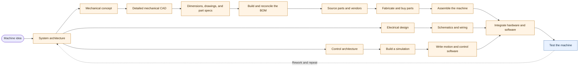
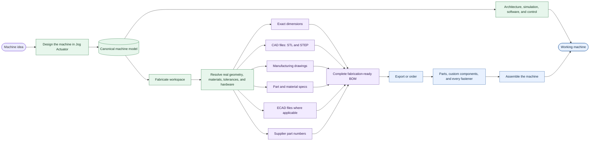

# RFD 16 - Next Gen Machine Design

In an internal conversatino where we demo'd Jog Actuators, an important question was asked:

> So after you design your machine, do you order it from Jog Actuators and it comes with all the screws and everything?

The answer, of course, is no. But why not? Because it's hard! And how do we know it's hard? Because we've had to start building a hardware as code framework to allow us to design our own machine and ... oh.

## The Vision

So what would this look like? To establish a trajectory I decided to look back at what the current Jog Actuator platform accomplishes for the user.

### Without Jog Actuator

### With Jog Actuator V1

```mermaid
flowchart LR
    IDEA([Machine idea]) --> JA[Design the machine in Jog Actuator]

    subgraph SOLVED[Handled by Jog Actuator]
        direction LR
        ARCH[Architecture] --> SIM[Simulation]
        SIM --> SOFTWARE[Software and control]
    end

    subgraph MANUAL[Low-level mechanical design is still manual]
        direction LR
        TRANSLATE[Translate the procedural frame into hardware]
        TRANSLATE --> CAD[Detailed CAD]
        CAD --> DOCS[Dimensions, drawings, and part specs]
        DOCS --> BOM[Build and reconcile the BOM]
        BOM --> SOURCE[Source parts and vendors]
        SOURCE --> FAB[Fabricate and buy parts]
        FAB --> ASSEMBLE[Assemble the machine]
    end

    JA --> ARCH
    JA --> TRANSLATE
    SOFTWARE --> INTEGRATE[Integrate and test]
    ASSEMBLE --> INTEGRATE
    INTEGRATE --> MACHINE([Working machine])

    classDef jog fill:#e7f6ec,stroke:#2d7d46,color:#12351f;
    classDef manual fill:#fff4e5,stroke:#b26a00,color:#3d2500;
    classDef outcome fill:#e8f1ff,stroke:#3568a8,color:#102a43;
    class JA,ARCH,SIM,SOFTWARE jog;
    class TRANSLATE,CAD,DOCS,BOM,SOURCE,FAB,ASSEMBLE manual;
    class INTEGRATE,MACHINE outcome;
```

### With Jog Actuator V2

### UX

A new Fabricate workspace shows me my machine not as the control / animation friendly procedurally generated frame, instead it's a *fully rendered machine*.

The gantry is a "real" cuboid composed of aluminum extrusions with either a belt rail, a linear actuator, or a head-d4ifen rail (I choose via a UI component). 

For custom parts, I can choose between 3d printed and cnc'd metal (aluminum or stainless steel) -- the app will reocmmend me a material per part for cheapest but still within tolerance based on machine size / weight / torque / etc. (And then I can order them and jog actuators will use a 3rd party to manufacture)

In the end, I get a beautiful BOM UI (with export options of course), each item has CAD (STL + STEP), ECAD (if applicable), part number (if applicable)
