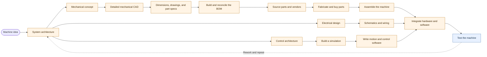

# RFD 16 - Next Gen Machine Design

In an internal conversation where we demo'd Jog Actuators, an important question was asked:

> So after you design your machine, do you order it from Jog Actuators and it comes with all the screws and everything?

The answer, of course, is no. But why not? Because it's hard! And how do we know it's hard? Because we've had to start building a hardware as code framework to allow us to design our own machine and ... oh.

## The Vision

So what would this look like? To establish a trajectory I decided to look back at what the current Jog Actuator platform accomplishes for the user.


### Without Jog Actuator


```mermaid
flowchart LR
    IDEA([Machine idea]) --> ARCH[System architecture]

    ARCH --> MECH[Mechanical concept]
    MECH --> CAD[Detailed mechanical CAD]
    CAD --> DOCS[Dimensions, drawings, and part specs]
    DOCS --> BOM[Build and reconcile the BOM]
    BOM --> SOURCE[Source parts and vendors]
    SOURCE --> FAB[Fabricate and buy parts]
    FAB --> ASSEMBLE[Assemble the machine]

    ARCH --> ELEC[Electrical design]
    ELEC --> WIRING[Schematics and wiring]

    ARCH --> CONTROL[Control architecture]
    CONTROL --> SIM[Build a simulation]
    SIM --> SOFTWARE[Write motion and control software]

    ASSEMBLE --> INTEGRATE[Integrate hardware and software]
    WIRING --> INTEGRATE
    SOFTWARE --> INTEGRATE
    INTEGRATE --> TEST[Test the machine]
    TEST -. Rework and repeat .-> ARCH

    classDef manual fill:#fff4e5,stroke:#b26a00,color:#3d2500;
    classDef outcome fill:#e8f1ff,stroke:#3568a8,color:#102a43;
    class ARCH,MECH,CAD,DOCS,BOM,SOURCE,FAB,ASSEMBLE,ELEC,WIRING,CONTROL,SIM,SOFTWARE,INTEGRATE manual;
    class TEST outcome;
```

### With Jog Actuator V1


```mermaid
flowchart LR
    IDEA([Machine idea]) --> JA[Design the machine in Jog Actuator]

    subgraph SOLVED[Handled by Jog Actuator]
        direction LR
        ARCH[Architecture] --> SIM[Simulation]
        SIM --> SOFTWARE[Software and control]
    end

    subgraph MANUAL[Low-level mechanical design is still manual]
        direction LR
        TRANSLATE[Translate the procedural frame into hardware]
        TRANSLATE --> CAD[Detailed CAD]
        CAD --> DOCS[Dimensions, drawings, and part specs]
        DOCS --> BOM[Build and reconcile the BOM]
        BOM --> SOURCE[Source parts and vendors]
        SOURCE --> FAB[Fabricate and buy parts]
        FAB --> ASSEMBLE[Assemble the machine]
    end

    JA --> ARCH
    JA --> TRANSLATE
    SOFTWARE --> INTEGRATE[Integrate and test]
    ASSEMBLE --> INTEGRATE
    INTEGRATE --> MACHINE([Working machine])

    classDef jog fill:#e7f6ec,stroke:#2d7d46,color:#12351f;
    classDef manual fill:#fff4e5,stroke:#b26a00,color:#3d2500;
    classDef outcome fill:#e8f1ff,stroke:#3568a8,color:#102a43;
    class JA,ARCH,SIM,SOFTWARE jog;
    class TRANSLATE,CAD,DOCS,BOM,SOURCE,FAB,ASSEMBLE manual;
    class INTEGRATE,MACHINE outcome;
```

### With Jog Actuator V2


```mermaid
flowchart LR
    IDEA([Machine idea]) --> DESIGN[Design the machine in Jog Actuator]
    DESIGN --> MODEL[(Canonical machine model)]

    MODEL --> RUNTIME[Architecture, simulation, software, and control]
    MODEL --> FABRICATE[Fabricate workspace]

    FABRICATE --> RESOLVE[Resolve real geometry, materials, tolerances, and hardware]
    RESOLVE --> DIMENSIONS[Exact dimensions]
    RESOLVE --> CAD[CAD files: STL and STEP]
    RESOLVE --> DRAWINGS[Manufacturing drawings]
    RESOLVE --> SPECS[Part and material specs]
    RESOLVE --> ECAD[ECAD files where applicable]
    RESOLVE --> PARTS[Supplier part numbers]

    DIMENSIONS --> BOM[Complete fabrication-ready BOM]
    CAD --> BOM
    DRAWINGS --> BOM
    SPECS --> BOM
    ECAD --> BOM
    PARTS --> BOM

    BOM --> ORDER[Export or order]
    ORDER --> KIT[Parts, custom components, and every fastener]
    KIT --> ASSEMBLE[Assemble the machine]
    RUNTIME --> MACHINE([Working machine])
    ASSEMBLE --> MACHINE

    classDef jog fill:#e7f6ec,stroke:#2d7d46,color:#12351f;
    classDef artifact fill:#f2ebff,stroke:#7251a5,color:#2f1b4d;
    classDef outcome fill:#e8f1ff,stroke:#3568a8,color:#102a43;
    class DESIGN,MODEL,RUNTIME,FABRICATE,RESOLVE jog;
    class DIMENSIONS,CAD,DRAWINGS,SPECS,ECAD,PARTS,BOM artifact;
    class ORDER,KIT,ASSEMBLE,MACHINE outcome;
```

### UX

A new Fabricate workspace shows me my machine not as the control / animation friendly procedurally generated frame, instead it's a *fully rendered machine*.

The gantry is a "real" cuboid composed of aluminum extrusions with either a belt rail, a linear actuator, or a head-d4ifen rail (I choose via a UI component). 

For custom parts, I can choose between 3D printed and CNC'd metal (aluminum or stainless steel) -- the app will recommend a material per part for the lowest cost that remains within the verified operating envelope based on machine size, weight, torque, and other template requirements. Jog Actuators can then have a third party manufacture them.

In the end, I get a beautiful BOM UI (with export options of course). Each item has CAD (STL + STEP), ECAD (if applicable), and a part number (if applicable).

## Product Premise

This is not an attempt to automate arbitrary mechanical engineering. The entire
Jog Actuator system is already organized around templated, verified machine
families. Fabricate extends those families from verified kinematics and control
into verified physical implementations.

The user supplies design intent inside a template's supported parameter space:
work envelope, payload, speed, accuracy class, environment, and discrete
options. Jog Actuator resolves that intent into an exact, versioned machine:
geometry, materials, manufacturing processes, interfaces, supplier parts,
fasteners, cables, firmware, and control limits.

The product inspiration is Prusa, not a general-purpose CAD marketplace. Prusa
makes its software and machine knowledge broadly available, but the commercial
product is the trusted physical implementation: official electronics, a
complete kit or assembled machine, excellent instructions, support, and a
long-lived upgrade path. Jog Actuator should take the same posture.

### Jog-compatible versus Original Jog

- A **Jog-compatible machine** may be assembled from open or community
  artifacts and modified freely. It may work with Jog software, but it does not
  carry Jog's promise that a particular physical configuration was verified.
- An **Original Jog machine** is built around an official Motion Core, generated
  from an official Machine Release, traceable through a machine passport,
  supported, calibratable, and upgradeable.

The files can remain inspectable, downloadable, repairable, and usable offline.
"Original Jog" is a support and verification boundary, not DRM.

## The Paid Nucleus: Jog Motion Core

The atomic commercial unit is not a PDF, a BOM export, or a referral to a parts
vendor. It is the **Jog Motion Core**: the official brain and muscles of a Jog
machine.

A Motion Core contains:

- the Jog controller;
- the Jog actuators required by the selected machine;
- power distribution, safety I/O, and standard Jog wiring harnesses;
- one Machine Release for the configured machine, included in the hardware
  price;
- the exact firmware, controller configuration, simulation parameters, and
  control limits for that release;
- the fabrication package, BOM, assembly instructions, automated supplier
  ordering, and commissioning workflow; and
- lifetime firmware improvements and support for that released machine.

This makes the purchasing decision legible. The user is not asked to pay for a
collection of generated files. They are buying the official control system that
turns the rest of the parts into a supported machine.

The Motion Core may be built and drop-shipped by a contract manufacturer. Jog
Actuator earns a hardware contribution or per-unit royalty without receiving,
stocking, or forwarding the product itself.

### Machine Release and machine passport

Purchasing a Motion Core includes one active machine. The user can iterate
freely before releasing it for fabrication. Pressing **Release for fabrication**
freezes a reproducible physical revision and creates a machine passport:

```text
Machine: 3-Axis Jog Gantry
Machine serial: JA-G3-000184
Controller serial: JC-2-008912
Mechanical release: 1.2.0
BOM revision: 2026-08-22.3
Runtime configuration: 1.8.1
Verified envelope: 600 x 400 x 150 mm
Verified payload: 4 kg
```

The passport ties together the as-designed machine, its controller, the exact
parts ordered, the firmware loaded, calibration results, support history, and
future upgrade compatibility. It can be recovered from the controller serial,
but the machine must not require a cloud connection to operate.

The following do not require a new purchase:

- regenerating artifacts for the same physical release;
- replacing an unavailable supplier SKU with a pre-verified equivalent;
- downloading firmware or control improvements;
- rebuilding the same machine; or
- replacing a failed controller and transferring the passport.

Meaningful physical conversions become upgrade products. When an upgrade
requires new Jog hardware, the updated Machine Release is included with that
hardware rather than sold as an artificial software unlock.

## Three Product Phases

These phases are an introduction sequence, not replacements. Once all three
exist, users choose between Motion Core, kit, and assembled-machine products in
the same way Prusa customers choose the degree of assembly they want.

### Phase 1: Original Jog Motion Core

> Buy the official brain and muscles of your machine. Jog coordinates
> everything else required to build it.

The customer buys the controller, actuators, and included Machine Release from
Jog Actuator. The resolved third-party BOM is divided among approved suppliers.
Jog refreshes pricing and availability, creates supplier-ready orders, and
shows unified order state and tracking. The suppliers remain sellers of record
and ship directly to the customer.

Multiple invoices, delivery dates, and boxes are acceptable in this phase. The
promise is that every required item is present and coordinated, not that a
single box arrives at the door.

Jog earns money from:

- controller and actuator contribution;
- accessories and replacement Jog components; and
- optional negotiated supplier rebates that must never influence engineering
  recommendations.

There is no separate Machine Release charge. Coordinated ordering is part of
the Motion Core experience and a conversion mechanism for Jog hardware.

Phase 1 is complete when:

1. several outside users build materially different configurations without a
   missing fastener, cable, manufactured part, or undocumented tool;
2. supplier orders require no routine manual intervention from Jog;
3. the controller recognizes and commissions the released machine; and
4. each completed machine meets its released travel, payload, and motion
   limits.

### Phase 2: Original Jog Machine Kit

> Everything required to assemble the machine arrives as a complete kit.

The same released machine becomes a single purchasable product. It includes:

- the Motion Core;
- extrusions cut and machined to length;
- rails, bearings, belts or leadscrews, brackets, and structural hardware;
- custom printed and CNC parts;
- electronics, cables, and connectors;
- unusual or machine-specific assembly tools;
- fasteners bagged and labeled by assembly step;
- a spare-fastener bag;
- a preconfigured controller; and
- printed quick-start material backed by detailed, versioned online
  instructions.

A fulfillment or contract-manufacturing partner receives the Resolved Kit,
procures or receives its components, verifies quantities, bags the hardware,
and ships it. Jog should not operate this warehouse. Long extrusions may still
arrive as a coordinated second package when oversize shipping makes literal
one-box fulfillment wasteful.

The customer sees one kit price. Behind it, Jog receives its Motion Core
contribution plus a negotiated design royalty, platform fee, or wholesale
spread; the fulfillment partner is paid for procurement, kitting, and shipping
and should remain seller of record when practical.

Assembly is part of the product, not documentation added at the end. Parts are
grouped by chapter, every fastener is visually identifiable, and the Fabricate
workspace can animate the current step. Once powered, the controller helps
verify wiring, actuator identity, direction, travel, limits, and calibration.
A successful commissioning run marks the machine passport as built.

Phase 2 is complete when:

1. someone unfamiliar with the design can complete the machine using only the
   supplied kit and instructions;
2. the kit requires no unrecorded fabrication operations or tools;
3. shortages and incorrect parts are rare, measured, and handled by the
   fulfillment partner; and
4. the completed machine passes the same automated acceptance test as the
   reference build.

### Phase 3: Original Jog Machine Platform

> Buy it as a Motion Core, buy it as a kit, or buy it assembled -- and upgrade
> it instead of replacing it.

Three product forms now coexist:

1. **Motion Core** for advanced users who want to source the structure
   themselves.
2. **Complete Kit** for users who want every part but prefer to perform the
   assembly or pay less.
3. **Assembled and Tested** for users who want a certified partner to build,
   wire, calibrate, and acceptance-test the machine before shipment.

The assembled product ships with its mechanical and electrical work complete,
controller provisioned, calibration recorded, factory acceptance results
attached, and machine passport marked with its as-built state. Certified
partners perform this work; Jog provides the designs, test procedures, control
system, and support boundary.

The installed base becomes an upgrade business. Examples include:

- a larger work envelope;
- a higher-payload axis;
- belt-to-leadscrew conversion;
- an additional rotary axis;
- a new toolhead or end-effector interface;
- a safety enclosure;
- a higher-power controller module; or
- a new actuator generation.

An Original Jog Upgrade contains the necessary physical components, a delta BOM
rather than a new full BOM, conversion instructions, an updated Machine
Release, new simulation and control limits, and a recommissioning procedure.
Software improvements remain free; revenue comes from meaningful hardware
upgrades, spares, professional support, and additional machines.

## Supply Chain Is an Implementation Detail

Supplier-managed availability is not a fourth product or a customer-facing
phase. It is infrastructure that matures underneath the three products:

- Phase 1 uses build-to-order direct shipment from suppliers.
- Phase 2 adds cross-docking, quantity verification, and kit consolidation.
- Phase 3 adds selective safety stock, regional fulfillment, long-lived spares,
  and certified assembly capacity.

Jog may never hold inventory. That does not mean inventory disappears; it means
the supplier, contract manufacturer, or fulfillment partner holds it under a
commercial agreement. Shorter promised lead times will require someone in the
network to carry an appropriate buffer.

The procurement system should generate a versioned Resolved Kit containing
exact manufacturer part numbers, preferred supplier SKUs, pre-verified
alternates, quantities, custom manufacturing files, material/process/finish,
inspection requirements, substitution policy, and fulfillment route. A master
order fans out into supplier suborders, while the user sees one machine-level
state.

## Commercial and Product Principles

1. **Sell the differentiated nucleus.** Jog's durable margin comes from the
   controller, actuators, verified machine knowledge, commissioning, and
   lifecycle -- not marking up commodity screws.
2. **Bundle the release with the hardware.** A Motion Core purchase includes
   the software and artifacts required to make it useful.
3. **Keep operation open and offline.** A released machine remains usable,
   repairable, and inspectable without a subscription or cloud connection.
4. **Charge for physical progress.** Firmware improvements are free; meaningful
   upgrade hardware, additional capabilities, spares, and additional machines
   are products.
5. **Keep recommendations economically neutral.** Supplier commissions are
   optional upside and must not change which verified component Jog recommends.
6. **Keep partners on the operational boundary.** Suppliers, contract
   manufacturers, and fulfillment partners should own purchasing exceptions,
   kitting, shipping, returns, and replacement fulfillment whenever practical.
7. **Preserve the machine across time.** Every design, order, calibration,
   repair, and upgrade is attached to the machine passport and can be
   reproduced from its release history.

## Non-goals

- General-purpose or arbitrary-machine CAD generation.
- Jog-operated bulk component inventory or a Jog warehouse.
- Becoming a general industrial-parts marketplace.
- Requiring a subscription or cloud authorization to operate purchased
  hardware.
- Automatically substituting structural, electrical, or interface-critical
  parts outside a pre-verified equivalence set.

## Open Questions

1. What is the exact minimum hardware boundary of a Motion Core: controller
   only, controller plus safety/power hardware, or controller plus every Jog
   actuator?
2. Which partner should be seller of record for the complete kit and assembled
   products?
3. Which changes count as regeneration of an existing release versus a new
   physical upgrade?
4. What evidence and acceptance tests are required before a machine or partner
   may use the Original Jog designation?
5. How long must Jog and its partners guarantee spares and upgrade
   compatibility for a released machine generation?
