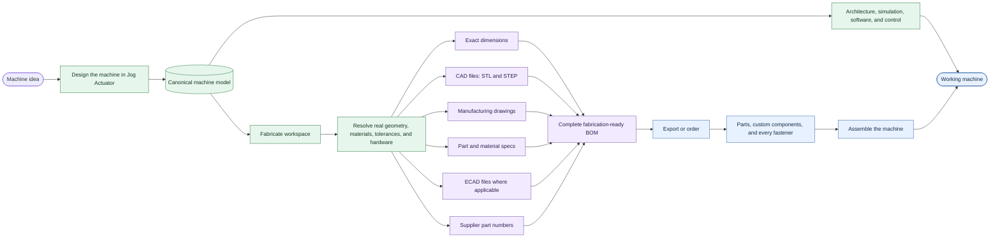

# RFD 16 - Next Gen Machine Design

In an internal conversation where we demo'd Jog Actuators, an important question was asked:

> So after you design your machine, do you order it from Jog Actuators and it comes with all the screws and everything?

The answer, of course, is no. But why not? Because it's hard! And how do we know it's hard? Because we've had to start building a hardware as code framework to allow us to design our own machine and ... oh.

## The Vision

So what would this look like? To establish a trajectory I decided to look back at what the current Jog Actuator platform accomplishes for the user.


### Without Jog Actuator


```mermaid
flowchart LR
    IDEA([Machine idea]) --> ARCH[System architecture]

    ARCH --> MECH[Mechanical concept]
    MECH --> CAD[Detailed mechanical CAD]
    CAD --> DOCS[Dimensions, drawings, and part specs]
    DOCS --> BOM[Build and reconcile the BOM]
    BOM --> SOURCE[Source parts and vendors]
    SOURCE --> FAB[Fabricate and buy parts]
    FAB --> ASSEMBLE[Assemble the machine]

    ARCH --> ELEC[Electrical design]
    ELEC --> WIRING[Schematics and wiring]

    ARCH --> CONTROL[Control architecture]
    CONTROL --> SIM[Build a simulation]
    SIM --> SOFTWARE[Write motion and control software]

    ASSEMBLE --> INTEGRATE[Integrate hardware and software]
    WIRING --> INTEGRATE
    SOFTWARE --> INTEGRATE
    INTEGRATE --> TEST[Test the machine]
    TEST -. Rework and repeat .-> ARCH

    classDef manual fill:#fff4e5,stroke:#b26a00,color:#3d2500;
    classDef outcome fill:#e8f1ff,stroke:#3568a8,color:#102a43;
    class ARCH,MECH,CAD,DOCS,BOM,SOURCE,FAB,ASSEMBLE,ELEC,WIRING,CONTROL,SIM,SOFTWARE,INTEGRATE manual;
    class TEST outcome;
```

### With Jog Actuator V1


```mermaid
flowchart LR
    IDEA([Machine idea]) --> JA[Design the machine in Jog Actuator]

    subgraph SOLVED[Handled by Jog Actuator]
        direction LR
        ARCH[Architecture] --> SIM[Simulation]
        SIM --> SOFTWARE[Software and control]
    end

    subgraph MANUAL[Low-level mechanical design is still manual]
        direction LR
        TRANSLATE[Translate the procedural frame into hardware]
        TRANSLATE --> CAD[Detailed CAD]
        CAD --> DOCS[Dimensions, drawings, and part specs]
        DOCS --> BOM[Build and reconcile the BOM]
        BOM --> SOURCE[Source parts and vendors]
        SOURCE --> FAB[Fabricate and buy parts]
        FAB --> ASSEMBLE[Assemble the machine]
    end

    JA --> ARCH
    JA --> TRANSLATE
    SOFTWARE --> INTEGRATE[Integrate and test]
    ASSEMBLE --> INTEGRATE
    INTEGRATE --> MACHINE([Working machine])

    classDef jog fill:#e7f6ec,stroke:#2d7d46,color:#12351f;
    classDef manual fill:#fff4e5,stroke:#b26a00,color:#3d2500;
    classDef outcome fill:#e8f1ff,stroke:#3568a8,color:#102a43;
    class JA,ARCH,SIM,SOFTWARE jog;
    class TRANSLATE,CAD,DOCS,BOM,SOURCE,FAB,ASSEMBLE manual;
    class INTEGRATE,MACHINE outcome;
```

### With Jog Actuator V2


```mermaid
flowchart LR
    IDEA([Machine idea]) --> DESIGN[Design the machine in Jog Actuator]
    DESIGN --> MODEL[(Canonical machine model)]

    MODEL --> RUNTIME[Architecture, simulation, software, and control]
    MODEL --> FABRICATE[Fabricate workspace]

    FABRICATE --> RESOLVE[Resolve real geometry, materials, tolerances, and hardware]
    RESOLVE --> DIMENSIONS[Exact dimensions]
    RESOLVE --> CAD[CAD files: STL and STEP]
    RESOLVE --> DRAWINGS[Manufacturing drawings]
    RESOLVE --> SPECS[Part and material specs]
    RESOLVE --> ECAD[ECAD files where applicable]
    RESOLVE --> PARTS[Supplier part numbers]

    DIMENSIONS --> BOM[Complete fabrication-ready BOM]
    CAD --> BOM
    DRAWINGS --> BOM
    SPECS --> BOM
    ECAD --> BOM
    PARTS --> BOM

    BOM --> ORDER[Export or order]
    ORDER --> KIT[Parts, custom components, and every fastener]
    KIT --> ASSEMBLE[Assemble the machine]
    RUNTIME --> MACHINE([Working machine])
    ASSEMBLE --> MACHINE

    classDef jog fill:#e7f6ec,stroke:#2d7d46,color:#12351f;
    classDef artifact fill:#f2ebff,stroke:#7251a5,color:#2f1b4d;
    classDef outcome fill:#e8f1ff,stroke:#3568a8,color:#102a43;
    class DESIGN,MODEL,RUNTIME,FABRICATE,RESOLVE jog;
    class DIMENSIONS,CAD,DRAWINGS,SPECS,ECAD,PARTS,BOM artifact;
    class ORDER,KIT,ASSEMBLE,MACHINE outcome;
```

### UX

A new Fabricate workspace shows me my machine not as the control / animation friendly procedurally generated frame, instead it's a *fully rendered machine*.

The gantry is a "real" cuboid composed of aluminum extrusions with either a belt rail, a linear actuator, or a toolhead rail (I choose via a UI component).

For custom parts, I can choose between 3D printed and CNC'd metal (aluminum or stainless steel) -- the app will recommend a material per part for the lowest cost that remains within the verified operating envelope based on machine size, weight, torque, and other template requirements. I can then have a third party manufacture them.

In the end, I get a beautiful BOM UI (with export options of course). Each item has CAD (STL + STEP), ECAD (if applicable), and a part number (if applicable).

## Product Premise

This is not an attempt to automate arbitrary mechanical engineering. The entire
Jog Actuator system is already organized around templated, verified machine
families. Fabricate extends those families from verified kinematics and control
into verified physical implementations.

The user supplies design intent inside a template's supported parameter space:
work envelope, payload, speed, accuracy class, environment, and discrete
options. Jog Actuator resolves that intent into an exact, versioned machine:
geometry, materials, manufacturing processes, interfaces, supplier parts,
fasteners, cables, firmware, and control limits.

The product inspiration is Prusa, not a general-purpose CAD marketplace. Prusa
makes its software and machine knowledge broadly available, but the commercial
product is the trusted physical implementation: official electronics, a
complete kit or assembled machine, excellent instructions, support, and a
long-lived upgrade path. Jog Actuator should take the same posture.

### Jog-compatible versus Original Jog

- A **Jog-compatible machine** may be assembled from open or community
  artifacts and modified freely. It may work with Jog software, but it does not
  carry Jog's promise that a particular physical configuration was verified.
- An **Original Jog machine** is built around an official Motion Core, generated
  from an official Machine Release, traceable through a machine passport,
  supported, calibratable, and upgradeable.

The files can remain inspectable, downloadable, repairable, and usable offline.
"Original Jog" records provenance and a support relationship; the passport
records the machine's current verification state. Neither is DRM.

## The Paid Nucleus: Jog Motion Core

The atomic commercial unit is not a PDF, a BOM export, or a referral to a parts
vendor. It is the **Jog Motion Core**: the official brain, safety spine, and
instrumented joints of a Jog machine.

A Motion Core contains:

- the Jog controller;
- integrated power distribution and safety hardware;
- the Jog smart gearboxes required by the released machine;
- standard Jog wiring harnesses, motor adapters, and boundary interfaces;
- one Machine Release for the configured machine, included in the hardware
  price;
- the exact firmware, controller configuration, simulation parameters, and
  control limits for that release;
- the fabrication package, BOM, assembly instructions, automated supplier
  ordering, and commissioning workflow; and
- ongoing access to firmware improvements, repair artifacts, compatibility
  releases, and support for that released machine.

This makes the purchasing decision legible. The user is not asked to pay for a
collection of generated files. They are buying the official control system that
turns the rest of the parts into a supported machine.

The Motion Core may be built and drop-shipped by a contract manufacturer. Jog
Actuator earns a hardware contribution or per-unit royalty without receiving,
stocking, or forwarding the product itself.

### The commodity motor boundary

The actual motor is deliberately outside Jog's proprietary hardware boundary.
It should be replaceable through a standard market path rather than becoming a
custom part that only Jog can supply. A motor is not arbitrary, however: every
supported motor has a qualified profile describing its electrical and thermal
limits, torque-speed curve, rotor inertia, shaft and flange interface,
commutation feedback, and brake characteristics when applicable.

The smart gearbox is the preferred place for Jog-specific sensing. Depending on
the machine family, it can contain output-position, load or torque, temperature,
vibration, identity, and calibration sensing. Its stable mechanical and
electrical interfaces allow the motor behind it to change without discarding
the sensing, calibration, or supported-machine identity.

The first smart gearbox generation uses:

- a magnetic output encoder for position and velocity feedback, calibration,
  and detection of lost motion or a stalled drive. An absolute encoder is
  preferred where cost and resolution permit;
- a temperature sensor for thermal derating and protective shutdown. Its
  location and trip thresholds must be explicit, and a gearbox temperature
  measurement must not be assumed to measure motor winding temperature;
- motor phase-current sensing in the drive electronics as a torque proxy. The
  estimator combines current with the selected motor profile, gear ratio,
  efficiency, and acceleration. It is useful for control and diagnostics but
  is not equivalent to a direct or safety-rated torque measurement; and
- a reserved mechanical, electrical, and software interface for a future
  direct output-torque sensor.

A sensor only becomes part of a safety function when the complete sensing,
logic, fault-detection, and stopping path has been assigned and validated to the
required safety performance. Merely including a temperature or position sensor
does not make it safety-rated.

Machinewright should model commodity motors as reusable specifications rather
than leaving their properties as unstructured assembly parameters. The model
has three distinct records:

1. **MotorSpec** contains the facts for an orderable motor SKU: manufacturer,
   part number and datasheet revision; mount, pilot, shaft, key or flat, length,
   mass, and inertia; motor type and phases; voltage, current, resistance, and
   inductance; continuous and peak torque and speed; torque and back-EMF
   constants; feedback and connector details; brake characteristics; and
   thermal limits, model, sensor, insulation class, and ambient range.
2. **MotorRequirement** describes what a smart gearbox, drive, or machine-axis
   slot accepts. It contains constraints and tolerances rather than identifying
   a particular vendor part.
3. **MotorQualification** records the evidence that a specific MotorSpec,
   driver, smart gearbox, and duty cycle were tested together. It belongs to a
   Jog Machine Release rather than the generic Machinewright component catalog.

Compatibility therefore means more than matching a NEMA frame. A candidate
motor must satisfy the MotorRequirement and either have existing qualification
evidence for the released combination or pass the required qualification
process.

The test for inclusion in the Motion Core is: **must this item come from Jog for
the machine to retain its supported identity?** Components inside the Core do
not all need to be invented or manufactured by Jog. Power and safety
subcomponents may be standard parts, for example, but the integrated assembly
is supplied under Jog's part number and verification responsibility.

### Machine Release and machine passport

Purchasing a Motion Core includes one serialized machine passport and its
initial release. The user can iterate freely before releasing it for
fabrication. Pressing **Release for fabrication** freezes a reproducible
physical revision and creates a machine passport:

```text
Machine: 3-Axis Jog Gantry
Machine serial: JA-G3-000184
Controller serial: JC-2-008912
Mechanical release: 1.2.0
BOM revision: 2026-08-22.3
Runtime configuration: 1.8.1
Verified envelope: 600 x 400 x 150 mm
Verified payload: 4 kg
```

The passport ties together the as-designed machine, its controller, the exact
parts ordered, the firmware loaded, calibration results, support history, and
future upgrade compatibility. It can be recovered from the controller serial,
but the machine must not require a cloud connection to operate.

The following do not require a new purchase or release fee:

- regenerating artifacts for the same physical release;
- replacing an unavailable supplier SKU with a pre-verified equivalent;
- downloading firmware or control improvements;
- rebuilding the same machine; or
- replacing a failed controller and transferring the passport.

The owner may modify the machine as much as they want. **Original Jog** records
provenance; it is never retroactively taken away. Verification is a separate,
current state recorded in the passport:

- **Original Jog -- Verified** matches an official or requalified release.
- **Original Jog -- Modified** contains owner changes outside the release's
  verified envelope. It remains usable, but Jog does not represent the changed
  configuration as verified.
- **Original Jog -- Reverified** is a modified machine that has passed the
  applicable qualification and commissioning process again.

Changes inside the published parameter space of an official template create a
verified owner revision without a special upgrade fee; the owner pays only for
the physical parts they choose to change. A custom change that requires human
engineering or qualification may be purchased as a professional service, but
the customer is never charged merely for permission to modify or operate the
machine.

When Jog publishes a materially improved official machine generation, adoption
is optional and may be sold as an **Upgrade Release**. The charge represents a
real deliverable: compatibility analysis, a delta BOM, conversion instructions,
a new verified envelope, and recommissioning. It should be included or credited
when the customer purchases the associated physical upgrade kit. The prior
release remains usable and repairable without purchasing the new generation.

## Three Product Phases

These phases are an introduction sequence, not replacements. Once all three
exist, users choose between Motion Core, kit, and assembled-machine products in
the same way Prusa customers choose the degree of assembly they want.

### Phase 1: Original Jog Motion Core

> Buy the official brain, safety spine, and instrumented joints of your
> machine. Jog coordinates everything else required to build it.

The customer buys the controller, integrated power and safety assembly, smart
gearboxes, and included Machine Release from Jog Actuator. Qualified commodity
motors and the rest of the resolved third-party BOM are divided among approved
suppliers. Jog refreshes pricing and availability, creates supplier-ready
orders, and shows unified order state and tracking. The suppliers remain
sellers of record for those third-party parts and ship directly to the
customer.

Multiple invoices, delivery dates, and boxes are acceptable in this phase. The
promise is that every required item is present and coordinated, not that a
single box arrives at the door.

Jog earns money from:

- controller, power and safety assembly, and smart gearbox contribution;
- accessories and replacement Jog components; and
- optional negotiated supplier rebates that must never influence engineering
  recommendations.

There is no separate Machine Release charge. Coordinated ordering is part of
the Motion Core experience and a conversion mechanism for Jog hardware.

Phase 1 is complete when:

1. several outside users build materially different configurations without a
   missing fastener, cable, manufactured part, or undocumented tool;
2. supplier orders require no routine manual intervention from Jog;
3. the controller recognizes each smart gearbox, loads the selected commodity
   motor profile, and commissions the released machine; and
4. each completed machine meets its released travel, payload, and motion
   limits.

### Phase 2: Original Jog Machine Kit

> Everything required to assemble the machine arrives as a complete kit.

The same released machine becomes a single purchasable product. It includes:

- the Motion Core;
- extrusions cut and machined to length;
- rails, bearings, belts or leadscrews, brackets, and structural hardware;
- custom printed and CNC parts;
- electronics, cables, and connectors;
- unusual or machine-specific assembly tools;
- fasteners bagged and labeled by assembly step;
- a spare-fastener bag;
- a preconfigured controller; and
- printed quick-start material backed by detailed, versioned online
  instructions.

A fulfillment or contract-manufacturing partner receives the Resolved Kit,
procures or receives its components, verifies quantities, bags the hardware,
and ships it. Jog should not operate this warehouse. Long extrusions may still
arrive as a coordinated second package when oversize shipping makes literal
one-box fulfillment wasteful.

The customer sees one kit price, with Jog as seller of record for the
standardized Original Jog kit. Behind it, Jog receives its Motion Core
contribution and kit margin; the contract manufacturer or fulfillment partner
is paid for procurement, kitting, and shipping without Jog operating the
warehouse.

Assembly is part of the product, not documentation added at the end. Parts are
grouped by chapter, every fastener is visually identifiable, and the Fabricate
workspace can animate the current step. Once powered, the controller helps
verify wiring, gearbox identity, motor profile, direction, travel, limits, and
calibration. A successful commissioning run marks the machine passport as
built.

Phase 2 is complete when:

1. someone unfamiliar with the design can complete the machine using only the
   supplied kit and instructions;
2. the kit requires no unrecorded fabrication operations or tools;
3. shortages and incorrect parts are rare, measured, and handled by the
   fulfillment partner; and
4. the completed machine passes the same automated acceptance test as the
   reference build.

### Phase 3: Original Jog Machine Platform

> Buy it as a Motion Core, buy it as a kit, or buy it assembled -- and upgrade
> it instead of replacing it.

Three product forms now coexist:

1. **Motion Core** for advanced users who want to source the structure
   themselves.
2. **Complete Kit** for users who want every part but prefer to perform the
   assembly or pay less.
3. **Assembled and Tested** for users who want a certified partner to build,
   wire, calibrate, and acceptance-test the machine before shipment.

The assembled product ships with its mechanical and electrical work complete,
controller provisioned, calibration recorded, factory acceptance results
attached, and machine passport marked with its as-built state. A certified
regional partner is normally seller of record and warrants its assembly,
installation, and site-specific work. Jog provides and warrants the Motion
Core, designs, test procedures, control system, and supported configuration.

The installed base becomes an upgrade business. Examples include:

- a larger work envelope;
- a higher-payload axis;
- belt-to-leadscrew conversion;
- an additional rotary axis;
- a new toolhead or end-effector interface;
- a safety enclosure;
- a higher-power controller module; or
- a new smart gearbox generation.

An Original Jog Upgrade contains the necessary physical components, a delta BOM
rather than a new full BOM, conversion instructions, an updated Machine
Release, new simulation and control limits, and a recommissioning procedure.
Software improvements remain free; revenue comes from meaningful hardware
upgrades, spares, professional support, and additional machines.

## Supply Chain Is an Implementation Detail

Supplier-managed availability is not a fourth product or a customer-facing
phase. It is infrastructure that matures underneath the three products:

- Phase 1 uses build-to-order direct shipment from suppliers.
- Phase 2 adds cross-docking, quantity verification, and kit consolidation.
- Phase 3 adds selective safety stock, regional fulfillment, long-lived spares,
  and certified assembly capacity.

Jog may never hold inventory. That does not mean inventory disappears; it means
the supplier, contract manufacturer, or fulfillment partner holds it under a
commercial agreement. Shorter promised lead times will require someone in the
network to carry an appropriate buffer.

The procurement system should generate a versioned Resolved Kit containing
exact manufacturer part numbers, preferred supplier SKUs, pre-verified
alternates, quantities, custom manufacturing files, material/process/finish,
inspection requirements, substitution policy, and fulfillment route. A master
order fans out into supplier suborders, while the user sees one machine-level
state.

## Commercial Roles and Seller of Record

Seller of record is not merely an accounting implementation detail. It
determines who owns checkout, collection, refunds, chargebacks, tax handling,
the primary warranty interaction, and the commercial customer relationship.
The intended split is:

1. **Motion Core:** Jog is seller of record and warrantor.
2. **Complete Kit:** Jog is seller of record and presents one price and one
   customer promise. A contract manufacturer or fulfillment partner procures,
   kits, and drop-ships as Jog's operational partner.
3. **Assembled or site-integrated machine:** a certified regional partner is
   normally seller of record and warrants assembly, installation, and
   site-specific integration. Jog remains the supplier and warrantor for the
   Motion Core and the design authority for the released configuration.

This split gives Jog a direct, Prusa-like product relationship for repeatable
products while placing local application and installation responsibility with
the party performing that work. Changing the name on the invoice does not by
itself transfer product-safety, warranty, or manufacturer responsibility.

Before Phase 2, the operating agreements must explicitly allocate:

- title, inventory ownership, and risk of loss;
- sales-tax collection, registrations, and exemption certificates;
- product, component, and workmanship warranties;
- returns, chargebacks, replacement fulfillment, and recalls;
- product-liability insurance and indemnification;
- customer support and escalation ownership;
- control of engineering changes and substitutions; and
- whether revenue is recognized gross or net under the applicable
  principal-versus-agent analysis.

The exact legal entities and market-specific tax treatment require review by
qualified accounting and legal counsel. They do not change the desired product
and customer-responsibility boundary above.

Selecting specific contract manufacturers, fulfillment providers, or regional
integrators is intentionally deferred. Jog should begin selection only after
the Motion Core and Resolved Kit have survived multiple external reference
builds without routine engineering intervention. Before that gate, the work is
to define the partner capability, quality, insurance, tax, data, and service
requirements and the package Jog will provide to prospective partners.

## Original Jog Qualification and Acceptance

There is no single universal certification for every Jog machine family.
Original Jog therefore uses a layered evidence model and pins the applicable
standards, jurisdictions, test procedures, and pass criteria into each release.

Qualification policy is owned by the machine-family template. The template
contains parameterized test definitions, formulas, allowable ranges,
measurement methods, and applicability rules. Generating a Machine Release
resolves those rules into immutable numeric thresholds for the exact machine.
Running the tests records measurements, equipment, timestamps, and pass/fail
results in the machine passport:

```text
Machine-family template: test rules and formulas
             -> Machine Release: resolved numeric thresholds
             -> Machine passport: measured results and evidence
```

Qualification tests and production-acceptance tests are separate collections
in the template. The former establishes that a design release is valid; the
latter determines whether each physical instance was built correctly.

### Design qualification: once per machine release

The design authority records at least:

- a risk assessment and resulting risk-reduction measures;
- intended use, reasonably foreseeable misuse, and prohibited use;
- structural load, stiffness, deflection, payload, and stability results;
- speed, accuracy, repeatability, thermal, and endurance results;
- safety-function analysis, required performance levels, and fault-injection
  results;
- electrical, grounding, overcurrent, environmental, and EMC evaluation; and
- the exact critical components, allowed equivalents, control limits, and
  firmware configuration.

The baseline standards profile should normally include
[ISO 12100](https://www.iso.org/standard/51528.html) for machinery risk
assessment, [ISO 13849-1](https://www.iso.org/standard/73481.html) for
safety-related control systems, and
[IEC 60204-1](https://webstore.iec.ch/en/publication/26037) for machine
electrical equipment, plus machine-specific and jurisdiction-specific
requirements. A UL 508A-certified panel may form part of the evidence in North
America, but panel certification does not certify the complete machine.

### Production acceptance: every physical machine

Every assembled Original Jog machine must pass and record:

- exact BOM, component revision, and serial-number capture;
- inspection of critical dimensions, joints, and fastener torque;
- protective-earth, insulation, and applicable electrical tests;
- wiring, gearbox identity, motor-profile, direction, and homing checks;
- emergency-stop, limit, guard, interlock, and relevant fault-response tests;
- calibration plus loaded travel, accuracy, and repeatability tests; and
- a representative cycle or burn-in appropriate to the machine family.

The signed result becomes part of the machine passport. Site-integrated
machines also require a site acceptance test for the actual utilities,
environment, guarding, tools, neighboring equipment, and intended application
before production use.

### Partner qualification: initially and continuously

A partner may apply the Original Jog designation only to a controlled release
built under an approved process. Qualification requires:

- trained, named technicians and clearly assigned responsibilities;
- first-article approval for each machine family;
- controlled work instructions and calibrated tools and test equipment;
- incoming-component, build, firmware, and serial traceability;
- a nonconformance and corrective-action process;
- periodic process audits and sample retesting; and
- requalification after a material component, process, facility, or personnel
  change.

The machine passport separates immutable provenance from current status. A
machine built and accepted under this system is **Original Jog -- Verified**.
Owner modifications do not erase its provenance, but changes outside the
released envelope make it **Original Jog -- Modified** until the relevant
qualification and acceptance tests are passed again.

Each market profile must also identify when a modification changes the legal
manufacturer or triggers a new conformity assessment. For example, the
[EU Machinery Regulation](https://eur-lex.europa.eu/legal-content/EN/TXT/?uri=celex%3A32023R1230)
treats some unplanned safety-affecting changes as substantial modifications and
assigns manufacturer obligations to the party making them.

## Repair Continuity and Legacy Support

Jog's lifecycle promise is: **no Original Jog machine will be intentionally
orphaned.** Indefinite support means preserving a practical repair path, not
warehousing every historical component forever.

The promise has three layers:

1. **Permanent digital availability.** Machine passports, releases, firmware,
   wiring diagrams, calibration and diagnostic procedures, manufacturing
   artifacts, and known-equivalent data remain available indefinitely and do
   not require a subscription to retrieve or use.
2. **Guaranteed physical service period.** Jog-specific spares or functional
   equivalents remain orderable for at least ten years after the last sale of a
   machine generation.
3. **Continuity after the guaranteed period.** For as long as Jog operates, it
   provides at least one documented route: component repair, a verified
   equivalent, build-to-order manufacture, or migration to a current
   component.

Compatibility firmware, adapter designs, and release regeneration required
solely because a Jog-specific component became obsolete are free. Customers pay
for the physical replacement, manufacturing, and shipping. Legacy
build-to-order parts may use transparent cost-plus pricing; optional upgrades
that add performance or capability carry normal commercial margin. Warranty
replacements remain governed by the applicable warranty.

The initial Motion Core warranty cannot be deferred: before the first sale, Jog
must define its duration, covered components, treatment of user assembly and
modification, replacement workflow, and responsibility for shipping. The exact
legacy cost-plus formula, end-of-life notice period, last-time-buy process, and
post-guarantee manufacturing terms are later-stage decisions that must be made
before discontinuing the first hardware generation.

Jog, rather than any single partner, owns this continuity promise. Partner
agreements must return or transfer tooling, manufacturing records, test
fixtures, calibration data, and supplier information when the relationship
ends.

### End-of-support artifact policy

The purpose of the artifact policy is to let a qualified owner or third party
repair or reproduce a Jog-specific component if Jog or a critical supplier can
no longer provide it. Direct publication is preferred over escrow:

1. **Always downloadable:** mechanical and electrical interface drawings,
   communication protocols, the motor-profile schema, wiring diagrams,
   released BOMs, firmware binaries, calibration procedures, diagnostic
   procedures, and user-service documentation.
2. **Published when a Jog-specific part becomes unsupported:** sufficient STEP
   files and manufacturing drawings, PCB fabrication outputs, build
   instructions, test-fixture designs, calibration-fixture designs, and
   firmware source or build instructions to reproduce or replace the part.
3. **Escrow only by exception:** a neutral third party may hold artifacts that
   cannot be published earlier because of certification constraints, security
   considerations, or third-party license terms. The agreement releases them
   upon defined events such as Jog's dissolution, cessation of support without
   a replacement path, or failure of a critical sole-source partner.

Active signing keys, customer data, and material Jog has no right to
redistribute are never published. Security continuity should use a documented
recovery or successor-signing mechanism rather than disclosure of an active
private key. Every production Jog-specific component must have an artifact
inventory that identifies what is public, what becomes public at end of
support, what is escrowed, and what cannot legally be transferred.

The architecture should make the promise cheaper over time through qualified
commodity motors, stable mechanical and electrical interfaces, versioned
protocols, reproducible releases, advance end-of-life notices, and retained
legacy test fixtures.

## Commercial and Product Principles

1. **Sell the differentiated nucleus.** Jog's durable margin comes from the
   controller, integrated power and safety system, smart gearboxes, verified
   machine knowledge, commissioning, and lifecycle -- not proprietary motors
   or marked-up commodity screws.
2. **Bundle the release with the hardware.** A Motion Core purchase includes
   the software and artifacts required to make it useful.
3. **Keep operation open and offline.** A released machine remains usable,
   repairable, and inspectable without a subscription or cloud connection.
4. **Charge for physical progress and verified migration.** General firmware
   and obsolescence-driven compatibility work are free. Meaningful upgrade
   hardware, an optional major-generation Upgrade Release, additional
   capabilities, spares, and additional machines are products.
5. **Keep recommendations economically neutral.** Supplier commissions are
   optional upside and must not change which verified component Jog recommends.
6. **Keep partners on the operational boundary.** Suppliers, contract
   manufacturers, and fulfillment partners should execute purchasing
   exceptions, kitting, shipping, returns, and replacement fulfillment under
   defined service levels. Jog retains the customer promise when it is seller
   of record.
7. **Preserve the machine across time.** Every design, order, calibration,
   repair, and upgrade is attached to the machine passport and can be
   reproduced from its release history.
8. **Keep provenance and verification distinct.** Owners may modify their
   machines without permission. The passport communicates whether the current
   configuration is Verified, Modified, or Reverified.

## Non-goals

- General-purpose or arbitrary-machine CAD generation.
- Jog-operated bulk component inventory or a Jog warehouse.
- A proprietary Jog motor when a qualified standard-market motor can satisfy
  the interface and verified operating envelope.
- Becoming a general industrial-parts marketplace.
- Requiring a subscription or cloud authorization to operate purchased
  hardware.
- Promising that every historical physical part will remain stocked forever;
  the promise is a documented repair or migration path.
- Automatically substituting structural, electrical, or interface-critical
  parts outside a pre-verified equivalence set.

## Implementation Decisions and Phase Gates

The product-policy questions are resolved. The remaining work is attached to
explicit implementation or commercial gates:

1. **First smart gearbox:** implement the magnetic output encoder, temperature
   protection, current-based torque estimate, and expansion interface for a
   future direct torque sensor. Assign safety functions only after validating
   the complete safety path.
2. **Before automated motor selection:** add MotorSpec and MotorRequirement to
   Machinewright, then attach MotorQualification evidence to Machine Releases.
3. **After repeatable external reference builds:** evaluate and select contract
   manufacturing, fulfillment, and regional integration partners against the
   requirements defined in this RFD.
4. **For each machine-family template:** define parameterized qualification and
   production-acceptance tests. Resolve their numeric thresholds into each
   release and store the measured evidence in its passport.
5. **Before the first Motion Core sale:** approve the component warranty and
   replacement policy. Before the first end-of-life announcement, approve the
   legacy pricing, notice, last-time-buy, and post-guarantee support terms.
6. **Before production release of each Jog-specific component:** create its
   repair-artifact inventory and ensure that its public, end-of-support, and
   exceptional escrow classifications are complete.
