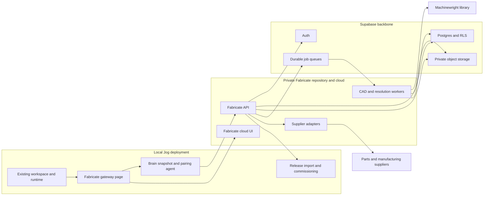
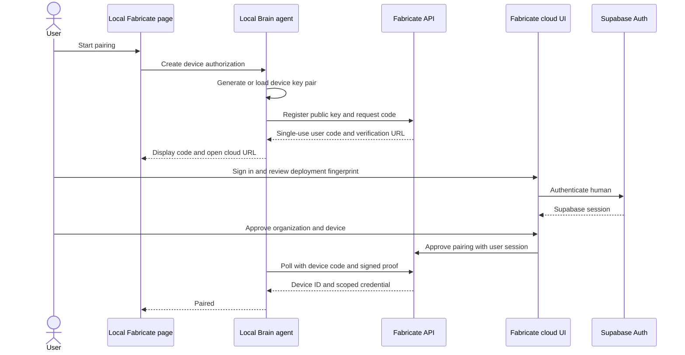
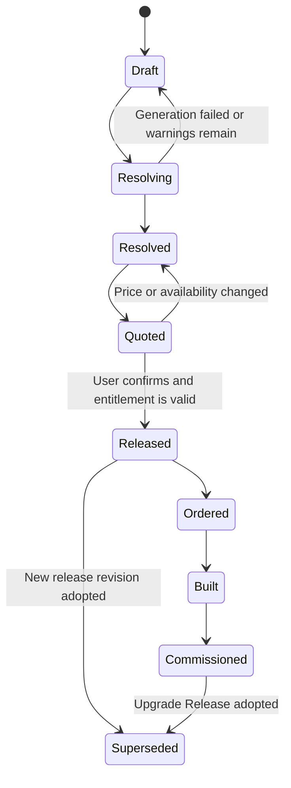
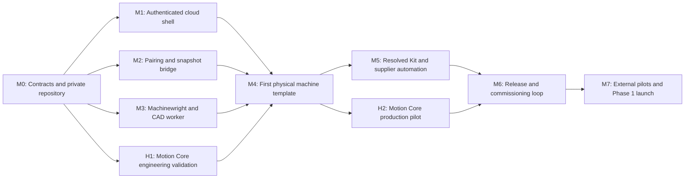

# RFD 18 - Roadmap to Fabricate Phase 1

Status: Draft

## Summary

[RFD 16](RFD-16.md) defines Phase 1 as the Original Jog Motion Core plus a coordinated path
to every third-party component required to build and commission one verified
machine. Reaching that phase requires more than adding CAD export to the local
Jog UI. It requires a cloud product, a deterministic fabrication backend, a
versioned bridge from local Jog deployments, a machine-component model in
Machinewright, supplier resolution and ordering, and an immutable Machine
Release and passport lifecycle.

Fabricate will be developed in a separate, strictly private repository and
delivered as a cloud application. Supabase will provide human authentication,
Postgres, Row Level Security, private object storage, and the durable job queue.
Dedicated Fabricate workers will perform CAD, BOM, rendering, and resolution
jobs that are too CPU- and memory-intensive for edge functions.

The existing local Jog workspace remains unchanged. The only new product
surface in the local UI is a **Fabricate** route that pairs the deployment,
uploads an explicitly selected machine snapshot, shows connection state, and
opens the authenticated cloud workspace. Existing design, jog, teach, program,
G-code, and local-authentication behavior continue to operate without Fabricate
or an Internet connection.

## Phase 1 Product Outcome

Phase 1 is complete for at least one official machine family when a customer
can:

1. design a machine locally from a supported Jog template;
2. pair the local Jog deployment with a Fabricate account;
3. upload a versioned, minimal machine snapshot intentionally;
4. resolve that snapshot into real geometry, materials, motors, smart
   gearboxes, fasteners, wiring, manufactured parts, and supplier parts;
5. inspect a rendered machine, fabrication package, and complete BOM;
6. buy a Motion Core from Jog and initiate coordinated supplier orders for the
   remaining parts;
7. freeze an immutable Machine Release and download a complete offline archive;
8. assemble the machine without missing parts, undocumented fabrication, or
   undocumented tools; and
9. load the released runtime configuration into the local controller and pass
   commissioning and acceptance tests.

Phase 1 permits multiple sellers, invoices, shipments, and delivery dates. It
does not require the single-box kit or assembled-machine operations described
by later phases in RFD 16.

## Product and Architecture Principles

1. **The local machine remains local-first.** Fabricate may derive artifacts
   from a machine but cannot remotely jog, run, stop, or reconfigure it.
2. **Uploading is explicit.** Jog uploads a versioned snapshot chosen by the
   local user, not the controller filesystem, programs, telemetry, credentials,
   or an ambient stream of machine state.
3. **The cloud is optional after release.** A released machine continues to
   operate, commission, and expose its downloaded release archive without a
   Fabricate session.
4. **The paywall is server-side.** Private source code and a hidden navigation
   item are not authorization. Every paid operation and artifact grant is
   checked by the Fabricate API and backed by an entitlement record.
5. **Generation is deterministic and traceable.** The same inputs and pinned
   dependency versions produce the same logical assembly, BOM, and release
   manifest.
6. **Machinewright stays generic.** It provides reusable hardware-as-code
   primitives and contracts; it does not learn Jog pricing, entitlements,
   official machine policy, or supplier relationships.
7. **Fabricate owns product opinion.** Official machine-family fabrication
   templates, qualified combinations, sourcing policy, release semantics, and
   customer workflows belong to the private Fabricate product.
8. **Start with one narrow machine family.** Phase 1 should prove a complete
   path for one family before broadening the template catalog. The existing
   three-axis gantry is the default candidate unless a separate product decision
   selects another family.

## Current State and the Missing System

The current repository already provides useful foundations:

- a React and Vite UI with
  [authenticated routes](../ui/src/App.tsx) and a
  [global side navigation](../ui/src/components/AppToolbar.tsx);
- a self-hosted Brain API, SQLite persistence, and local user authentication;
- a canonical
  [`MachineDescription`](../brain/brain/models/machine.py) containing a pinned
  template reference, DH-chain values, end-effector data, and actuator bindings;
- versioned runtime templates and generated URDF;
- a Python [`cad/`](../cad/) package containing the Jog smart-gearbox assembly;
- Machinewright as the CAD object, assembly, material, export, print-layout,
  and BOM foundation; and
- a containerized local deployment containing the UI, Brain, sidecar, and
  simulator.

The current `cad/` package is nevertheless a developer CLI consumer of
Machinewright. It is not multi-tenant, asynchronous, version-addressed,
resource-isolated, or exposed through an authenticated API. Its BOM is an
export, not yet the resolved commercial and release object required by
Fabricate. The existing local Brain token also represents a local user and must
not be accepted as a cloud identity.

## Repository and Ownership Boundaries

Three repositories participate in the system.

| Repository | Visibility | Owns | Does not own |
| --- | --- | --- | --- |
| `smart-actuator` | Existing visibility | Local runtime UI; Fabricate gateway page; local device key; explicit Machine Snapshot export; scoped cloud client; release import; local commissioning; controller, smart-gearbox, sidecar, and actuator protocol firmware | Cloud UI; supplier integrations; pricing; entitlements; Fabricate CAD jobs |
| `machinewright` | Existing visibility | Generic CAD objects and assemblies; component and interface specifications; materials, processes, tolerances, inspection metadata; deterministic assembly and structured BOM primitives; generic exporters | Jog machine families; qualified Jog combinations; live supplier data; releases; accounts; ordering |
| `fabricate` | Strictly private | Cloud web app; Fabricate API and workers; extracted Jog-specific CAD; official fabrication-template extensions; component qualification; catalogs and suppliers; jobs and artifacts; entitlements; orders; releases and passports; Supabase migrations and deployment | Local motion control and runtime safety |

The private-repository boundary protects implementation and commercial data,
not protocol secrecy. A minimal versioned Machine Snapshot and release-transfer
contract must ship in the local deployment and is therefore observable. No
authorization decision may depend on hiding that contract.

The `fabricate` repository must not be a Git submodule or build-time requirement
of the self-hosted Jog image. A network outage, Fabricate deployment failure, or
loss of Fabricate entitlement cannot break the current local product.

An initial private-repository layout is:

```text
fabricate/
  web/                 Cloud React application
  api/                 FastAPI control plane and OpenAPI source
  worker/              CAD, render, resolution, and supplier workers
  domain/              Snapshot, assembly, BOM, release, and passport models
  templates/           Private Jog fabrication-template extensions
  hardware/            Jog-specific CAD migrated from the current cad module
  suppliers/           Supplier capability adapters and normalized contracts
  supabase/             Migrations, RLS, storage policies, queues, and seeds
  deploy/               Container, environment, and observability definitions
```

## Target System



### Cloud application shape

The private repository deploys three independently scalable processes:

1. **Fabricate Web** is the authenticated browser application.
2. **Fabricate API** is the control plane for authorization, projects, pairing,
   snapshots, jobs, catalogs, orders, releases, and signed artifact access.
3. **Fabricate Worker** is a containerized Python process with Machinewright,
   CadQuery, OpenCascade, renderers, and supplier-resolution code.

The default implementation reuses the existing languages: React and
TypeScript for Fabricate Web, Python and FastAPI with Pydantic contracts for the
API, and Python for workers. The API publishes versioned OpenAPI and generates
its browser and local clients so hand-written request types cannot drift. This
is an implementation default rather than part of the wire contract.

CAD generation must not execute synchronously inside an HTTP request or a
Supabase Edge Function. Supabase currently directs heavy, long-running work to
background workers, and its hosted Edge Functions have tight CPU, memory, and
wall-clock limits. Fabricate uses
[Supabase Queues](https://supabase.com/docs/guides/queues) for durable work
messages and separately hosted workers for the actual computation. Edge
Functions remain optional for short webhooks or orchestration.

### Supabase responsibilities

Supabase is the Fabricate backbone for:

- human signup, login, account recovery, and optional MFA;
- organizations and memberships rooted in `auth.users`;
- Postgres records and transactions;
- Row Level Security as defense in depth between organizations;
- private machine-input, generated-artifact, and release-archive buckets;
- durable background queues; and
- migrations and reproducible development, staging, and production schemas.

Supabase Auth JWTs identify human browser sessions. The Fabricate API verifies
them using the project signing keys and then applies organization membership,
role, entitlement, and resource-ownership checks. RLS is enabled on every
tenant-owned table and storage bucket. Authorization data must not be derived
from user-editable metadata. Supabase documents the intended combination of
[Auth and RLS](https://supabase.com/docs/guides/database/postgres/row-level-security)
and supports server-managed claims through
[custom access-token hooks](https://supabase.com/docs/guides/auth/auth-hooks/custom-access-token-hook).

Service-role credentials exist only in the API and worker secret stores. They
are never shipped to the browser or local Jog deployment. Database changes are
made only through version-controlled migrations and promoted through separate
development, staging, and production projects, following the
[Supabase migration workflow](https://supabase.com/docs/guides/deployment/database-migrations).

### Initial cloud data model

The first schema contains, at minimum:

- `organizations` and `organization_members`;
- `device_authorizations`, `devices`, and `device_keys`;
- `entitlements` and their grant or consumption history;
- `machine_projects` and immutable `machine_snapshots`;
- `fabrication_jobs` and `artifact_sets`;
- `machine_releases`, `release_artifacts`, and `machine_passports`;
- `component_specs`, `qualified_components`, and `part_equivalences`;
- `bom_items`, `supplier_parts`, and quote observations;
- `order_groups`, `supplier_orders`, and `shipments`; and
- append-only `audit_events` for security and release-significant actions.

Machine files are blobs, not Postgres rows. They live in private Storage paths
partitioned by organization and project, use content-addressed names, and are
accessed through short-lived signed URLs. Large uploads use resumable upload
support. Supabase provides both private buckets and
[signed or resumable uploads](https://supabase.com/docs/guides/storage/uploads/resumable-uploads).
Signed URLs are restricted to one object and kept short-lived because an
already issued URL remains usable until it expires even if the human session is
subsequently revoked.

## The Local Fabricate Page

The local UI adds one route and one navigation item: **Fabricate**. No existing
workspace is restructured around it.

The local page is a gateway, not a locally bundled copy of the private
application. It provides:

- Fabricate connection and entitlement status;
- the cloud account and organization currently paired to this deployment;
- an explicit machine selector and **Send snapshot to Fabricate** action;
- upload progress, the resulting cloud project link, and recoverable errors;
- device revocation and re-pairing; and
- an **Open Fabricate** action that opens the cloud application;
- release download, signature verification, configuration diff, and explicit
  local apply; and
- commissioning and acceptance workflows that must interact with local
  hardware.

All Phase 1 local UI additions remain beneath `/fabricate`; the navigation item
is the only visible change outside that route. Cloud-only design, BOM, order,
and release-management surfaces remain in Fabricate Web.

The initial integration uses a top-level cloud page, in the same or a new tab,
rather than loading remote JavaScript into the local UI origin. Remote code
executing with the local page's privileges could read the Brain token and reach
local machine APIs. A cross-origin iframe provides better code isolation but
creates authentication, cookie, framing-policy, and variable-local-origin
problems. It may be added later only as a sandboxed presentation layer with a
small, allowlisted `postMessage` protocol. It must never receive the local Brain
token or gain direct motion-control access.

The private web bundle is necessarily downloaded by authenticated browsers and
must contain no secrets. Source-repository privacy protects development and
server implementation; the Fabricate API and entitlements enforce the product
boundary.

## Human Identity, Device Identity, and Entitlements

Fabricate has three separate concepts:

- **Local user:** authenticated only to the self-hosted Brain under the existing
  local account system.
- **Fabricate user:** authenticated in the cloud by Supabase Auth and associated
  with one or more Fabricate organizations.
- **Jog deployment:** a revocable device identity belonging to an organization,
  represented by a locally held key pair rather than a human refresh token.

The local Brain's self-issued JWT is never exchanged for a Supabase session and
is never accepted by the Fabricate API. Conversely, a Supabase user token is not
stored in `/data` or accepted as authority to control the local machine.

### Pairing flow

The Fabricate API implements a narrow device-authorization flow modeled after
OAuth device authorization rather than assuming that Supabase human auth also
solves device identity:



The device private key is generated locally, stored in the persistent data
volume with restrictive permissions, and never uploaded. Pairing codes are
short-lived and single-use. After pairing, the Brain exchanges a signed
challenge for short-lived device access tokens scoped initially to:

- create and upload snapshots for its organization;
- read status for jobs created from those snapshots; and
- download signed release packages explicitly assigned to the deployment.

The flow uses outbound HTTPS only. Fabricate never requires port forwarding,
an inbound tunnel, or cloud access to the local Brain. Devices can be named,
audited, rotated, and revoked from both the local page and cloud account.

### Entitlement model

Supabase Auth answers **who is this?** An entitlement answers **may this account
perform this paid Fabricate operation?** Initial entitlement records should
support:

- development and internal-test access;
- pilot access granted administratively;
- a Motion Core purchase that includes one machine passport and initial
  Machine Release;
- ownership of a released machine and perpetual access to its release archive;
- an optional future Upgrade Release; and
- support or partner roles that do not imply ownership.

The API checks entitlement on project creation, generation, release, ordering,
and artifact-download grants as appropriate. User interfaces may mirror the
result but are never the enforcement point. Draft-generation access may expire;
ownership access to an already purchased and released machine does not.

A commerce provider is an adapter behind the entitlement service. Pilot users
may be provisioned manually, but a public Phase 1 launch requires the Motion
Core order or payment webhook to issue the release entitlement automatically.

## Machine Snapshot Contract

The local deployment uploads a `MachineSnapshotV1`, not its SQLite database or
arbitrary `/data` directory. The manifest contains:

- snapshot schema version and capability flags;
- local deployment ID and machine ID;
- the exact runtime template identity, semantic version, content hash, and
  source reference;
- the canonical `MachineDescription` values;
- a copy or canonical serialization of the referenced runtime template;
- expanded URDF as diagnostic evidence, not trusted source of truth;
- installed Brain, controller, firmware, and actuator protocol versions;
- Jog hardware serials when available, excluding network addresses and local
  secrets;
- explicitly selected attachments; and
- a content digest and signature from the paired device key.

The default snapshot excludes local users, passwords, tokens, saved programs,
G-code, general file uploads, logs, network addresses, and telemetry. The API
enforces schema, size, path, media-type, and decompression limits before any
worker processes an attachment.

Snapshots are immutable. Uploading again creates a new snapshot linked to the
same cloud project. The contract has its own version independent of the Brain,
Fabricate, and Machinewright versions. Both sides negotiate supported versions
and return actionable upgrade guidance instead of silently coercing unknown
fields.

Runtime templates remain part of the local, inspectable machine definition.
Fabricate adds a private fabrication extension keyed by the runtime template's
publisher, ID, version, and content hash. The private extension adds physical
structure, resolution rules, qualified components, and acceptance policy; it
must not redefine the uploaded kinematics unnoticed.

## Fabricate API and Job Model

The Fabricate API owns these public resource groups:

- account, organization, membership, and entitlement views;
- device authorization, device status, and revocation;
- machine projects and snapshot upload tickets;
- fabrication jobs, progress, warnings, failures, and artifacts;
- resolved assemblies, rendered previews, and BOM views;
- supplier availability, quotes, alternates, and order groups;
- Machine Release and passport actions; and
- signed downloads and release transfer back to the local deployment.

Every mutating endpoint accepts an idempotency key. Long operations create a
job record and queue message within one database transaction. Workers claim
jobs with a visibility timeout, emit structured progress, and either archive or
retry messages safely. Jobs are cancellation-aware and resource-limited.

### Resolution pipeline

A successful generation job performs:

1. validate and canonicalize the Machine Snapshot;
2. locate the exact private fabrication-template extension;
3. resolve design intent into a versioned physical assembly graph;
4. select smart gearboxes, qualified commodity motors, power and safety
   components, structure, rails, transmissions, wiring, fasteners, and tools;
5. evaluate template rules and reject configurations outside the verified
   envelope;
6. generate STEP, STL, drawings, layouts, ECAD references, preview renders, and
   assembly metadata as applicable;
7. generate a structured BOM with manufacturer parts, custom-process
   requirements, inspection requirements, and allowed equivalents;
8. resolve supplier offers, availability, fulfillment routes, and warnings;
9. store immutable artifacts and a complete provenance manifest; and
10. publish the result to the cloud UI without mutating any earlier result.

The logical artifact key includes at least the snapshot hash, runtime-template
hash, fabrication-template version, Machinewright version, Fabricate resolver
version, component-catalog revision, and relevant exporter versions. File-byte
identity may vary for formats that embed timestamps; semantic geometry, BOM,
and manifest invariants must remain deterministic.

## Evolving Machinewright

Machinewright is the reusable substrate for Fabricate, not the Fabricate
backend itself. Before the cloud resolver can be trustworthy, Machinewright
needs:

- `MotorSpec` and `MotorRequirement` from RFD 16;
- unit-aware physical quantities and explicit tolerances;
- typed mechanical, electrical, feedback, thermal, and connector interfaces;
- manufacturer-part identity separate from distributor SKU identity;
- structured material, process, finish, and inspection requirements;
- stable part and assembly identities independent of Python object addresses;
- a serializable resolved-assembly graph;
- structured JSON BOM output in addition to CSV;
- deterministic parameter canonicalization and content hashes;
- validation diagnostics with stable error codes and source paths;
- headless export APIs with progress, cancellation, and resource limits; and
- golden-test helpers for geometry, mass properties, interfaces, and BOMs.

Machinewright may contain generic starter catalogs and importer interfaces. It
must not contain live supplier credentials, negotiated prices, preferred Jog
SKUs, Jog qualification evidence, or official Jog template constraints.
`MotorQualification`, for example, belongs to the Fabricate release/catalog
data even though it references Machinewright `MotorSpec` records.

## Migrating the Current CAD Module

The current `cad/` module becomes the seed of the private fabrication backend,
but migration must preserve a working reference while the new system forms:

1. Establish golden inputs and record current STEP, STL, print-layout, mass,
   interface, and BOM invariants.
2. Extract newly generic contracts and utilities into Machinewright with tests.
3. Create the private `fabricate` repository and move or reproduce Jog-specific
   gearbox, shell, electronics, material, and assembly code there.
4. Keep the developer CLI in the private repository as a debugging path while
   making the same service-layer functions callable by workers.
5. Put an asynchronous Fabricate API and queue in front of those functions;
   never expose a raw CadQuery interpreter or arbitrary Python module selector.
6. Prove output parity for frozen fixtures, then make the private worker the
   authoritative generator for new Fabricate work.
7. Freeze the public `cad/` module during the parity period. Deprecation or
   removal after parity is a separate repository-maintenance decision and must
   not interrupt the existing local workspace.

The name **Fabricate API** refers to the cloud control plane plus its workers,
not to running CAD synchronously in the API web process.

## Motion Core Hardware and Firmware Workstream

Fabricate Phase 1 also depends on a production-representative Motion Core. This
work remains part of the Jog Actuator hardware, firmware, sidecar, and local
runtime rather than Machinewright or the Fabricate cloud control plane.

The first Motion Core must deliver:

- the controller and its versioned hardware identity;
- an integrated power-distribution and safety assembly;
- a smart gearbox for every required drive, including magnetic output position,
  temperature protection, calibration identity, and the reserved interface for
  a future direct torque sensor;
- drive-electronics current sensing and a documented current-based output-torque
  estimator;
- a stable commodity-motor mechanical, electrical, feedback, and thermal
  boundary represented by MotorRequirement;
- firmware and protocol support for gearbox identity, calibration, telemetry,
  faults, motor-profile loading, control limits, and safe configuration changes;
- serial-number provisioning and a cryptographic or otherwise tamper-evident
  link between physical Core components and the machine passport;
- manufacturing and service test fixtures for controller, power/safety, and
  smart-gearbox assemblies; and
- a repeatable calibration, end-of-line test, firmware provisioning, and
  acceptance record.

The Phase 1 safety claim must match the evidence actually available. A sensor
used for control or diagnostics is not described as safety-rated until the
complete sensor, logic, fault-detection, and stopping path has been validated.
The safety and power assembly needs a defined certification path and
jurisdictional profile even when formal third-party certification is completed
later.

Hardware and Fabricate exchange versioned facts rather than duplicating them:

- Machinewright describes the generic physical and interface specifications.
- Motion Core engineering publishes released hardware identities, firmware
  capabilities, calibration schemas, and test procedures.
- Fabricate records qualified hardware combinations, selects them for a
  machine, and freezes the exact versions and limits into a Machine Release.
- The local runtime enforces the released configuration and produces
  commissioning evidence.

Prototype hardware may be built internally before a production partner is
selected. Production partner selection remains gated by repeatable reference
builds, but hardware design-for-manufacture, fixtures, serialized identity, and
test data cannot wait until after the software is complete.

## Fabricate Cloud UX for Phase 1

The first cloud workspace needs the following product surfaces:

1. **Project and snapshot:** source deployment, machine identity, template and
   compatibility status, snapshot history, and explicit regenerate action.
2. **Rendered machine:** the resolved physical machine, selectable options,
   warnings, verified envelope, and traceable part selection.
3. **Parts and fabrication:** complete BOM; manufactured-part previews;
   material, process, finish, tolerance, and inspection details; STEP, STL,
   drawing, and ECAD downloads where applicable.
4. **Order:** price and availability refresh, supplier grouping, alternate
   review, Motion Core purchase, supplier checkout initiation, and unified
   order state.
5. **Release:** final diff, unresolved-warning gate, release entitlement,
   immutable version, complete offline archive, and passport creation.
6. **Build and commission:** versioned instructions, ordered-part status,
   machine-readable runtime package, commissioning checklist, and acceptance
   results returned from the local deployment.

Draft projects can be regenerated. A Machine Release is append-only. Corrections
create a new release revision and preserve the previous manifest and artifacts.

## Supplier and Ordering Automation

Phase 1 suppliers remain sellers of record for third-party parts. Fabricate
coordinates rather than pretending that all suppliers expose equivalent APIs.
Each adapter declares supported capabilities:

- exact SKU and availability lookup;
- price and lead-time quote;
- prefilled cart or punchout link;
- API order submission;
- custom-manufacturing package upload;
- order, shipment, and tracking status; and
- cancellation, return, or replacement initiation.

The workflow uses the strongest available capability per supplier. A vendor
without order APIs may still receive a deterministic package and produce a
prefilled cart; the customer completes that vendor's checkout. No supplier
order or charge occurs without explicit customer confirmation.

Adapters normalize offers without erasing provenance. Fabricate records the
manufacturer part, distributor SKU, quantity, quote timestamp, price, currency,
lead time, substitution class, and seller-of-record terms. An alternate can be
selected automatically only when it belongs to a pre-qualified equivalence set
and does not cross a release-critical interface.

The Phase 1 automation target is not that exceptions never occur. It is that a
normal supported machine requires no Jog employee to copy line items, request
routine quotes, reconcile quantities, or answer which part to buy.

## Machine Release and Return to Local

Release is a state transition, not a ZIP button:



The release archive includes the manifest, machine snapshot, resolved assembly
identity, BOM, supplier selections, CAD and manufacturing artifacts, assembly
instructions, firmware and controller configuration, motor profiles, control
limits, commissioning plan, acceptance thresholds, and Fabricate signature.

The local Brain downloads only a release explicitly assigned to its device. It
verifies the archive digest and a pinned, rotatable Fabricate signing key,
previews the configuration delta, and requires a local authorized user to apply
it. Import does not silently overwrite the running configuration. The machine
can commission offline after the archive is downloaded, and results can be
uploaded later to mark the passport commissioned.

Release ownership belongs to the organization and machine passport, not to a
particular device credential. A failed controller or local deployment can be
replaced, re-paired, and explicitly authorized to recover the existing release
without purchasing it again.

## Security and Privacy Requirements

Phase 1 cannot launch without:

- organization-isolation tests for every API resource, Postgres table, and
  Storage path;
- server-side entitlement checks for every paid or owner-only operation;
- scoped, short-lived, revocable device credentials bound to a local key;
- no Supabase service key or human refresh token in the local deployment;
- no inbound cloud-to-Brain network path and no cloud motion-control API;
- strict snapshot allowlists, archive limits, checksum verification, and safe
  extraction;
- sandboxed and resource-limited CAD workers with no arbitrary customer code
  execution;
- encrypted transport and managed encryption at rest;
- audit events for pairing, upload, entitlement, release, order, artifact
  access, and revocation;
- configurable data export, deletion, and retention behavior;
- separate development, staging, and production data and secrets;
- tested database restore and immutable release-archive recovery; and
- dependency and container scanning for the private service and workers.

Machine designs are customer intellectual property. Application logs contain
IDs, hashes, timings, and error codes by default, not raw snapshots, CAD files,
credentials, or supplier payment data.

## Delivery Roadmap

The roadmap is ordered by evidence and dependency rather than calendar dates.
Machinewright and cloud-foundation work can proceed in parallel after the first
contracts are frozen.



### M0: Contracts and private repository

Deliver:

- create the private `fabricate` repository, owners, access policy, CI, and
  secret-management policy;
- define `MachineSnapshotV1`, release manifest v1, capability negotiation, and
  error-code conventions;
- define repository ownership and the Machinewright extraction list;
- capture golden fixtures and invariants from the current CAD module;
- write the cloud/local threat model and machine-data classification;
- create local, staging, and production Supabase projects and migration layout;
  and
- choose the first official machine family.

Exit evidence:

- a clean environment can reproduce the private service schema from migrations;
- contract fixtures validate in both repositories; and
- the private repository generates the current reference smart gearbox through
  a test entry point.

### M1: Authenticated and entitled cloud shell

Deliver:

- deploy Fabricate Web and API to development and staging;
- implement Supabase signup, login, recovery, organizations, and memberships;
- implement RLS, private Storage buckets, audit events, and an entitlement
  service with internal and pilot grants;
- add the local `/fabricate` route and navigation item without changing other
  pages; and
- implement a server-side paywall test from browser through API and Storage.

Exit evidence:

- an entitled user can create a project and an unentitled user cannot create a
  job by calling the API directly;
- one organization cannot enumerate or fetch another organization's rows or
  objects; and
- the complete existing local UI and runtime test suite still passes offline.

### M2: Pairing and Machine Snapshot bridge

Deliver:

- local device-key generation, storage, rotation, and reset;
- single-use pairing codes, cloud approval, scoped token minting, and
  revocation;
- local Machine Snapshot creation, validation preview, signing, and upload;
- cloud snapshot validation, immutable persistence, and deduplication;
- compatibility negotiation and actionable upgrade errors; and
- release-package download plumbing without apply behavior yet.

Exit evidence:

- a deployment behind NAT pairs using outbound HTTPS only;
- no local or Supabase human credential crosses the identity boundary;
- revoked devices cannot upload or download;
- interrupted uploads resume or fail safely without duplicate snapshots; and
- disallowed local data is absent from captured snapshot fixtures.

### M3: Machinewright foundation and CAD-service vertical slice

Deliver:

- generic component/interface schemas, including MotorSpec and
  MotorRequirement;
- structured assembly, manufacturing metadata, JSON BOM, stable identities,
  and deterministic hashes;
- extracted private Jog CAD assemblies and a worker service layer;
- durable jobs, progress, cancellation, retries, object storage, and worker
  isolation; and
- preview rendering plus STEP, STL, print-layout, and BOM artifacts.

Exit evidence:

- frozen gearbox fixtures retain required geometry, interface, material, and
  BOM invariants;
- retrying the same job is idempotent and produces the same logical manifest;
- malformed or adversarial jobs cannot escape worker limits; and
- an uploaded snapshot produces a visible cloud preview and downloadable
  artifacts through the authenticated API.

### H1: Motion Core engineering validation

Deliver:

- controller, power-distribution, safety, and smart-gearbox engineering
  prototypes;
- magnetic output-position and temperature sensing plus drive-current
  measurement;
- the first commodity-motor interface and at least one complete MotorSpec and
  MotorRequirement pair;
- serial identity, calibration storage, firmware capability reporting, motor
  profile loading, limits, faults, and telemetry;
- engineering calibration and test fixtures; and
- documented electrical, thermal, torque, accuracy, endurance, fault, and
  safety-path test plans.

Exit evidence:

- each component reports stable identity, firmware, sensor, and calibration
  data through the released actuator protocol;
- the selected commodity motor can be replaced by another unit of the same
  qualified SKU without redesigning the smart gearbox;
- temperature protection and the current-based torque estimate behave within
  documented bounds;
- loss or mismatch of a required sensor, profile, or calibration produces a
  safe and diagnosable fault; and
- engineering prototypes survive the qualification cycles required to support
  the first physical machine template.

### M4: First official physical machine template

Deliver:

- a private fabrication extension for exactly one runtime machine template;
- parameterized frame, rails or transmission, custom parts, fasteners, wiring,
  power and safety, tools, and Motion Core integration;
- a first qualified commodity-motor catalog and MotorQualification records;
- material/process selection inside a declared verified envelope;
- design qualification and per-unit production-acceptance definitions;
- complete assembly metadata and versioned instructions; and
- failure explanations when parameters exceed the physical template.

Exit evidence:

- two materially different configurations resolve without hand-edited CAD or
  BOMs;
- every physical item and required tool appears exactly once in the resolved
  package;
- an internal builder constructs both configurations using only generated
  artifacts and instructions; and
- both builds meet their resolved travel, payload, accuracy, and safety checks.

### M5: Resolved Kit and supplier automation

Deliver:

- versioned manufacturer-part and supplier-SKU catalogs;
- quote freshness, availability, lead-time, currency, and minimum-order models;
- pre-qualified substitution sets and release-critical substitution rules;
- adapters for the minimum supplier set needed by the first machine family;
- custom-manufacturing packages and quote/order handoff;
- grouped carts or API orders, explicit customer confirmation, and unified
  status; and
- Motion Core commerce integration or an operational pilot-order substitute.

Exit evidence:

- every line in each pilot BOM has an orderable or manufacturable route;
- order quantities and custom files are produced without transcription;
- repricing and unavailable parts do not mutate an existing release silently;
- repeated submission cannot create duplicate orders; and
- normal pilot orders require no Jog parts-ordering clerk.

### H2: Motion Core production pilot

Deliver:

- design-for-manufacture review and production-representative revisions of the
  controller, power/safety assembly, smart gearbox, wiring, and enclosure;
- controlled BOMs, approved equivalents, assembly instructions, fixtures, and
  firmware-provisioning images;
- serialized component, calibration, and end-of-line test records that can be
  attached to passports;
- a small pilot run with yield, rework, failure, and unit-cost measurement;
- packaging, replacement, return, and repair procedures; and
- sufficient pilot inventory or build capacity for M6 and M7 machines.

Exit evidence:

- production-representative Cores pass the same automated end-of-line test;
- each physical serial resolves to its hardware, firmware, calibration, and
  test evidence;
- substitutions and rework remain traceable to the released BOM; and
- pilot yield, unit economics, and field-replacement procedure are acceptable
  for external use.

### M6: Machine Release, passport, and commissioning loop

Deliver:

- release state machine, entitlement consumption, immutable manifests, and
  signed archives;
- passport identity linking machine, Motion Core, snapshot, release, orders,
  firmware, calibration, and acceptance evidence;
- local release verification, diff, explicit apply, rollback, and offline
  archive storage;
- smart-gearbox recognition and commodity-motor profile loading;
- guided checks for wiring, identity, direction, travel, limits, safety, and
  calibration; and
- delayed upload of signed commissioning and acceptance results.

Exit evidence:

- changing released input creates a new revision rather than mutating history;
- the local deployment rejects tampered or incompatible archives;
- applying a release requires a local authorized action;
- the reference machine commissions without cloud connectivity after download;
  and
- the cloud passport can be reconstructed from the release and uploaded
  commissioning evidence.

### M7: External pilots and Phase 1 launch

Deliver:

- several external builds across materially different supported parameter
  choices;
- pilot support, defect classification, supplier exception, and replacement
  workflows;
- production warranty and Motion Core entitlement issuance;
- operational dashboards, alerts, queue recovery, backups, restore exercises,
  and incident procedures;
- tenant-isolation and application security review;
- measured generation cost, job latency, supplier success, missing-part rate,
  and commissioning success; and
- complete release export and continuity-artifact inventory.

Exit evidence is the Phase 1 gate from RFD 16:

1. several outside users build materially different supported configurations
   without a missing fastener, cable, manufactured part, or undocumented tool;
2. supplier orders require no routine manual intervention from Jog;
3. the controller recognizes the smart gearboxes, loads qualified motor
   profiles, and commissions the released machine; and
4. every completed machine meets its released travel, payload, motion, and
   acceptance limits.

## Cross-Cutting Test Strategy

The roadmap requires evidence at several layers:

- **Schema tests:** Machine Snapshot, template extension, resolved assembly,
  BOM, release manifest, and passport compatibility fixtures.
- **Machinewright tests:** units, tolerance propagation, interfaces, part
  identities, mass properties, geometry invariants, and structured BOMs.
- **Golden-generation tests:** known inputs compared semantically across
  dependency and worker-image revisions.
- **Contract tests:** local Brain against staging Fabricate API and old local
  versions against supported new API versions.
- **Tenant tests:** direct API, PostgREST, Storage, queue, and signed-URL attempts
  across organizations.
- **Job tests:** duplicate delivery, cancellation, worker death, timeout,
  retry, poison input, and deterministic output.
- **Supplier tests:** recorded fixtures plus live sandbox tests for quote,
  alternate, order, cancellation, and webhook flows.
- **Release tests:** immutable history, entitlement races, signature checking,
  downgrade handling, explicit apply, rollback, and offline commissioning.
- **Physical tests:** reference builds, missing-part audit, tool audit,
  dimensional inspection, loaded motion, safety checks, and acceptance results.

## Metrics for Phase 1

Track at least:

- snapshot upload success and compatibility rejection rate;
- generation success, median and tail latency, retry rate, and compute cost;
- percent of BOM lines with current orderable or manufacturable routes;
- stale quote and unavailable-part rate;
- substitutions requiring engineering review;
- duplicate or incorrect order rate;
- missing, excess, or mislabeled part rate per build;
- instruction-blocking issue count per build;
- first-pass commissioning and acceptance rate;
- Motion Core manufacturing yield, calibration failure, and rework rate;
- field replacement success without machine redesign; and
- Jog human minutes spent per normal machine order.

The last metric is the clearest test that Fabricate is a product rather than a
new internal parts-ordering department.

## Risks and Mitigations

| Risk | Mitigation |
| --- | --- |
| Fabricate becomes arbitrary mechanical engineering | Support one explicit verified family and reject inputs outside its parameter space |
| Cloud access compromises a local machine | Outbound-only device flow, no remote Brain token, no cloud motion API, explicit local release apply |
| Private browser code is treated as the paywall | Enforce entitlements and ownership in the API, RLS, and Storage grants |
| Machinewright accumulates Jog product policy | Keep generic specs and algorithms public; keep qualifications, templates, prices, and sourcing private |
| CAD jobs exhaust the web tier | Durable queue, isolated workers, resource limits, cancellation, and content-addressed caching |
| Local and cloud templates drift | Pin ID, version, content hash, schema version, and capability negotiation in every snapshot |
| Outputs cannot be reproduced | Pin all resolver, catalog, Machinewright, exporter, and template versions in the manifest |
| Supplier APIs are incomplete or unstable | Capability-based adapters, prefilled-cart fallback, idempotency, quote freshness, and explicit confirmation |
| Customer machine IP leaks across tenants | RLS, private buckets, API ownership checks, isolation tests, minimal logs, retention and deletion controls |
| Phase 1 expands into kit operations | Keep suppliers as sellers of record and defer consolidated inventory, kitting, and assembled machines |

## Phase 1 Non-goals

- Changing or replacing the current local workspace.
- Requiring cloud connectivity for normal machine control or released-machine
  operation.
- Cloud-initiated jog, program execution, firmware application, or emergency
  actions.
- Arbitrary CAD generation or arbitrary customer Python execution.
- More than one production-quality machine family before the first is proven.
- A single supplier invoice or consolidated package.
- Jog-owned commodity inventory or a Jog warehouse.
- Phase 2 kitting, bagging, and shortage operations.
- Phase 3 assembled machines, regional certification, or site integration.
- The future direct torque sensor.
- A general industrial-parts marketplace.

## Decisions

1. Fabricate is a separate private repository and cloud application.
2. The local product adds only a Fabricate gateway route and additive Brain
   integration; all existing workspaces remain local and unchanged.
3. The initial cloud experience opens as a top-level application. Any later
   iframe remains origin-isolated and narrowly messaged.
4. Supabase provides human Auth, Postgres, RLS, private Storage, migrations, and
   durable queues.
5. Device identity uses a separate outbound pairing flow and local key pair;
   neither local nor Supabase human tokens cross trust domains.
6. Dedicated workers run Machinewright and CAD generation outside Supabase Edge
   Functions and outside the API request process.
7. The current CAD module seeds the private worker implementation after parity
   fixtures are captured.
8. Machinewright owns generic specifications and deterministic fabrication
   primitives; Fabricate owns Jog templates, qualifications, sourcing,
   commerce, releases, and passports.
9. The Machine Snapshot is explicit, minimal, immutable, signed, and versioned.
10. Paywall enforcement resides in server-side entitlements. A Motion Core
    purchase grants an initial release and continued owner access to that
    release archive.
11. Phase 1 proves one official machine family end to end before adding more.

## Deferred Choices That Do Not Block M0

- The hosting provider for Fabricate Web, API, and worker containers.
- The commerce provider that converts a Motion Core purchase into an
  entitlement.
- The exact first supplier adapter set and regional coverage.
- Whether a later sandboxed iframe materially improves the desktop experience.
- The initial warranty duration and post-guarantee legacy pricing formula,
  which remain gated as specified in RFD 16.

## Appendix A: M0 Data Model and API Surface

This appendix is a human-readable contract map, not a database schema or an
OpenAPI specification. M0 must settle the resource boundaries, identifiers,
ownership rules, state machines, and representative payloads well enough that
the local Jog client, Fabricate Web, Fabricate API, workers, and Machinewright
can be developed independently without inventing incompatible models.

The tables below describe the intended Phase 1 logical model. M0 does not need
to create every later-milestone table immediately. It must create the
foundation required by M1 through M3, document the later relationships, and
establish a migration sequence that adds the remaining tables when their
workstreams begin. This avoids both an underspecified foundation and a large
set of speculative, unused tables.

### Supabase CRUD versus the Fabricate API

Supabase should handle ordinary persistence, query, subscriptions, and blob
storage. Fabricate should not rebuild generic CRUD endpoints merely to wrap
PostgREST. An authenticated browser may use the Supabase client directly for:

- RLS-filtered reads of projects, jobs, artifacts, BOMs, releases, and other
  resources the user may see;
- edits to explicitly non-critical user metadata, such as a profile name,
  project display name, or UI preferences;
- Realtime subscriptions to job and order status rows; and
- transfers to private Storage only after receiving a narrowly scoped upload
  or download grant.

Fabricate's own API is the command and policy boundary. An operation must go
through it when it does one or more of the following:

- proves a device identity or changes organization membership;
- grants, consumes, or interprets an entitlement;
- validates, canonicalizes, or freezes an immutable object;
- transitions a state machine, such as a job, order, or release;
- writes several records that must succeed atomically;
- enqueues computation or communicates with an external system;
- handles a supplier credential, signing key, or Supabase service credential;
- produces or verifies a signature;
- issues access to a private object based on product policy; or
- creates a security-, commerce-, or release-significant audit event.

Consequently, the browser must not directly insert or update device
authorizations, device keys, entitlement events, machine snapshots,
fabrication jobs, supplier orders, releases, passports, acceptance results, or
audit events. RLS remains defense in depth for API-originated writes rather
than the only enforcement mechanism.

### Logical table families

Every tenant-owned table carries an `organization_id` or has an unambiguous
parent that does. Mutable resources carry creation and update timestamps plus a
revision or equivalent optimistic-concurrency field. Immutable resources use
stable IDs, content digests, schema versions, and creation timestamps; they are
superseded rather than edited.

#### Identity and tenancy

| Table | Purpose | Principal writer |
| --- | --- | --- |
| `profiles` | Application-facing information for a Supabase `auth.users` identity; no authorization facts live here | Supabase CRUD by the owning user |
| `w` | Customer or internal tenant and its display and billing references | Fabricate API for lifecycle; limited Supabase CRUD for display metadata |
| `organization_members` | User membership, role, status, and invitation provenance | Fabricate API |
| `organization_invitations` | Expiring, single-use invitations and their acceptance state | Fabricate API |

Supabase Auth remains the source of human identity. These tables model how a
human participates in Fabricate; they do not duplicate passwords, sessions, or
MFA state.

#### Devices and entitlements

| Table | Purpose | Principal writer |
| --- | --- | --- |
| `device_authorizations` | Short-lived device code, human code, expiry, approval, and redemption state for pairing | Fabricate API |
| `devices` | A paired Jog deployment, its owner, status, reported capabilities, and last-seen compatibility information | Fabricate API |
| `device_keys` | Public keys, rotation history, revocation, and proof-of-possession metadata; never private keys | Fabricate API |
| `entitlements` | Current grant to use a paid Fabricate capability, including scope, source, validity, and remaining allowance when metered | Fabricate API or trusted commerce integration |
| `entitlement_events` | Append-only grant, consume, refund, expire, and administrative-adjustment history | Fabricate API |

Entitlements are ledger-like. A cached boolean such as `is_paid` is not
sufficient because release creation may need to consume a grant exactly once
and explain later why access was allowed.

#### Projects, snapshots, jobs, and artifacts

| Table | Purpose | Principal writer |
| --- | --- | --- |
| `machine_projects` | Mutable workspace that groups snapshots, jobs, and releases for one intended machine | Supabase CRUD for safe metadata; Fabricate API for lifecycle |
| `machine_snapshots` | Immutable canonical Machine Snapshot, source device, schema and template versions, digest, storage object, and validation result | Fabricate API |
| `fabrication_jobs` | Requested operation, input snapshot, pinned resolver versions, state, progress, cancellation, retry, and terminal result | Fabricate API and worker |
| `job_events` | Append-only structured progress, warning, retry, and failure events | Worker and Fabricate API |
| `artifact_sets` | Immutable manifest grouping the outputs of one successful logical generation | Worker |
| `artifacts` | Individual preview, STEP, STL, drawing, BOM, instruction, manifest, or archive object with digest, media type, size, and Storage location | Worker or signing service |

Machine files stay in private Supabase Storage. Postgres holds manifests and
content metadata, not large binaries. A snapshot row is created only after the
API has validated the payload, computed its canonical digest, and finalized
the corresponding object.

#### Components, qualification, and supplier observations

| Table | Purpose | Principal writer |
| --- | --- | --- |
| `component_specs` | Versioned physical and interface requirements used to resolve a design | Controlled Fabricate catalog import |
| `qualified_components` | Evidence that a manufacturer part satisfies a requirement within a declared machine-family envelope | Controlled Fabricate qualification workflow |
| `part_equivalence_sets` | Policy for a group of parts that may substitute for one another | Controlled Fabricate catalog workflow |
| `part_equivalence_members` | Members, constraints, ranking, and release-critical substitution behavior within an equivalence set | Controlled Fabricate catalog workflow |
| `supplier_parts` | Mapping from a manufacturer part to a supplier SKU, region, packaging, and adapter identity | Supplier adapter or catalog import |
| `quote_observations` | Time-bounded price, currency, stock, lead time, minimum quantity, and provenance observed from a supplier | Supplier adapter |

Generic component and interface definitions originate in Machinewright where
appropriate. Fabricate stores Jog qualification policy, catalog revisions,
commercial mappings, and supplier observations. Supplier observations are
historical facts with expiry, not fields that silently rewrite a released BOM.

#### Resolved BOM and ordering

| Table | Purpose | Principal writer |
| --- | --- | --- |
| `bom_items` | Immutable resolved line item, quantity, role, selected manufacturer part or custom process, allowed substitutions, and provenance | Worker |
| `order_groups` | Customer-confirmed purchasing session that groups one or more seller-specific orders | Fabricate API |
| `supplier_orders` | Seller-specific order or cart handoff, state, totals, idempotency reference, and external reference | Fabricate API and supplier adapter |
| `supplier_order_lines` | Exact released BOM quantities and commercial selections submitted to one seller | Fabricate API |
| `shipments` | Tracking, carrier, status, and line allocation reported for a supplier order | Supplier adapter or webhook handler |
| `supplier_webhook_receipts` | Deduplicated external notifications, verification result, and processing status | Webhook handler |

An order is never a generic row update. The API first validates quote freshness,
release compatibility, user confirmation, entitlement or product policy, and
idempotency; only then may an adapter create an external side effect.

#### Releases, passports, and commissioning

| Table | Purpose | Principal writer |
| --- | --- | --- |
| `machine_releases` | Immutable, numbered release binding a snapshot, resolved artifacts, BOM, version pins, signature, and lifecycle state | Fabricate API and signing service |
| `release_artifacts` | Exact artifact membership and role within a release archive | Fabricate API |
| `machine_passports` | Durable machine identity linking its release, Motion Core, ownership, and current continuity history | Fabricate API |
| `passport_events` | Append-only upgrade, repair, ownership, hardware, firmware, and compatibility events | Fabricate API after evidence validation |
| `commissioning_runs` | A local commissioning attempt, compatible release, controller identity, timestamps, and overall result | Fabricate API after signed upload |
| `acceptance_results` | Structured checks, measurements, thresholds, evidence references, and pass or fail result | Fabricate API after signed upload |

Published releases and accepted evidence cannot be patched in place. A
correction produces a new release, run, result, or passport event while the
earlier record remains explainable.

#### Operational integrity

| Table | Purpose | Principal writer |
| --- | --- | --- |
| `idempotency_records` | Caller, operation, key, request digest, in-progress state, and replayable result for command deduplication | Fabricate API |
| `audit_events` | Append-only actor, organization, action, target, outcome, correlation ID, and safe context for significant operations | Fabricate API and trusted services |
| `outbox_events` | Transactional messages awaiting queue or integration delivery | Fabricate API and workers |

The outbox allows a database change and the intent to enqueue or notify to
commit together. Consumers must still be idempotent because delivery is at
least once.

### Fabricate-owned API surface

The paths below are illustrative resource groups and commands. M0 must define
their responsibilities, authorization, request and response examples, stable
identifiers, state transitions, and error vocabulary. It need not freeze every
URL or field before implementation teaches us more.

#### System and compatibility

- `GET /v1/system/capabilities` returns supported contract versions, upload
  limits, artifact types, and relevant service capabilities.
- `POST /v1/compatibility/check` evaluates a local client, snapshot schema,
  runtime template, and requested operation without changing state.
- `GET /v1/health` supports deployment health checks without exposing tenant
  or dependency secrets.

#### Human context, organizations, and entitlements

- Return the current Fabricate principal, organization memberships, roles, and
  effective capabilities after verifying a Supabase Auth token.
- Create, invite to, accept membership in, leave, or deactivate an
  organization through explicit commands.
- Return entitlement decisions and their reasons for a proposed operation.
- Grant, consume, refund, or reconcile entitlements only from trusted service
  contexts. Browser clients may inspect but not mutate the ledger directly.

#### Device authorization and device sessions

- Begin pairing by registering a device public key and compatible local-client
  information, then return a short-lived device code and human verification
  code.
- Approve or deny a pending pairing from a human Supabase session.
- Poll or redeem an approved authorization using signed proof of possession.
- Refresh or exchange the resulting scoped device credential without turning
  it into a human session.
- Report device capabilities, inspect device status, rotate a public key, and
  revoke a deployment.

The device credential is limited to snapshot upload, compatibility checks,
release download, and later evidence upload for its own organization and
device. It never authorizes cloud-initiated motion.

#### Projects and snapshot ingestion

- Create or archive a machine project after evaluating organization and
  entitlement policy.
- Request a one-object, short-lived snapshot upload grant with declared size,
  media type, and digest.
- Finalize an upload by validating the object, canonicalizing
  `MachineSnapshotV1`, checking template compatibility, and creating the
  immutable snapshot row.
- Inspect validation failures and list compatible operations without revealing
  private template implementation.

Finalization, rather than the raw Storage upload, is the authoritative creation
of a snapshot. Abandoned temporary objects can therefore be collected safely.

#### Generation, jobs, and artifact access

- Request a named operation such as validate, preview, resolve, or generate,
  with a snapshot and explicitly selected options.
- Return the existing logical job when an idempotent request has already been
  accepted.
- Inspect job state, progress, structured warnings, terminal errors, version
  pins, and result manifests; status rows may also be read or subscribed to
  directly through Supabase.
- Request cancellation when a job remains cancellable.
- Issue short-lived grants for individual artifacts or a prepared archive only
  after verifying ownership and entitlement.
- Verify an artifact manifest or release signature without regenerating it.

The API commits the job row and an outbox or queue intent atomically. Workers
consume an internal job contract, heartbeat their claim, emit events, and
publish outputs through a separate service surface unavailable to browsers or
local Jog deployments.

#### Resolution, BOM, suppliers, and orders

- Return a resolved assembly and BOM view, including unresolved lines,
  provenance, release-critical selections, and warnings.
- Refresh supplier quotes for selected lines and explain observation age,
  region, currency, packaging, and availability.
- Evaluate a proposed substitution against the exact machine-family and
  release rules; engineering approval is an explicit decision, not a row edit.
- Prepare seller-specific carts, custom-manufacturing packages, or API orders
  and return the exact items and totals for customer confirmation.
- Confirm submission, query status, request cancellation where supported, and
  process signed supplier webhooks without duplicate external orders.

Supplier adapters implement a private internal interface for capability
discovery, quote, cart handoff, order submission, status, cancellation, and
webhook normalization. The public API exposes a consistent Jog workflow while
preserving when a supplier supports only a subset of those operations.

#### Releases, passports, and commissioning

- Create a release candidate from one successful artifact set and resolved
  BOM, returning all blockers without consuming an entitlement.
- Confirm publication as an explicit, idempotent command that rechecks inputs,
  consumes any required entitlement, freezes the manifest, and invokes the
  isolated signing service.
- Download the signed release archive and verify ownership, compatibility, and
  continued access policy.
- Create or associate a machine passport and record append-only continuity
  events.
- Accept signed commissioning and acceptance evidence uploaded by the paired
  local deployment, validate it against the release policy, and return a
  structured decision.

### Authentication modes

The same API supports distinct principals with non-interchangeable tokens:

1. **Human:** a Supabase Auth JWT identifies a user; Fabricate resolves
   organization membership, role, and entitlement for each operation.
2. **Device:** a Fabricate-issued, short-lived, scoped credential is obtained
   only after proof of possession and human approval.
3. **Service:** workers, supplier adapters, commerce handlers, and the signing
   service use workload identities with the smallest required scopes.
4. **External webhook:** the handler authenticates the supplier-specific
   signature and timestamp before normalizing an event; an external object ID
   alone is never authentication.

Every request receives a correlation ID. Significant commands record the human,
device, service, or external principal that initiated them and, when one acted
for another, both identities.

### Cross-cutting API conventions

M0 defines these conventions before endpoint implementation begins:

- all public contracts are versioned under `/v1`; additive evolution is
  preferred, while incompatible contracts receive a new version;
- machine-readable errors contain a stable code, safe human message,
  correlation ID, and optional field-level details or remediation hints;
- every command supports an idempotency key scoped to its principal and
  operation, and rejects reuse with a different request digest;
- updates to mutable resources use optimistic concurrency rather than
  last-write-wins behavior;
- long-running operations return a job immediately rather than holding an HTTP
  request open;
- every file reference includes a digest, byte size, media type, and schema or
  format version where applicable;
- timestamps use UTC ISO 8601, physical values carry explicit units, money
  carries currency, and supplier results carry region and observation time;
- lists use stable cursor pagination and deterministic ordering;
- state transitions and audit events are append-only even when a current-state
  projection is also maintained;
- API errors, logs, and audit context never contain credentials, raw machine
  files, signed URLs, or supplier secrets; and
- compatibility responses distinguish unsupported client, unsupported schema,
  unknown template, unavailable fabrication extension, and paid-capability
  denial rather than collapsing them into a generic failure.

### M0 contract package and exit evidence

M0 is complete for this appendix when the private repository contains:

1. schemas and representative valid and invalid examples for
   `MachineSnapshotV1`, capability negotiation, device authorization,
   generation requests, job state, artifact manifests, resolved BOMs, release
   manifests, and commissioning evidence;
2. migrations for the M1 through M3 foundation: profiles, organizations,
   memberships, devices and authorization, entitlements, projects, snapshots,
   jobs and events, artifacts, idempotency, outbox, and audit;
3. RLS and Storage-policy tests proving cross-organization isolation for every
   foundational resource;
4. documented state diagrams for device authorization, jobs, entitlements,
   orders, and releases, even where the later tables are not migrated yet;
5. example transcripts for a human request, a paired-device snapshot upload,
   an idempotent job request, a worker completion, and an artifact download;
6. cross-repository fixtures that validate identically in `smart-actuator`,
   `fabricate`, and, where applicable, `machinewright`; and
7. generated TypeScript and Python clients that compile against the contract
   without requiring the Fabricate server to be operational.

The API implementation may evolve after M0, but changing one of these contract
boundaries requires an explicit migration and compatibility decision rather
than an incidental frontend or worker change.
