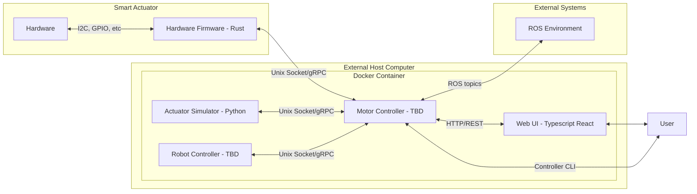

# RFD-3: Proposed Architecture

This is quite rough and needs some polishing. 

### Hardware
This is basically everything below firmware -- servo/stepper controller, power, sensors, etc.

### Hardware Firmware
The primary responsibility of the firmware is to take the varied messy interfaces of the hardware and turn them into a single clean actuator interface.

### Motor Controller
The Motor Controller is what allows the Smart Actuator to talk to the outside world. It provides a REST API for the UI and other user apps, a ROS interface for integration into existing systems, and a CLI for scripting and testing

### Robot Controller
The Robot Controller is where our "higher order" functionality lives--where we understand a collection of smart actuators as a single robot: URDF, forward and inverse kinematics, MuJoCo physics simulation

### Actuator Simulator
See [RDF-2](RFD-2.md)
