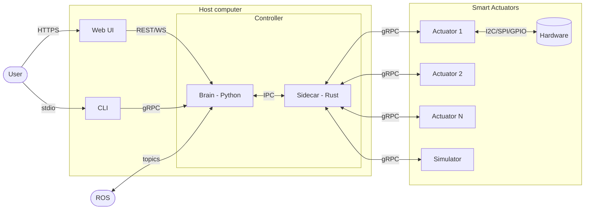

# RFD-3: Proposed Architecture

## System diagram



## Layering

The system has **two layers of process**, mapping onto RFD-1's three conceptual
layers. The "joint cluster" tier from RFD-1 does not get its own process — it
is absorbed partly into the Controller and partly into the smart actuators
themselves.

| Conceptual layer (RFD-1) | Where it lives in RFD-3                                                       |
| ------------------------ | ------------------------------------------------------------------------------ |
| Robot                    | Controller / Brain (Python)                                                    |
| Joint cluster            | Split: Controller / Sidecar (transport, discovery, watchdog) + each actuator (local safety, trajectory exec, refuse-unsafe) |
| Smart actuator           | Smart Actuator firmware (or simulator) — Rust                                  |

## Components

### Smart Actuator (firmware + hardware)

Each smart actuator is a self-contained, **safety-autonomous** node. It owns:

- motor control, encoder feedback, current and thermal sense
- soft limits, current/thermal cutoffs, control-mode selection
- `refuse_unsafe_command(reason)` — the actuator is the last line of defence
- local calibration and health reporting
- local trajectory execution (Level 3 in [RFD-2](RFD-2.md))

Implementation: **Rust**, in a shared Cargo workspace with the simulator
(see "Cargo workspace layout" below). The actuator exposes a gRPC service
defined once in `actuator-proto/`.

### Smart Actuator (simulator)

A **first-class peer** of the real actuator, not throwaway scaffolding.
Indistinguishable from real firmware over gRPC.

Implementation: **Rust**, sharing the `actuator-core` crate with the firmware.
Anything that is *behavior* (state machine, control modes, safety,
calibration, trajectory execution) is in `actuator-core` and used by both
firmware and simulator unchanged. The simulator wraps that core with a
dynamics model (motor + load + encoder noise) in place of HAL drivers.

Rationale: making the simulator share code with firmware by construction
turns "the sim is a permanent peer" from an aspiration into a build-system
fact. The two cannot drift, because they execute the same code paths.
Python remains the right language for *analysis* of the simulator (Jupyter
notebooks, plotting, parameter sweeps) — those live as clients that drive
the Rust sim over gRPC, not inside the sim itself.

See "Open question (S1)" for the parts of this still to nail down.

### Controller

A single process on the host, internally two cooperating components:

**Brain (Python).** The robot-level layer. Owns:
- URDF, forward/inverse kinematics, trajectory generation
- MuJoCo physics simulation (for planning, what-if, visualization)
- Robot-aware safety: collision, workspace, joint coordination
- ROS gateway (joint semantics live with the URDF, so ROS lives here)
- Public REST + WebSocket API for the Web UI
- gRPC API for the CLI and external clients

**Sidecar (Rust).** The transport and watchdog layer. Owns:
- gRPC client pool to N actuators (real and simulated, indistinguishably)
- Actuator discovery and addressing
- E-stop broadcast (fan-out to all actuators)
- Safety watchdog: deadman/heartbeat, watchdog timer, fallback hold/halt
  if the Brain stops responding
- Streaming joint state aggregation (so ROS / WebSocket can subscribe to one
  stream rather than N)

The Brain and Sidecar run in the same container as one logical Controller.
The Sidecar exists because (a) a Python process should not be on the
critical path for fan-out and safety broadcast, and (b) the watchdog must
survive Brain crashes — that is the residual "thin safety service" value
from earlier draft discussions, kept and moved where it belongs.

### Web UI

TypeScript + React. Talks only to the Controller (one public API).

### Controller CLI

Talks to the Controller over gRPC. One CLI, one front door.

## Repository layout

```
.
├── ui/                          # TypeScript + React
├── controller/                  # Python Brain — pyproject.toml
│   └── ...
└── smart-actuator/              # Rust Cargo workspace
    ├── Cargo.toml               # workspace root
    ├── proto/                   # .proto source of truth
    └── crates/
        ├── actuator-proto/      # generated gRPC types, shared units/frames
        ├── actuator-core/       # state machine, control modes, safety, calibration, traj exec
        ├── actuator-firmware/   # actuator-core + HAL drivers + main()
        ├── actuator-sim/        # actuator-core + dynamics model + main()
        └── controller-sidecar/  # gRPC pool + watchdog + E-stop + IPC to Brain
```

The simulator and firmware are siblings under `crates/`, both building on
`actuator-core`. The sidecar lives in the same Cargo workspace so it shares
`actuator-proto` types directly — the wire contract is defined exactly once.
The Controller Brain is a separate Python project that speaks to the Sidecar
over IPC; it has no Rust build dependency.

## Two-level safety, restated

1. **Local (per-actuator, autonomous).** Each smart actuator enforces its
   own limits, current/thermal cutoffs, soft limits, and refuses commands it
   cannot execute safely. Works even when the host is off.
2. **Robot-level (whole-machine, host-mediated).** The Brain enforces
   collision, workspace, and joint coordination using the URDF. The Sidecar
   enforces watchdog and E-stop fan-out independently of the Brain. If the
   Brain crashes, the Sidecar holds or halts the machine; (1) still holds
   regardless.

## Open questions

### Resolved (kept here briefly for traceability)

- **One API or two?** One. The Controller is the only front door.
- **Stack vs star?** Neither — two-layer hub-and-spokes (Controller ↔ N actuators).
- **ROS placement?** On the Brain (joint semantics live with the URDF).
- **"Motor Controller" naming?** Dropped; motor control belongs in the actuator.
- **Deployment shape?** One container, two internal components.

### Open

1. **Brain ↔ Sidecar interface.** In-process via PyO3 / FFI, or local gRPC,
   or Unix-socket gRPC in the same container? Trade-off: PyO3 is fastest but
   couples lifecycles; local gRPC is cleaner and preserves the Sidecar's
   independent failure domain.
2. ~~**Sidecar language?**~~ **Decided: Rust.** Shares the Cargo workspace,
   `actuator-proto` types, and unit/frame helpers with firmware and sim.
3. **Discovery.** How does the Sidecar learn about actuators? Static config,
   mDNS, USB enumeration, gRPC reflection on a known multicast group?
4. **Time sync.** Trajectories in RFD-2 use `start_time`. NTP, PTP, or
   monotonic with handshake offset?
5. **Peer-to-peer actuator comms.** Deferred. If a future use case needs
   sub-millisecond coordination between actuators (e.g. synchronized
   steppers), the answer is a shared bus (CAN, EtherCAT) between actuators,
   not a new service tier on the host.
6. **Host-down behavior.** When the Controller is off, what does the machine
   do? Each actuator already enforces local safety, so it cannot run away —
   but should the actuators have a local E-stop input / button, hold pose,
   or go limp?
7. **State of truth for the UI.** Joint position shown in the UI: raw stream
   from the Sidecar, or the Brain's forward-kinematic view? Probably both,
   on different screens — make it explicit per endpoint.

### Simulator-specific

- **S1. How much code is actually shared between firmware and sim?**
  The proposal commits to a shared `actuator-core` crate. We need to be
  honest about which behaviors are *truly* hardware-independent (state
  machine, control mode selection, safety refusal logic, calibration math,
  trajectory time-stepping) versus hardware-coupled (PWM generation, encoder
  reading, current loop tuning). The latter group does *not* go in
  `actuator-core`. If that group turns out to be most of the work, the
  shared-crate win shrinks and Python sim becomes more defensible again.
- **S2. Dynamics model fidelity.** First-pass sim is a kinematic + simple
  motor model. Do we ever want sim to integrate with MuJoCo at the
  Controller level for whole-machine dynamics, or stay strictly per-actuator?
  If per-actuator, the choice of Rust is easy. If whole-machine, we may want
  the Brain's MuJoCo to drive the sim's hardware-side dynamics, which is
  another reason to keep the sim's gRPC interface clean and stateless.

## Architectural tensions — status

The earlier draft of this RFD called out a number of tensions. With the
two-layer collapse above, most resolve:

| Tension                                          | Status                                                            |
| ------------------------------------------------ | ----------------------------------------------------------------- |
| T1. MC doing three jobs                          | **Resolved.** Jobs collapse into Brain modules + Sidecar.         |
| T2. Two REST APIs leak layering                  | **Resolved.** One Controller, one public API.                     |
| T3. Stack vs star                                | **Resolved.** Neither; two-layer hub-and-spokes.                  |
| T4. ROS placement / extra hop                    | **Resolved.** ROS on Brain, no extra hop.                         |
| T5. "Motor Controller" naming                    | **Resolved.** Smart actuator owns motor control.                  |
| T6. Simulator's role beyond v1                   | **Resolved.** First-class peer via shared `actuator-core` crate.  |
| T7. Deployment shape                             | **Resolved (v1).** One container, two components. Reopen if RC outgrows the host. |
| T8. User's mental model                          | **Resolved.** One Controller, one API; internals hidden.          |
| T9. Reconciling with RFD-1                       | **Still open.** RFD-1 needs revising — see below.                 |

## Follow-up: revise RFD-1

[RFD-1](RFD-1.md)'s three-layer model assumed all three layers were
*services*. In this architecture, the "joint cluster" layer is not a service:
it is a set of responsibilities split between the host (transport, discovery,
watchdog) and each actuator (local safety, trajectory exec). RFD-1 should be
updated to reflect that distinction, and to use "Smart Actuator" + "Controller"
as the two top-level system nouns.
