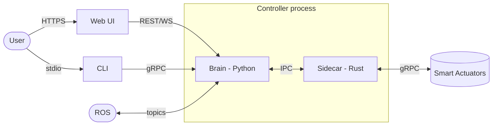
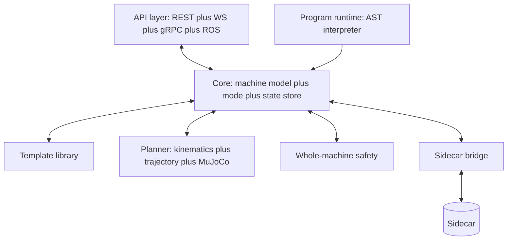

# RFD-4: The Smart Actuator Brain

This RFD discusses the capabilities and interfaces of the Smart Actuator
Brain — the Python half of the Controller process described in
[RFD-3](RFD-3.md).

## Context

From [RFD-3](RFD-3.md), the Controller is one process with two components:

- **Sidecar (Rust)** — transport, discovery, watchdog, E-stop fan-out,
  joint-state aggregation. On the critical path for safety.
- **Brain (Python)** — everything robot-level: kinematics, planning,
  whole-machine safety, ROS, and the public user-facing APIs.

This document is about the Brain. The Sidecar is treated here as a
dependency with a known interface; its internals are out of scope.

## Where the Brain sits



The Brain is the **only** thing the user ever talks to directly. All
three external interfaces (REST/WS, gRPC, ROS) are front doors into the
same internal state.

## Capabilities

Grouped roughly from "closest to hardware" up to "closest to the user".

### C1. Machine builder and machine model

The Brain holds the canonical description of the user's machine. In v1
that description is **always produced from a template** — we do not
accept arbitrary user-authored URDF. This is a deliberate scope cut
(see "Templated machines" below).

- Maintain a **template library**: a small catalogue of known robot
  shapes (e.g. 3-DOF arm, 2-DOF pan/tilt, gantry, differential drive,
  ...). Each template defines:
  - Its link/joint graph as a parametric URDF skeleton.
  - Its parameter surface (segment lengths, segment-to-segment mount
    angles, joint role names, material presets) and the valid ranges
  for each parameter. See "Template parameter surface" below.
  - Default motion limits, a recommended actuator binding order, and
    *recipes* (not cached results) for the per-machine quantities
    that depend on parameter values: reach volume, IK feasibility,
    and self-collision bounds. Those are computed at bind time and
    cached on disk by the Brain.
- Accept a **machine description** = `(template_id, parameters,
  actuator_bindings)`. The Brain expands this into a concrete URDF
  internally. The user never edits raw URDF.
- **Per-slot, kind-aware binding.** Each joint slot in the template
  is bound independently to one of:

  - `unbound` — no actuator yet; the joint is structurally present
    in the description but cannot be commanded.
  - `real` — paired with a discovered hardware actuator from the
    Sidecar's pool. Carries the actuator's stable id.
  - `sim` — paired with a Brain-deployed `actuator-sim` instance
    (see C11). Carries the sim instance handle.

  Mixed bindings (some slots `real`, some `sim`) are first-class.
  This is what makes the [RFD-7](RFD-7.md) "+ Add motor" flow
  possible: the user clicks an unbound joint, picks real or sim,
  and the binding updates. There is no "bind all in order"
  ceremony; that earlier framing is superseded.
- Hold the expanded link/joint graph as the canonical model used by
  C2–C9.
- Persist the machine description (the small `(template_id, params,
  bindings)` tuple, not the expanded URDF) across restarts. Binding
  entries persist by `kind` + actuator-id / sim-handle as
  appropriate.

Machine descriptions are their own AST, distinct from program ASTs
(see C6).

### C2. Kinematics and dynamics

- Forward kinematics: joint state → link poses.
- Inverse kinematics: target pose → joint targets (with redundancy
  resolution policy TBD).
- Jacobian / velocity mappings for Cartesian commands.
- MuJoCo physics simulation of the whole machine — used **on demand**
  for planning validation, what-if scenarios, and (future) contact
  tasks. Not run continuously. Not on the live state hot path. Not
  the source of the UI's 3D view.

The "good simulation feel" that comes from whole-machine dynamics
(gravity coupling, inertia, jiggle on fast moves) is **not** the
Brain's job. It lives in the simulator and is the subject of
[RFD-6](RFD-6.md).

### C3. Trajectory and motion

- Generate trajectories (joint-space and Cartesian) with timing.
- Split a whole-machine trajectory into per-actuator segments, hand each
  to the Sidecar with a common `start_time` (see RFD-2 Level 3, RFD-3
  open question on time sync).
- Track execution: receive tracking error, pause/resume/abort across all
  actuators atomically.
- Support move primitives: move-J, move-L, move-to-pose, follow-path,
  hold-pose, go-home.

### C4. Robot-level safety

The Brain enforces *whole-machine* safety. Per-actuator safety stays in
the actuator (RFD-1 / RFD-3). Specifically:

- Collision checking (self-collision, workspace bounds, declared
  obstacles) against URDF + planned motion.
- Joint coordination: refuse motions that violate cross-joint constraints
  even if each joint alone would accept them.
- E-stop: surface the call, then delegate fan-out to the Sidecar (which
  owns the critical path).
- Mode gating: enforce which capabilities are available in which
  operating mode (see C7).

The Brain is *not* the last line of defence. The Sidecar's watchdog and
each actuator's local refusal logic are.

### C5. State and telemetry

- Subscribe to the Sidecar's aggregated joint-state stream.
- Maintain a current best estimate of machine state (joint angles,
  velocities, currents, health, faults).
- Maintain two views explicitly:
  - **Measured** — raw stream from the Sidecar (what the actuators say).
  - **Modeled** — Brain's forward-kinematic view (FK only; not MuJoCo).
  - Per-endpoint, we declare which one is being served (resolves RFD-3
    open question 7).
- Per-actuator state carries a `kind` field (`real` | `sim`) sourced
  from the binding (C1) and the sim registry (C11). The UI uses
  this to render a `SIM` badge ([RFD-7](RFD-7.md)). It is *not* a
  safety signal — safety treats real and sim identically.
- Buffer recent state for short-term replay / debugging.

### C6. Programs and behaviors

This is the "program your machine" surface from RFD-1. The Brain runs
programs expressed as a **program AST** (a small DSL defined as a proto
schema). The AST is the source of truth; the Web UI's block editor is a
view on it. External languages drive the Brain through gRPC, not by
emitting the program AST.

- Program AST primitives include: sequences, conditionals, loops, move
  primitives (move-J, move-L, move-to-pose, follow-path, hold-pose,
  go-home), waits, sensor reads, mode transitions, named sub-programs.
- The Brain interprets the AST in Python, calling into the same Core
  that REST/gRPC/ROS call into. No native compilation — programs are
  bound by physical motion time, not interpreter speed.
- Programs are **type-checked against the current machine description**
  before they run: a `move shoulder` block referring to a joint the
  machine doesn't have is rejected at edit time, not at run time.
- The program AST and the machine-description AST are **two separate
  schemas**. Programs *reference* names defined by the description;
  they don't redeclare structure.
- Named programs are first-class persistent entities ("modes" and
  "behaviors" in RFD-1 terms).

### C7. Lifecycle and modes

Explicit machine-level operating modes, e.g.:

- `OFFLINE` — no actuators bound.
- `IDLE` — bound, holding, no motion allowed.
- `MANUAL` — jog / teach, low speed, single-joint commands.
- `RUN` — programs / trajectories permitted.
- `FAULT` — something refused; requires acknowledgement to leave.

Mode transitions are first-class events; every interface can observe them.

### C8. Calibration and onboarding

- Drive the onboarding flow from RFD-1 ("discover → describe → calibrate
  → test").
- Onboarding is **per-joint**, not whole-machine-at-once. The user
  parameterizes the template, then for each joint slot picks
  "onboard real hardware" or "add simulated" ([RFD-7](RFD-7.md)).
  The Brain handles binding (C1) and, for the sim case, deployment
  (C11). A machine becomes commandable once *enough* slots are
  bound for the requested operating mode (C7).
- **Calibration is a first-class job.** Per-actuator calibration
  (encoder offset, range sweep, friction model, …) and
  whole-machine calibration (tool frame, base frame) are both
  modelled as long-running, interactive jobs identified by
  `job_id`. A job carries a state machine, a current step, the
  last measurement, and a prompt for the UI to display ("move the
  arm to the home position and click continue"). The user advances
  or aborts the job; the Brain drives the underlying actuator
  primitives.
- The Brain exposes:

  - `POST /machines/{mid}/actuators/{aid}/calibrations` to start a
    per-actuator routine, returning `{job_id, initial_state}`.
  - `GET /machines/{mid}/calibrations/{job_id}` for current state.
  - `POST .../advance` and `POST .../abort`.
  - A `calibrations/{job_id}` topic on the events WS for live
    progress (step transitions, measurement updates, prompt
    changes, completion).

  These live in a dedicated `calibrations.py` REST module sitting
  beside `actuators.py`, `machine.py`, etc. `calibration_service.py`
  is unchanged in spirit but grows a flow-orchestrator layer above
  the existing primitives — the orchestrator owns the per-job
  state machine and serializes session state into the Brain's
  SQLite store so jobs survive a UI reload.
- Whole-machine calibration steps use the same job shape, scoped
  at the machine instead of an actuator
  (`POST /machines/{mid}/calibrations`).
- The old "Simulated bind" sub-bullet from earlier drafts is
  subsumed by per-slot `sim` binding (C1) plus sim lifecycle
  (C11). Designing a digital twin before assembly is now: pick
  template, tune parameters, add sim joints one by one, run
  programs. Swapping a sim for real hardware is a per-slot
  re-bind, not a whole-machine redescribe.

### C9. ROS gateway

Joint semantics live with the URDF, so ROS lives here (RFD-3 T4).

- Publish `/joint_states`, TF, and a machine-description topic.
- Subscribe to standard command topics (TBD which — `JointTrajectory`,
  `Twist`, ...).
- Optional: action servers for move primitives.

### C10. Observability

- Structured logs of commands accepted, refused, and faults.
- Metrics: command rate, tracking error, mode-time distribution.
- An event stream the UI can tail (likely the same WS stream used for
  state).

### C11. Actuator lifecycle and sim deployment

The Brain owns the lifecycle of any `actuator-sim` instances bound
into its machine. Real actuators are discovered and addressed by the
Sidecar (RFD-3); sim actuators are *deployed* by the Brain on user
request.

- **Deploy.** When a joint slot is bound `sim` (C1), the Brain
  spawns an `actuator-sim` process, registers it with the Sidecar
  so it becomes a peer in the gRPC pool indistinguishable from
  real firmware, and records the handle in the binding.
- **Track.** The Brain holds a sim registry: per sim, the process
  handle, the bound joint slot, the last health timestamp, and any
  configuration (e.g. shared-world attachment per [RFD-6](RFD-6.md)
  when applicable). The registry is persisted alongside the machine
  description so sims are re-spawned on Brain restart.
- **Teardown.** Unbinding a `sim` slot, or replacing it with a
  `real` binding, tears the sim process down cleanly and
  deregisters it from the Sidecar.
- **Health.** Sim processes that crash are surfaced as faults on
  the events WS; the Brain may auto-respawn within a small retry
  budget before declaring the binding faulted.

The sim lifecycle is deliberately the Brain's job, not the
Sidecar's: the Sidecar manages peer *transport*, not the existence
of peers. This keeps the Sidecar agnostic to whether its peers are
real or sim and keeps sim-specific concerns (which template?
attached to which shared world? how many retries?) on the side that
already owns the machine description.

Back-references: this capability exists to support the per-joint
"+ Add motor" flow in [RFD-7](RFD-7.md) and the mixed-bind
semantics in C1.

## Interfaces

All three interfaces are views onto the same Brain state. Where they
differ is in protocol shape, not capability.

### CLI

The CLI talks to the Brain over **gRPC** (RFD-3). One CLI, one front door.

Sketch of command groups (placeholder — to be refined):

- `actuator` — `list`, `describe`, `calibrate`, `set-limit`
- `machine` — `load-urdf`, `bind`, `status`, `home`
- `mode` — `get`, `set`, `history`
- `move` — `joint`, `linear`, `pose`, `path`, `stop`
- `program` — `run`, `pause`, `resume`, `abort`, `list`
- `state` — `dump`, `watch`
- `estop` — single command, plain refusal to do anything clever

CLI design principles to pin down:

- Every command has a non-interactive form usable from scripts.
- Long-running operations stream progress over gRPC; Ctrl-C aborts cleanly.
- Output is human by default, `--json` for machines.

### REST

REST is for the Web UI, but treated as a public, documented API —
anything the UI can do, a script can do.

Resource sketch (verbs are HTTP, plus a WebSocket channel for streams):

- `GET /machine` — current bound machine description.
- `PUT /machine` — load/replace URDF.
- `GET /actuators` / `GET /actuators/{id}` — discovered actuator info.
- `POST /actuators/{id}/calibrate`
- `POST /machines/{mid}/actuators/{aid}/calibrations` — start a
  calibration job (C8). `GET`, `advance`, `abort` follow.
- `GET /state` — snapshot. `WS /state` — live stream.
- `GET /mode`, `POST /mode` — read / request mode change.
- `POST /move/joint`, `POST /move/linear`, `POST /move/pose`
- `POST /estop`
- `GET /programs`, `POST /programs`, `POST /programs/{id}/run`
- `GET /events` — WS stream of mode changes, faults, refusals.

The public WS endpoint is **single-connection, topic-multiplexed**
([RFD-7](RFD-7.md)). A client opens one socket, then subscribes to
topics (`state`, `events`, `mode`, `calibrations/{job_id}`,
`programs/{id}/run`, …). High-rate topics like `state` accept a
**per-subscriber rate parameter**; the Brain downsamples Sidecar
frames to the requested rate. The canvas asks for 60 Hz; a
diagnostics client can ask for full Sidecar rate. The "Modeled"
view is its own topic and is rate-negotiable independently.

Conventions to settle:

- Auth model (none in v1? token? localhost-only?).
- Long-running ops: do we return a job handle (`202 + /jobs/{id}`) or
  block?
- Streaming: WebSocket vs SSE for the live channels.

### ROS

ROS-side interfaces, mirroring C9:

- **Published**
  - `/joint_states` (`sensor_msgs/JointState`)
  - `/tf`, `/tf_static`
  - `/robot_description` (URDF)
  - `/machine/mode` (custom small msg)
  - `/machine/events`
- **Subscribed**
  - `/joint_trajectory` (`trajectory_msgs/JointTrajectory`)
  - `/cmd_pose` or similar (TBD)
- **Action servers** (likely)
  - `move_to_joint`, `move_to_pose`, `follow_trajectory`
- **Services**
  - `set_mode`, `estop`, `home`

Open: ROS 1 vs ROS 2 (assume ROS 2 unless we have a reason).

## Internal shape (sketch, not prescriptive)

A rough internal decomposition so we can talk about it concretely:



The point: every interface goes through the same Core, so behavior is
consistent across CLI / REST / ROS by construction.

## Templated machines (v1 scope)

v1 supports **only** templated machine descriptions. The user cannot
load arbitrary URDF. This is a deliberate constraint with concrete
payoffs:

- The Brain only ever sees URDFs it already understands. Reach,
  collision volumes, IK feasibility, and safe workspace are
  **computed at bind time** from the template's recipes and the
  user's parameter values, then cached. Cheap thereafter, and bounded
  to a shape the Brain understands rather than a free-form URDF.
- Onboarding (RFD-1) collapses to "pick a template, plug in actuators,
  bind in order" — no URDF authoring, no joint-name mapping.
- Calibration defaults, motion limits, and example programs ship with
  the template. The user gets a working machine immediately after
  binding.

Arbitrary user-authored URDF is explicitly a **future** capability, not
a day-one escape hatch. If a v1 user needs a shape we don't have, the
answer is "we'll add a template," not "here, write XML."

## Open questions

### Resolved (kept for traceability)

- **Brain ↔ Sidecar transport.** gRPC over Unix socket. Keeps the Brain
  and Sidecar as independent failure domains, reuses our existing
  `.proto` tooling, avoids the lifecycle coupling of PyO3.
- **Program language.** A small DSL defined as a proto-schema AST,
  interpreted in Python on the Brain. The Web UI's block editor is a
  view on the AST. External languages drive the Brain via gRPC, not by
  emitting the AST. No native compilation in v1 — programs are bound
  by physical motion time, not interpreter speed; revisit only if a
  measured perf wall appears.
- **One DSL or two?** Two. Machine description and behavior are
  separate ASTs with separate schemas. Behavior is type-checked against
  the machine description.
- **Arbitrary URDF in v1?** No. Templates only. See "Templated
  machines" above.
- **Template library location.** Templates live in **git** — not in a
  custom store. The official catalogue is an Ambient-Labs-managed
  public repo (e.g. `ambient-labs/actuator-templates`). The Brain
  bundles a cached snapshot at install time so it works offline; an
  explicit `templates update` action pulls the latest from upstream.
  User-authored and third-party templates (post-v1) come from
  *additional* git URLs the user configures — same schema, same
  tooling, just a different remote. No custom VCS.
- **How a machine description references a template.** As
  `(source, template_id, version, content_hash)`, plus a cached copy
  of the expanded URDF. The reference is the source of truth; the
  cache is a fallback so a machine keeps working if the source repo
  moves or goes offline. A hash mismatch on update is detectable and
  surfaced.
- **Template marketplace / discovery.** Deferred. Captured separately
  in [RFD-5](RFD-5.md) so we don't get sidetracked here. The Brain's
  data model is forward-compatible with it (the `source` field already
  accommodates a future non-git registry) but does not assume it
  exists.
- **State persistence.** SQLite. One file on disk owned by the Brain.
  Stores the machine description, calibration data, the program
  library, and any user accounts (see auth, below). Chosen over flat
  files for transactional updates and over a server-backed DB because
  the Brain is a single-host process.
- **Auth.** Token-based from day one, backed by a small local
  OAuth-2.0-compatible auth surface in the Controller. Users have
  username/password accounts (stored in the SQLite DB) and can mint
  long-lived API tokens from the Web UI. The CLI and external scripts
  use tokens; the Web UI does the OAuth dance. v1 is single-tenant
  (one Brain, a small number of users on a LAN); the design is
  forward-compatible with role/scope additions later.
- **API codegen across interfaces.** Yes — generate REST handlers and
  ROS bindings from the gRPC service definition so the three surfaces
  cannot drift. **Conditional on developer UX:** if the codegen story
  makes everyday Brain hacking painful (slow rebuilds, opaque
  generated code, debugging through layers of macros), we revisit.
  See open question on codegen toolchain selection.
- **Multi-machine future.** v1 is 1:1 (one Brain manages one machine).
  The data model and APIs **must not bake in that assumption** —
  resource paths, identifiers, and storage are scoped so a future
  multi-machine Brain is an additive change, not a rewrite. Concretely:
  the SQLite schema carries a `machine_id`, REST/gRPC resources are
  nested under a machine identifier even though only one exists in
  v1, and the Sidecar bridge is per-machine.
- **Template trust and signing.** GitHub-Actions-style: trust is by
  **provenance** (source URL), not by signature. A template reference
  is `<host>/<owner>/<repo>/<path>@<ref>`, where `<ref>` is either a
  floating tag (`v2`) or an immutable SHA. Floating refs are the
  default for ergonomics; SHA pins are how power users get
  reproducibility. The `content_hash` already in the machine
  description gives end-to-end drift detection for both modes.

  The Brain ships with a small **trusted-source allowlist** (initially
  `github.com/ambient-labs/*`). Templates from allowlisted sources
  load without warning. Anything else loads with a clear UI provenance
  banner ("from `<url>`, not verified by Ambient"). The allowlist is
  config, not code — we can add sources without a Brain release.

  We deliberately do **not** ship cryptographic signatures in v1. The
  door stays open to add signed git tags as an "Ambient verified"
  badge later (additive, not a redesign). Repo compromise and
  typosquatting are accepted residual risks, mitigated by SHA pinning
  and clear UI rendering of the full source URL.
- **Template manifest format.** YAML, **one file per template**, not
  per repo. A template reference resolves to a specific *path* inside
  a repo (`github.com/owner/repo/<path>@ref`), exactly like GitHub
  Actions, and the manifest lives at `<path>/template.yaml`. This
  lets a single repo hold many templates in arbitrary locations with
  no required repo-root index. Repos can be one-template or
  many-template; the Brain doesn't care.

  Each `template.yaml` declares:

  ```yaml
  manifest_version: 1
  id: arm-3dof
  version: 2.1.0
  name: "3-DOF Arm"
  summary: "Three rotational joints, single end-effector."
  publisher: ambient-labs        # display only; trust is by URL
  compatibility:
    brain: ">=0.3,<0.5"          # semver ranges
    firmware: ">=0.2"
  # ...plus references to the parametric URDF skeleton,
  # parameter surface, default motion limits, icons, etc.
  ```

  Exact field set beyond the above is design work in the template-lib
  repo, not in this RFD.
- **MuJoCo coupling depth.** **On-demand only.** The Brain has MuJoCo
  as a dependency but does not run a continuous sim instance. MuJoCo
  is invoked for specific bounded tasks: pre-flight collision/reach
  checks before executing a motion, user-initiated "preview this" /
  "what-if" workflows, and (later) contact-physics scenarios. The UI's
  live 3D view is a browser-side URDF renderer fed by Brain joint
  state, not a MuJoCo render. The Brain's "Modeled" telemetry view
  (C5) is plain forward kinematics, not MuJoCo.

  The realistic-feel problem — simulated actuators behaving like a
  real machine, with gravity coupling, inertia, and inter-joint
  dynamics — is **not solved here**. It lives in the simulator, via
  a shared MuJoCo world that `actuator-sim` instances attach to.
  That work is its own RFD: [RFD-6](RFD-6.md). The Brain's MuJoCo
  and the simulator's MuJoCo are separate model instances with
  different purposes and do not share state.

  Continuous digital-twin simulation in the Brain is explicitly
  deferred: the resource cost (always-on MuJoCo step loop) is not
  justified by the marginal benefit over on-demand validation +
  browser-side FK rendering. Revisit if a measured need appears.
- **Template parameter surface.** Continuous, with a small set of
  discrete material presets. Concretely, a template can expose three
  kinds of parameters:

  1. **Continuous geometry.** Segment lengths and segment-to-segment
     **mount angles** (the fixed structural angle at which one
     segment attaches to the next, baked into the URDF at machine
     build time). Each is a float with a template-declared valid
     range. This does *not* include runtime joint motion limits;
     those stay defaults shipped with the template for v1.
  2. **Discrete material presets.** A small enum per segment
     (e.g. `aluminum`, `steel`, `pla`, `petg`) that maps to
     density / inertia / friction values used by the simulator
     ([RFD-6](RFD-6.md)) and by motion-limit defaults. The Brain
     does not let users type arbitrary material numbers; the preset
     enum is the surface.
  3. **Optional discrete variants** that a template author may
     declare (e.g. "with-gripper" vs "without-gripper"). Used
     sparingly when geometry alone can't express the difference.

  Because geometry is continuous, **per-template precomputation of
  reach / collision / IK feasibility is not viable**. Templates
  ship *recipes* (which checks to run, which closed-form bounds to
  evaluate); the Brain runs those recipes at bind time against the
  user's specific parameter values and caches the result on disk
  alongside the expanded URDF. First bind is slower; subsequent
  loads are cheap.

  A template author who wants faster binds *may* supply analytic
  closed-form expressions for reach / limits as functions of the
  params, but this is an optimization, not a requirement. The
  default is "compute at bind time."
- **Templates encode kinematics and dynamics only.** No physical
  assembly encoding in v1. Templates carry: the parametric URDF
  (links, joints, geometry), the parameter surface and ranges,
  material presets, default motion limits, and the bind-time
  recipes. They do **not** carry: part numbers / bill of materials,
  fastener lists, hole-by-hole connection topology, cable routing,
  or build instructions.

  This is a deliberate scope cut. The user goal that motivated the
  question — "design and play with a digital twin before
  assembly" — is satisfied by the simulated-bind path in onboarding
  (C8): pick template, tune params, bind to `actuator-sim` instead
  of hardware, run programs against the twin. None of that needs an
  assembly encoding.

  Guided physical build — BOM, step-by-step instructions, "did you
  assemble it right?" validation — is a separate product surface
  (CAD-adjacent, much larger scope), not a template-schema
  extension. If/when we add it, it lives naturally as a companion
  artifact next to a template (e.g. `<path>/build/` alongside
  `<path>/template.yaml`) and the Brain doesn't need to understand
  its internals; the build UI / docs layer does. Designing the
  template schema today around an assembly encoding we don't have
  would be premature.
- **Template update UX.** **Notify only in v1.** When the user runs
  `templates update` and a tag-pinned template referenced by an
  existing machine has a new version upstream, the Brain surfaces
  the availability of the new version (UI banner, CLI summary) but
  does **not** rewrite the machine's reference. The machine keeps
  running against its current pinned version + cached expansion.

  Acting on the notification is an explicit user gesture: re-bind
  the machine against the new version. That re-bind goes through
  the same path as the original bind — run the template's recipes
  against the existing parameters, recompute reach / collision / IK
  caches, surface any compatibility issues (e.g. parameters that
  no longer exist, ranges that shifted, manifest-declared
  `compatibility.brain` violations). If the new version is
  incompatible with the current parameters, the re-bind is
  refused; the user fixes parameters and tries again.

  Out of scope for v1: automated migration of parameter values
  across template-version-bumps, diff UIs that explain what
  changed, multi-machine bulk updates. SHA-pinned machines are
  unaffected by `templates update` by construction.
- **Per-joint kind-aware binding.** Each joint slot binds
  independently to `unbound`, `real`, or `sim`. Mixed bindings
  are first-class. Supersedes the earlier "bind discovered
  actuators in order" framing. Driven by the
  [RFD-7](RFD-7.md) "+ Add motor" flow. See C1, C11.
- **Sim lifecycle is a Brain capability.** Spawning, tracking,
  and tearing down `actuator-sim` processes belongs to the Brain
  (C11), not the Sidecar. The Sidecar manages peer transport;
  the Brain decides which peers exist. Back-propagated from
  [RFD-7](RFD-7.md).
- **Calibration is a first-class job model.** Long-running,
  interactive, addressed by `job_id`, with REST CRUD and a
  dedicated `calibrations/{job_id}` WS topic. New REST module
  `calibrations.py`; orchestrator layer above the existing
  primitives in `calibration_service.py`. See C8. Back-propagated
  from [RFD-7](RFD-7.md).
- **Public WS is single-connection, topic-multiplexed, with
  per-subscriber rate control.** Clients open one socket and
  subscribe to topics; the Brain downsamples high-rate topics to
  the requested rate. See the REST section. Back-propagated from
  [RFD-7](RFD-7.md).

### Open

1. **User-defined templates.** Out of scope for v1. When/how we open
   this up later — and what the validation gate looks like — is open.
2. **Codegen toolchain.** REST-from-gRPC has a few real options
   (`grpc-gateway`-style transcoding, hand-written FastAPI thin
   wrappers driven by the proto, or a custom generator). ROS-from-gRPC
   is less standard and needs a landscape survey first — adopt
   existing tooling if any is healthy; build specialized-to-our-proto
   glue only if nothing usable exists. Either way, pick a stack that
   keeps the everyday dev loop fast and the generated code legible;
   revisit the codegen decision itself if no good option exists.

## Non-goals (for now)

- Cloud connectivity, fleet management, remote access.
- Arbitrary user-authored URDF. Templates only in v1.
- User-defined templates. Catalogue-only in v1.
- A template marketplace / discovery service. Deferred to
  [RFD-5](RFD-5.md).
- A custom version-control system for templates. Git only.
- Native compilation of user programs. Interpreter only; revisit on
  measured need.
- Continuous digital-twin simulation in the Brain. On-demand MuJoCo
  only; the realistic-sim-feel problem belongs to the simulator
  ([RFD-6](RFD-6.md)).
- Physical-assembly encoding in templates. No BOM, fastener lists,
  hole-by-hole connection topology, cable routing, or build
  instructions in the template schema. Guided physical build is a
  separate future surface, not a template extension.
- Automated template-version migration. v1 notifies on new versions
  and supports explicit re-bind; it does not auto-rewrite machine
  descriptions or auto-translate parameters across version bumps.
- Vision / perception stacks. ROS is the integration point if a user
  brings their own.
- Task-level planning (pick-and-place reasoning, behavior trees).
  Programs in C6 are the substrate those could be built on later.
