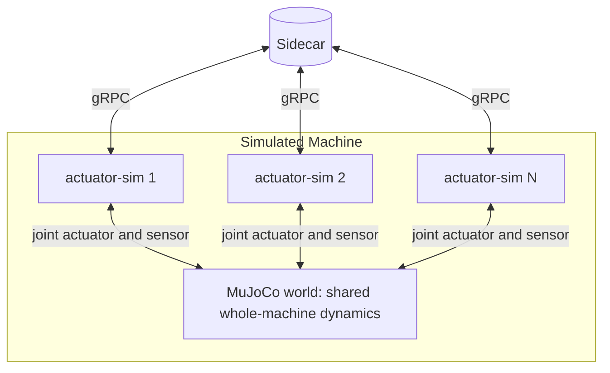

# RFD-6: Shared-World Physics for the Actuator Simulator

This RFD covers a piece of the platform that doesn't live in any single
component: the simulator's whole-machine physics. It picks up
[RFD-3](RFD-3.md)'s open question **S2** ("dynamics model fidelity")
and proposes the direction we're committing to.

## Why this is its own RFD

The actuator simulator (RFD-3) is per-actuator and shares
`actuator-core` with the firmware. That's the right shape for "each
sim looks indistinguishable from a real actuator over gRPC." But it
leaves a gap: when N simulated actuators run together as a robot,
each one is dynamically isolated. They don't see each other's
inertia, gravity coupling, or contact forces. The simulated robot
moves, but it doesn't *feel* like a real robot.

[RFD-4](RFD-4.md) considered putting MuJoCo in the Brain to solve
this. We decided against it: the Brain's MuJoCo is on-demand, for
planning validation and what-if. The realistic-feel problem belongs
on the *simulation* side, not the planning side.

This RFD is where that lives.

## Goal

Give simulated machines the inter-joint dynamics of a real machine —
gravity, inertia, joint coupling, and (eventually) contact — without
breaking the "each sim is a peer of real firmware" abstraction that
RFD-3 commits to.

A user running the whole stack against simulated actuators should
see a simulated robot that behaves recognizably like the real one:
arms sag under gravity, fast moves overshoot a little, payloads
matter.

## Proposed shape

A **shared MuJoCo world** that all `actuator-sim` instances of a
single simulated machine talk to. Sketch:

Key properties:

- **The gRPC interface to each `actuator-sim` does not change.** The
  Sidecar still sees N peer actuators. The Brain doesn't know
  whether it's talking to real or simulated firmware, and doesn't
  know whether sims are isolated or world-coupled.
- **The MuJoCo world owns the dynamics.** Each `actuator-sim`
  commands its joint in MuJoCo (via the joint's actuator), reads
  back position/velocity/torque, and runs its same control loop
  from `actuator-core` against those values.
- **One MuJoCo world per simulated machine.** Not one per sim, not
  one per host. The world is the shared resource that makes joints
  see each other.
- **The Brain's on-demand MuJoCo (RFD-4) is a separate model**
  instance, used for planning validation. It does not share state
  with the sim's world — they are different processes running
  different MuJoCo instances for different purposes. Possibly the
  same URDF source, possibly even shared XML, but not shared state.

## Where the world lives

There are two reasonable answers and we should decide:

1. **In-process per-sim, with shared memory or a coordinator
   process.** One `actuator-sim` binary launches the MuJoCo world
   in-process; siblings attach to it. Lower latency, fiddlier
   lifecycle.
2. **As a separate `sim-world` process.** Each `actuator-sim` talks
   to it (locally, fast IPC). Cleaner lifecycle, slightly higher
   latency, naturally supports inspection / visualization clients
   subscribing to world state.

Default lean: **(2)**, because the lifecycle wins are real and the
latency cost is not on a safety-critical path (this is the
simulator). A small `sim-world` binary that hosts MuJoCo and exposes
joint-actuator / joint-sensor channels over a local socket.

## Hard parts

These are the parts that justify the RFD existing.

1. **Time stepping.** MuJoCo wants to advance in deterministic
   fixed-rate steps. The actuator control loops want their own rate.
   The Sidecar's gRPC layer is event-driven. We need a stepping
   contract that's faster than the slowest consumer and that
   guarantees the world doesn't drift behind the sims that depend
   on it. Sim-time vs wall-time matters here too (do we run
   real-time, faster, slower, headless-as-fast-as-possible for
   tests?).
2. **Lifecycle and discovery.** When do sims start the world? Who
   owns it? What happens when a sim crashes? When the world crashes?
   How do sims find the world they belong to (vs. someone else's
   sim world on the same host during development)?
3. **Sim-time vs wall-time semantics.** For interactive use we want
   real-time. For tests we want as-fast-as-possible. For replay we
   want deterministic stepping at an arbitrary rate. The interface
   should make all three reachable.
4. **URDF source of truth.** The Brain expanded the URDF from a
   template. The MuJoCo world wants a model. Do we use the Brain's
   expanded URDF directly (and accept MuJoCo's URDF importer's
   quirks), or do templates ship a MuJoCo-native XML alongside the
   URDF? The latter is more honest but doubles the template author's
   burden.
5. **Determinism.** Reproducible simulator runs are valuable for
   tests and for "replay the bug." MuJoCo is deterministic given
   the same step sequence, but only if we control the order of
   commands and steps across N sim peers. The stepping contract has
   to address this explicitly.
6. **Contact and external forces.** The simplest world is gravity +
   inertia. Adding ground, walls, and grippable objects is its own
   set of decisions. v1 of this RFD aims for "gravity + inertia +
   self-collision" and parks contact-with-the-world as a later
   layer.
7. **Visualization.** The shared world is the natural source of
   truth for a "watch the simulated robot" 3D view, including
   simulated objects in the scene. This overlaps with the Brain's
   joint-state-driven UI viewer (RFD-4). Open question whether the
   UI should be able to subscribe to the sim world directly for
   richer scenes, or stay pure joint-state-driven.

## Non-goals

- High-fidelity contact physics for manipulation (grasping, in-hand
  manipulation). Eventually, but not what this RFD is solving.
- Sensor simulation beyond joint state (cameras, depth, IMU). Their
  own thing.
- Soft-body dynamics. MuJoCo can do some; we don't need it.
- Multi-machine worlds (two robots in one scene). Future, and
  related to RFD-4's multi-machine open question.
- Mixed-bind whole-machine dynamics (some joints `real`, some
  `sim` in a single machine). The shared world is fully-sim-only;
  mixed-bind machines fall back to per-sim isolated dynamics.
  See "Relationship to other RFDs" for the rationale.
- Backwards-incompatible changes to the `actuator-sim` gRPC surface.

## Phasing

- **Phase 0 (today).** `actuator-sim` is per-actuator with isolated
  motor + load model. Gravity is approximated per joint or absent.
  This is enough to develop the Brain and Sidecar against.
- **Phase 1.** Introduce the `sim-world` process. Each `actuator-sim`
  optionally attaches to it. Default off; opt-in for development of
  the shared-world path. World provides gravity + inertia +
  self-collision.
- **Phase 2.** Default on. Templates ship with whatever extra
  metadata the world needs (mass, inertia, collision meshes). v1
  product ships here.
- **Phase 3.** Contact with environment objects, scene
  composition, richer visualization stream.

## Relationship to other RFDs

- **[RFD-2](RFD-2.md):** the per-actuator interface (Levels 1–4)
  doesn't change. This RFD adds a new collaborator behind the sim
  implementation, not a new interface.
- **[RFD-3](RFD-3.md):** resolves open question S2 in the direction
  of "yes, with whole-machine dynamics, via a separate sim-world
  process." The `actuator-sim` crate gains an optional dependency
  on the world client; `actuator-core` stays untouched.
- **[RFD-4](RFD-4.md):** the Brain's MuJoCo remains on-demand and
  scoped to planning. The realistic-sim-feel goal is satisfied here,
  not there.
- **[RFD-7](RFD-7.md):** the UI's "+ Add motor" flow makes
  per-joint binding kind-aware, which means a single machine can
  have a mix of real and sim joints ([RFD-4](RFD-4.md) C1). The
  shared MuJoCo world cannot accurately couple real and sim
  joints — a real arm hanging off a sim base, or vice versa, is
  not a coherent dynamics problem for the world to solve. **v1
  stance:** the shared world only attaches when *every* joint in
  the machine is `sim`. In mixed bindings, sims fall back to
  per-sim isolated dynamics (Phase 0 behavior). Mixed-bind
  whole-machine dynamics is explicitly out of scope; revisit if a
  use case shows up.

## Status

Direction agreed. Phase boundaries, world-process design, and
stepping contract are the next concrete pieces of work, and warrant
their own follow-up RFDs as we get to them.
