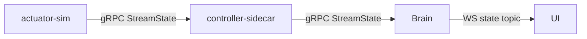
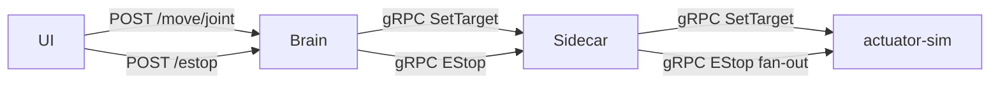
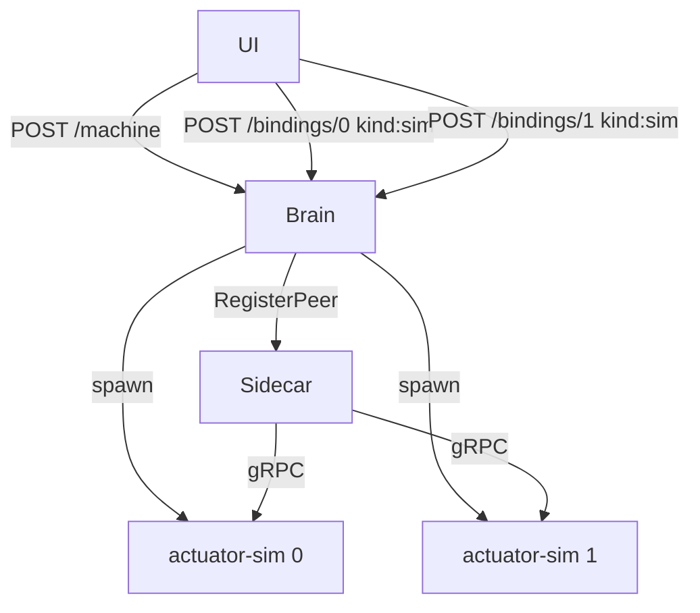
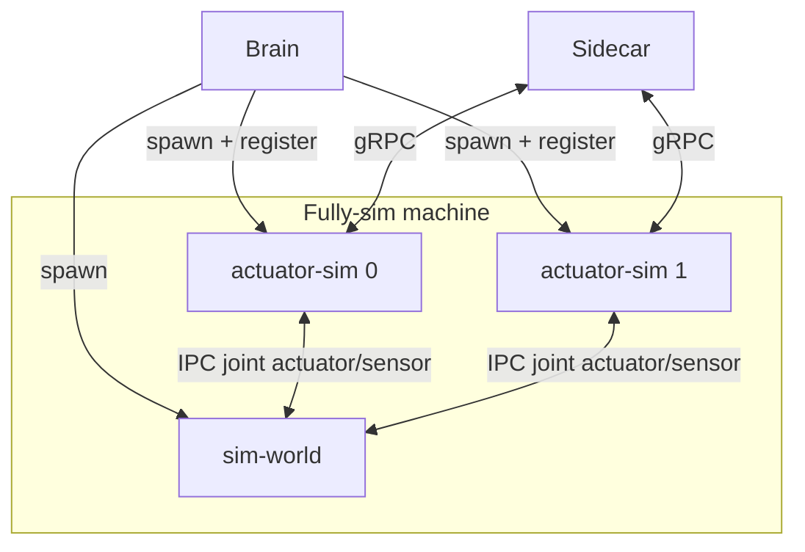
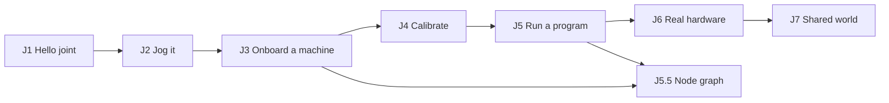

# RFD-8: Development Journeys
Author: Jose Catarino

## Why this RFD

RFDs 1–7 lay out a system that is coherent on paper. The risk now is
siloing: building each component to its specification and hoping they
connect. The alternative is **vertical slices** — a sequence of dev
journeys, each one the thinnest possible path through every layer that
still produces a working demo at the end. By the time each journey is
done, every layer has been exercised at least once against the real
interfaces that will carry it to production.

This RFD maps those journeys. It does not replace the other RFDs; it
sequences them. Each journey cites which RFD capabilities it exercises
and what it stubs out. The stub list is as important as the build list:
it defines the scope contract that keeps a journey shippable.

One more thing this RFD does: surface the open design questions that
only become visible when you try to order the work. Sequencing forces
tradeoffs that architecture can defer.

## The shape of a journey

Each journey has:

- **A one-line demo.** The thing you show. If you can't demo it in
  one sentence, the journey is too big.
- **A layer-by-layer build list.** What is new in each component.
- **A stub list.** What is explicitly skipped. Not cut — deferred to
  the next journey.
- **Exit criteria.** Measurable conditions. The journey is done when
  these pass, and not before.

The journeys are numbered J1–J7. They are ordered by dependency, not
by product priority. J1 unblocks J2, J2 unblocks J3, and so on. You
cannot skip.

## Cross-cutting concerns

Three things span every journey and should not be treated as a journey
of their own. Add them incrementally; do not defer them to a dedicated
sprint.

**Auth.** Token-based, per [RFD-4](RFD-4.md). Add a single token
middleware to the Brain in J1. One line of middleware now beats a
full auth refactor in J3. The UI doesn't need a login screen in J1 —
the token can be read from an env var or a config file. The login
screen lands in J3 as part of onboarding.

**Observability.** Structured logs from day 1 in every layer. A
`journey_id` request header (or equivalent field in the gRPC
metadata) that propagates UI → Brain → Sidecar → log. Without this,
debugging J3's multi-process sim spawn will be painful. With it, you
can grep a single ID across four processes.

**Smoke tests.** Each journey needs a headless smoke test in CI that
exercises its exit criteria without a human in the loop. If a journey
cannot be smoke-tested, you cannot detect when J5 breaks J2. The test
does not need to be complete — it needs to fail loudly when the
plumbing breaks.

## J1 — "Hello, joint"

**Demo:** open the UI, see a single cylinder rotating, driven live by
a real `actuator-sim` process.

This journey is about proving the plumbing: protobufs compile in both
Rust and Python, gRPC flows from sim through Sidecar to Brain, the
Brain's WebSocket delivers joint state to the browser, and React Three
Fiber renders it. No semantics. No safety. No auth screen.

| Layer | What you build | What you stub |
|---|---|---|
| `actuator-sim` | minimal gRPC server; `StreamState` emitting a sine-wave on `joint[0].position` | no dynamics, no command surface |
| `proto/actuator.proto` | `JointState` message; `StreamState` RPC | command RPCs present in proto but unimplemented |
| `controller-sidecar` | gRPC client to one hard-coded address; `StreamState` aggregated out to Brain | no discovery, no pool, no watchdog, no E-stop |
| `proto/sidecar.proto` | `StreamState` RPC only | everything else |
| Brain | one gRPC client stub for the Sidecar; `GET /state` snapshot; `WS /events` with `state` topic at 30 Hz; token middleware reading from env | no machine model, no SQLite, no templates |
| UI | Vite + React + R3F scaffold; WS client; one cylinder whose rotation tracks `state.joints[0].position` | no router, no onboarding, no E-stop, no auth screen |

**Exit criteria:**
1. `cargo run -p actuator-sim` + `cargo run -p controller-sidecar` +
   `make brain` + `npm run dev` → cylinder spins in the browser.
2. Kill `actuator-sim`. Within 2 s the Brain's WS stops emitting
   `state` frames (the pipeline doesn't hang silently).
3. `journey_id` appears in all four log streams for a single request.
4. CI smoke test: start the stack headlessly, `GET /state`, assert
   `joints[0].position` is changing.

**Lines-of-code signal.** If a layer is taking real design work here,
you are doing too much. J1 should feel embarrassingly small.

## J2 — "Jog it"

**Demo:** click a button, the cylinder moves toward the target.
Press space (or the big red button), it stops and stays stopped.

This journey proves the **command direction** and the **safety
hot-path**. These are the highest-risk architectural decisions in
RFD-3 — proving them in J2, before any product surface lands, means
you find breaks early instead of mid-onboarding.

| Layer | What is new |
|---|---|
| `actuator-sim` | `SetTarget(position)` gRPC handler; simple PD loop; `EStop` handler that freezes output |
| `proto/actuator.proto` | `SetTarget` RPC; `EStop` RPC |
| `proto/sidecar.proto` | `SendCommand` / `EStop` RPCs |
| Sidecar | command pass-through to one peer; `EStop` fan-out (still one peer, so fan-out is trivial — but the code path is real); watchdog timer: if Brain stops sending heartbeats, hold last position |
| Brain | `POST /move/joint` (raw joint-space target); `POST /estop`; three-state mode model: `IDLE → JOG → ESTOPPED`; mode transitions enforced (can't `SetTarget` while `ESTOPPED`) |
| UI | jog buttons (±° per joint); large E-stop button; mode indicator in status cluster |

**Exit criteria:**
1. Jog moves `joint[0]` to within ±2° of the requested target.
2. E-stop from UI click to sim output frozen: < 100 ms round-trip.
3. Releasing E-stop requires an explicit mode-change request (`POST /mode` with `{mode: "IDLE"}`); it cannot be done by sending another jog command.
4. Kill the Brain mid-jog. Within the watchdog period, the Sidecar
   holds last position and stops accepting new targets. Restart the
   Brain; jog works again.
5. Smoke test: REST POST jog, assert state converges; POST estop,
   assert state freezes; restart Brain, assert recovery.

## J3 — "Onboard a machine"

**Demo:** fresh Brain, no machine. Open the UI, run the onboarding
wizard, pick the shipped 2-DOF arm template, parameterize it (link
lengths), click "+ Add motor" twice with `sim` for both slots. Land
in the workspace with two cylinders you can jog.

Kill the Brain. Restart it. The sims come back up. The UI reconnects.
Jog still works.

This is the **first product journey** — the first time a user could
actually do something. It is also the largest journey in this list,
because it lights up most of [RFD-4](RFD-4.md) C1, C8, C11, and
[RFD-7](RFD-7.md)'s onboarding flow simultaneously. That surface
area is unavoidable: binding, sim lifecycle, machine persistence, and
the Sidecar's dynamic pool are all entangled.

| Layer | What is new |
|---|---|
| Brain — `template_service` | template loader from disk; URDF expansion; **one shipped template** (2-DOF planar arm); DSL surface (the `(template_id, params)` tuple the UI sends) |
| Brain — `machine_service` | machine model = `(template_id, params, bindings)`; SQLite persistence; `machine_id` scoping for all resources |
| Brain — C11 (sim lifecycle) | spawn `actuator-sim` subprocess on `sim` bind; write sim address and handle to the sim registry (SQLite); re-spawn on Brain restart; respawn on crash within retry budget; surface crashes as `events` WS faults |
| Brain — REST | `POST /machines/{mid}` (create/replace); `GET /machines/{mid}`; `POST /machines/{mid}/bindings/{slot}` with `{kind: "sim" \| "unbound"}` |
| Sidecar | **dynamic peer registration:** new gRPC RPC `RegisterPeer(addr)` that the Brain calls when spawning a sim. The Sidecar adds the address to its pool and begins state aggregation. Corresponding `DeregisterPeer(addr)` for teardown. This is the resolution to [RFD-3](RFD-3.md) open question 3. |
| UI — onboarding wizard | step 1: template picker (thumbnail grid); step 2: param form (link lengths, joint limits — driven by template's parameter schema); step 3: per-slot binding (for each joint slot: `+ Add motor` → pick `Onboard real hardware` or `Add simulated`). Shows `SIM` badge on sim slots. |
| UI — workspace | FK-only 3D rendering from the machine DSL (cylinders sized by link-length params); WS `state` subscription; jog tool from J2 now works against 2 joints |
| UI — DSL renderer | machine-description-to-primitives: cylinders for links, spheres for joints, positioned from the DSL params. No URDF parsed client-side. |

**Faked:** `real` binding kind exists in the proto/schema but is not
exposed in the UI yet (J6). No calibration (J4). No programs (J5).

**Exit criteria:**
1. Fresh Brain → onboarding → 2-DOF arm with 2 sim slots → jog both
   joints independently.
2. Kill the Brain. Restart it. Both sim processes come back up within
   5 s. UI reconnects. Jog works.
3. `GET /machines/{mid}` returns the binding state correctly after
   restart.
4. The Sidecar's dynamic pool grows from 0 to 2 peers during the
   wizard; `StreamState` gains two joints as each sim is registered.
5. Smoke test: run wizard via REST (bypassing UI), assert two sim
   processes appear in `ps`, assert state stream has 2 joints, kill
   Brain, assert sims restart.

**What this proves:** the binding model ([RFD-4](RFD-4.md) C1 + C11)
is sound. The sim-lifecycle decision ("Brain owns spawn/track/teardown,
Sidecar manages transport") pays for itself here: the Sidecar stays
agnostic and the Brain's restart-and-rejoin logic is straightforward.
If the abstraction leaks anywhere, J3 will find it.

## J4 — "Calibrate"

**Demo:** click "Calibrate" on joint 0. The UI shows a prompt:
*"Move the arm to home position and click Continue."* Click Continue.
The sim plays a range sweep. The UI shows the result. Close the tab,
reopen it, the job is still there in its completed state.

The point of this journey is not calibration math. The math can be a
no-op that returns a plausible-looking result. The point is the
**interactive job pattern** — a long-running, multi-step, UI-driven
flow with persistent state — because the same pattern is needed for
programs (J5), template updates, and whole-machine calibration. Build
it once here, correctly, and everything else reuses it.

| Layer | What is new |
|---|---|
| Brain — `calibration_service` orchestrator | per-job state machine: `{job_id, state, step, prompt, last_measurement}`; `advance` and `abort` transitions; SQLite session table that survives restart |
| Brain — `calibrations.py` REST | `POST .../calibrations` (start); `GET .../{job_id}` (current state + prompt); `POST .../{job_id}/advance`; `POST .../{job_id}/abort` |
| Brain — WS | `calibrations/{job_id}` topic: emits step transitions, measurement updates, prompt changes, completion |
| UI — job runner | generic `InteractiveJob` component: subscribes to the topic, renders the current `prompt`, shows Continue / Abort, shows a step progress bar. Reused in J5 for program runs. |

**Exit criteria:**
1. Start calibration on joint 0. The UI shows the first prompt.
2. Open the same calibration in a second browser tab. Advancing in
   tab A causes tab B's UI to update in < 500 ms.
3. Reload tab A mid-calibration. The job state, step, and prompt are
   recovered from the Brain's SQLite store.
4. Abort a job. The Brain transitions to `aborted` state. Subsequent
   `advance` calls return an error.
5. Smoke test: start job via REST, advance to completion via REST,
   assert final state; restart Brain, assert job is still readable.

## J5 — "Run a program"

**Demo:** place two "MoveJoint" nodes on the canvas, wire them in
sequence, click Run. The arm moves through both targets in order.
Click Stop mid-run; it stops cleanly. Watch the same run from a
second browser tab.

Start with the **minimum viable programming surface**: a linear
sequence of `MoveJoint` and `Wait` nodes. That is two node types.
Two node types are enough to exercise the AST schema, the program
runner, the streaming execution UI (which reuses J4's job-runner
component), and the multi-client observation story.

This journey has an explicit **scope gate:** the node graph editor is
deferred to J5.5. J5 ships with a **list view** — ordered steps,
each step a form. The AST schema is the same either way; the
node-graph editor is a rendering decision. Shipping the list view
first lets the AST stabilize before investing in the graph renderer.

| Layer | What is new |
|---|---|
| Brain — `program_service` | program AST schema (`Program`, `MoveJointNode`, `WaitNode`, `SequenceEdge`); in-memory program registry (SQLite persistence); sequential runner that steps through a linear graph; emits step events on a WS topic |
| Brain — REST | `POST /programs` (create/update AST); `GET /programs/{id}`; `POST /programs/{id}/run` (starts a runner job); `POST /programs/{id}/stop` |
| Brain — WS | `programs/{id}/run` topic (reuses J4's job pattern): current step id, status (`running \| paused \| stopped \| completed \| faulted`) |
| UI — list view | ordered step list; add / remove / reorder steps; per-step param form (target position for `MoveJoint`, duration for `Wait`); Run / Stop buttons; live step highlighting from WS |
| UI — second-tab observation | any tab subscribing to `programs/{id}/run` sees live step progression |

**Faked:** no Cartesian moves (no IK yet); no branches or
conditionals; no variables; no node graph (J5.5).

**Exit criteria:**
1. Create a 3-step program (MoveJoint → Wait → MoveJoint). Run it.
   The arm moves through both joint targets with the wait between.
2. Click Stop during the second MoveJoint. The runner halts at that
   step; the arm stops.
3. A second browser tab sees the same live step progression.
4. Edit the program (change a target angle) and run again without
   reloading.
5. Smoke test: create program via REST, run via REST, poll WS topic
   until `completed`, assert arm is within ±2° of final target.

**J5.5 (follow-on, not a separate journey number).** Upgrade the
list view to the node-graph editor from [RFD-7](RFD-7.md). The AST
schema does not change; only the rendering and edit UX changes. J5.5
is gated on AST stability from J5. It can happen in parallel with J6.

## J6 — "Real hardware"

**Demo:** one real actuator and one simulated actuator bound into the
same 2-DOF machine. Jog both. Run a program from J5 against the
mixed machine. No code in the Brain or UI knows which is which,
except the `SIM` badge on the sim joint.

This is the **architecture validation journey**. If the real/sim
abstraction from [RFD-2](RFD-2.md) and [RFD-3](RFD-3.md) is sound,
J6 requires almost no new design — just a real `actuator-firmware`
binary speaking the same gRPC surface as `actuator-sim`, a static
discovery config for the one real actuator, and a `real` binding kind
in the UI. If anything here requires a special case in the Brain or UI,
that is a bug in the abstraction, not a J6 feature.

| Layer | What is new |
|---|---|
| `actuator-firmware` | minimum real implementation: same `actuator.proto` gRPC surface as `actuator-sim`; one motor, one encoder, a PD loop. The Sidecar cannot distinguish it from `actuator-sim`. |
| Sidecar | static config discovery for the real actuator's address (resolves [RFD-3](RFD-3.md) open question 3 for the real-hardware case; the dynamic-peer path from J3 handles sim). |
| Brain — C1 binding | `real` binding kind: when binding a slot to `real`, pull the actuator id from the Sidecar's discovered-peer list rather than spawning a sim. |
| Brain — C5 state | per-joint `kind` field (`real \| sim`) on the state emitted to the UI; sourced from the binding and the sim registry. |
| UI — onboarding | "+ Add motor" now shows two options: **Onboard real hardware** (lists discovered-but-unbound actuators from the Sidecar) and **Add simulated** (J3 path). |
| UI — workspace | `SIM` badge on sim joints in the inspector and the status cluster. No other visible difference. |

**Exit criteria:**
1. Bind slot 0 to `real`, slot 1 to `sim`. Jog both. Programs from
   J5 run on the mixed machine.
2. Re-bind slot 0 from `real` → `sim` → `real` without restarting
   the Brain. Programs keep working after each re-bind.
3. `GET /machines/{mid}` shows the correct `kind` per slot after
   each re-bind.
4. The Brain emits the correct `kind` on the `state` WS topic. The
   UI badge flips immediately on re-bind.
5. Smoke test: bind mixed machine via REST, run a program, assert
   real joint tracks target (within tolerance for real hardware),
   assert sim joint tracks target.

**What this proves:** [RFD-2](RFD-2.md)'s Level 1–4 abstraction
held up. [RFD-3](RFD-3.md)'s "real and simulated, indistinguishably"
claim is true. If J6 required any special-casing in the Brain or
the UI, that is the signal to go back and fix the abstraction.

## J7 — "Shared world"

**Demo:** the 2-DOF arm in a fully-sim machine has gravity. Drop it
from horizontal; it swings under its own weight. The period matches
a hand-computed pendulum to within 10%.

This journey exists to deliver the "feels real" goal from
[RFD-6](RFD-6.md): inter-joint dynamics, gravity, inertia coupling.
It is the last journey because it depends on J3's sim-lifecycle
plumbing (Brain spawns and registers sim peers) and because it
requires every joint slot to be `sim` (per [RFD-6](RFD-6.md)'s
mixed-bind non-goal). J6's real-hardware path is unaffected.

| Layer | What is new |
|---|---|
| `sim-world` (new crate) | MuJoCo wrapper process; local socket IPC; `Attach(joint_id)`, `Step(dt)`, `ActuateJoint(torque)`, `ReadJoint() → (pos, vel, torque)` |
| `actuator-sim` | optional `--shared-world <addr>` flag; when set, defers dynamics to `sim-world` via IPC instead of its own isolated model |
| Brain — C11 | when *all* slots in a machine bind to `sim`, spawn one `sim-world` process scoped to that machine and pass its address to each `actuator-sim` at spawn time. When any slot is `real` or `unbound`, skip the shared world (fall back to per-sim isolated dynamics — Phase 0 behavior from [RFD-6](RFD-6.md)). |
| Templates | the 2-DOF arm template gains mass, inertia, and link-length metadata that `sim-world` needs to load the correct MuJoCo model. |

**Faked:** contact with environment objects (RFD-6 Phase 3); the
visualization stream from `sim-world` to a debug client.

**Exit criteria:**
1. Fully-sim 2-DOF arm. Release from horizontal. Pendulum swings.
   Period is within 10% of $2\pi\sqrt{L/g}$ for the configured link
   length.
2. Re-bind slot 0 to `real`. Confirm `sim-world` is torn down (no
   longer running in `ps`). Slot 1's sim falls back to isolated
   dynamics. Jog still works.
3. Mixed machine (one `real`, one `sim`) does not attempt to share
   a world; the `sim-world` process is absent from `ps`.
4. Smoke test: fully-sim machine, measure pendulum period over 5
   swings, assert within 10% tolerance.

## Ordering and risk map

The main chain is serial: J1 unblocks J2, J2 unblocks J3, and so on
through J7. J5.5 (the node-graph editor) has two prerequisites — J5
must ship first so the AST is stable, and J3 must ship first so there
is a bound machine to author programs against. Everything else in the
chain is strictly linear. You cannot skip a journey; each one
establishes the plumbing and contracts that the next one depends on.

The two highest-risk journeys:

- **J3.** The largest surface area. Binding, sim lifecycle, machine
  persistence, and the Sidecar's dynamic pool are all first exercised
  here. If the C1 binding model is wrong, J3 is where you find out.
  Do not delay it by polishing J2.
- **J6.** Architecture validation. If the real/sim abstraction leaks
  (any special case in Brain or UI for real vs. sim), you will see
  it here. Earlier journeys cannot catch this because they are
  all-sim.

J4 and J5 are the lowest-risk journeys — they extend an established
pattern (J4 invents the pattern; J5 reuses it). They can be
deprioritized if hardware shows up early and J6 becomes time-sensitive.

## Open questions

### Resolved (kept for traceability)

- **Vertical slices over component silos.** Building component by
  component and hoping they connect is the failure mode. Journeys
  are the explicit alternative: every layer is exercised for every
  journey. Resolved by adopting the journey model in this RFD.
- **Node graph vs. list view for J5.** J5 ships with a list view.
  The node graph (J5.5) is gated on AST stability from J5. The AST
  schema is identical either way; the graph is a rendering upgrade,
  not a data-model change.
- **Sidecar dynamic peer registration shape.** Resolved as a `RegisterPeer(addr)` / `DeregisterPeer(addr)` gRPC RPC pair that the Brain calls when spawning or tearing down a sim. This is the concrete answer to [RFD-3](RFD-3.md) open question 3 for the sim case.
- **Cross-cutting concerns are not their own journeys.** Auth,
  observability, and smoke tests span all journeys and are added
  incrementally, not in a dedicated sprint.

### Open

1. **Discovery for real actuators (J6).** [RFD-3](RFD-3.md) leaves
   the discovery mechanism open (static config, mDNS, USB
   enumeration). J6 uses static config as the v1 answer, which
   avoids blocking on a discovery decision. But the real resolution
   belongs in [RFD-3](RFD-3.md) and should be made before J6 ships.

2. **Calibration math scope (J4).** J4 treats the calibration
   routines as no-ops that return plausible results. Real calibration
   (encoder offset, range sweep, friction model) is a separate scope
   decision. This RFD makes no claim about when that lands; it only
   ensures the job *pattern* is correct first.

3. **Template parameter schema format.** J3 needs a template with a
   concrete parameter schema (link lengths, joint limits, mass,
   inertia). The schema format — JSON schema? a custom DSL? — is not
   settled. It needs to be settled before J3 ships, because the UI's
   param form renderer depends on it.

4. **IK for J5 Cartesian moves.** J5 defers Cartesian motion (no IK
   yet). When IK lands, `MoveJoint` generalizes to `MovePose` and
   the program AST gains a new node type. The AST schema in J5
   should accommodate this extension cleanly without a breaking
   change.

## Non-goals

- A complete product feature list. Each journey's stub list is
  explicit about what is deferred; this RFD does not enumerate
  every deferred feature.
- A sprint plan or timeline. Journeys are ordered by dependency;
  velocity determines when each ships.
- Parallel journeys. The ordering is serial. Working two journeys
  in parallel is possible in a team but risks mid-journey
  interface churn; do so deliberately.

## Relationship to other RFDs

- **[RFD-1](RFD-1.md):** the journeys are the "deploy the
  controller container → open a browser UI → onboard → program"
  flow made buildable.
- **[RFD-2](RFD-2.md):** J6 is the direct test of the
  real/sim-indistinguishable claim from RFD-2's Level 1–4
  abstraction.
- **[RFD-3](RFD-3.md):** J2 exercises the Sidecar watchdog; J3
  exercises dynamic peer registration (resolving open question 3
  for the sim case); J6 adds static discovery for real hardware.
- **[RFD-4](RFD-4.md):** J3 exercises C1 (binding), C8
  (onboarding, skipping calibration math), and C11 (sim lifecycle);
  J4 exercises C8's calibration job orchestrator; J5 exercises C6
  (program service).
- **[RFD-6](RFD-6.md):** J7 builds out Phase 1–2 of RFD-6's
  phasing. The fully-sim-only constraint from RFD-6's non-goals
  is enforced in J7's Brain logic.
- **[RFD-7](RFD-7.md):** J1–J2 build Phase 0–1 of RFD-7's
  phasing; J3 builds Phase 2; J5 builds Phase 3 (list view);
  J5.5 completes Phase 3 with the node graph.

## Status

Journey model adopted. Open questions 1–4 above need answers before
or during their respective journeys; they do not block starting J1.
