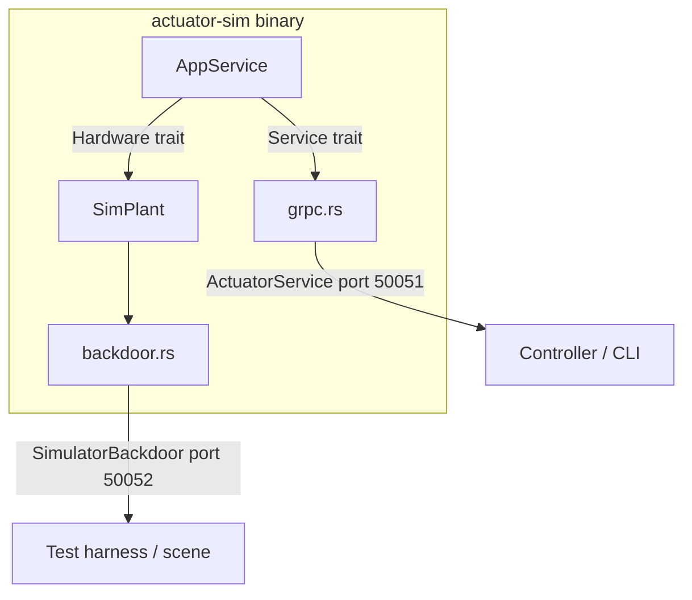

# actuator-sim

A Rust gRPC simulator for the smart actuator. It implements the same `ActuatorService` wire contract as the real firmware so the controller stack can be developed, integrated, and tested without physical hardware.

---

## Contents

- [Architecture](#architecture)
- [Quick start](#quick-start)
- [CLI reference](#cli-reference)
- [Configuration reference](#configuration-reference)
- [Logging](#logging)
- [Physics model](#physics-model)
- [gRPC API levels](#grpc-api-levels)
- [Backdoor interface](#backdoor-interface)
- [Extending the simulator](#extending-the-simulator)

---

## Architecture



### Key design decisions

| Concern | Decision |
|---|---|
| Firmware / sim seam | `Hardware` trait in `actuator-core`. `SimPlant` implements it for the sim; `HalHardware` stub implements it for firmware. `AppService` never sees either concrete type. |
| Control logic lives once | All admission logic (soft limits, mode enforcement, fault latch, trajectory executor) is in `actuator-core::AppService`. The simulator gets it for free — no duplication. |
| Backdoor separation | `proto/actuator_sim.proto` is compiled only into `actuator-sim`. `actuator-core` and `actuator-firmware` never depend on it. This enforces the semantic boundary between "what the controller can do" and "what the test scene can do". |
| Physics tick | A dedicated tokio task runs at `tick_hz` (default 1 kHz). Each tick: (1) `AppService::tick` advances the control state machine and applies the current setpoint to the plant; (2) `SimPlant::tick` integrates the dynamics. |

### Crate responsibilities

| Crate | Role |
|---|---|
| `actuator-core` | `Hardware` trait, `AppService`, all domain types, all unit tests |
| `actuator-sim` | `SimPlant`, gRPC adapters, backdoor service, CLI |
| `actuator-firmware` | `HalHardware` stub — swap in real HAL calls when drivers are ready |
| `actuator-proto` | Shared proto definitions for `ActuatorService` |

---

## Quick start

```bash
# from smart-actuator/
make build        # cargo build --workspace
make run          # builds and starts the sim detached (background)
make stop         # sends SIGTERM via the PID file

# or run in the foreground (logs to stderr):
ACTUATOR_SIM_CONFIG=crates/actuator-sim/configs/default.yaml \
  ./target/debug/actuator-sim run

# confirm it's up
./target/debug/actuator-sim cmd status
```

Expected output:
```
position:       0.0000 rad
velocity:       0.0000 rad/s
current:        0.0000 A
temperature:   25.0000 °C
```

---

## CLI reference

All subcommands load configuration from `ACTUATOR_SIM_CONFIG` (env var) or `configs/default.yaml` (fallback). Ports are taken from the config — no per-command flags needed.

### Process management

```bash
actuator-sim run              # start in foreground
actuator-sim run -d           # start detached (background); logs go to file
actuator-sim stop             # send SIGTERM to the running daemon
```

When using `-d`, the parent prints a summary and exits:
```
actuator-sim detached
  identity : sim 1 (actuator-simulator-001)
  gRPC     : 0.0.0.0:50051
  backdoor : 0.0.0.0:50052
  log      : actuator_sim.log
  pid file : actuator_sim.pid
  config   : crates/actuator-sim/configs/default.yaml
```

> **Note:** set `log_to_stderr: false` in the config before running detached, otherwise logs are lost after the terminal disconnects.

### Actuator commands (`cmd`)

Sends requests to the main `ActuatorService` on port 50051. This is the same interface the real controller uses.

```bash
# Telemetry
actuator-sim cmd status               # position, velocity, current, temperature
actuator-sim cmd clock                # sim monotonic time (seconds)
actuator-sim cmd tracking-error       # trajectory tracking stats

# Motion commands (Level 1)
actuator-sim cmd move 1.57            # SetPosition (rad)
actuator-sim cmd velocity 0.5         # SetVelocity (rad/s)
actuator-sim cmd torque 0.1           # SetTorque (N·m)

# Safety configuration (Level 2)
actuator-sim cmd set-mode position    # position | velocity | torque | impedance
actuator-sim cmd set-limits -- -3.14 3.14   # soft position limits (rad)
actuator-sim cmd set-current-limit 5.0      # maximum current (A)
actuator-sim cmd set-temp-limit 80.0        # maximum temperature (°C)
actuator-sim cmd clear-fault               # clear a latched fault

# Trajectory control (Level 3)
actuator-sim cmd pause
actuator-sim cmd resume
actuator-sim cmd abort
```

Successful commands print `ok`. Refused commands print `refused [<code>]: <reason>`, e.g.:
```
refused [WrongControlMode]: must be in position mode
```

### Backdoor commands (`sim`)

Sends requests to `SimulatorBackdoor` on port 50052. This interface is **sim-only** — it does not exist on real firmware. Use it from test harnesses or MuJoCo scenes to set up initial conditions, inject disturbances, and control sim time.

```bash
# Ground-truth state (no encoder noise)
actuator-sim sim truth

# Teleport — unspecified fields keep their current values
actuator-sim sim set-state --pos 1.57
actuator-sim sim set-state --pos 0.0 --vel 0.0
actuator-sim sim set-state --temp 75.0          # only changes temperature

# Disturbances
actuator-sim sim apply-torque 2.5               # indefinite
actuator-sim sim apply-torque 2.5 --duration-ms 200
actuator-sim sim set-ambient 40.0               # ambient temperature (°C)

# Fault injection
actuator-sim sim inject-fault over-temperature
actuator-sim sim inject-fault over-current
actuator-sim sim inject-fault encoder-stuck

# Deterministic time stepping (pause first)
actuator-sim sim pause
actuator-sim sim step 0.001                     # advance 1 ms
actuator-sim sim resume
```

---

## Configuration reference

Config is loaded from `ACTUATOR_SIM_CONFIG` (env var) or `configs/default.yaml`. All fields are optional and have defaults.

```yaml
pid_file: actuator_sim.pid   # written on start, removed on clean shutdown

log_settings:
  file: actuator_sim.log     # log file path (used when log_to_stderr: false)
  level: DEBUG               # tracing filter: ERROR | WARN | INFO | DEBUG | TRACE
  log_to_stderr: false       # true → human-readable to stderr; false → JSON to file

grpc:
  host: "0.0.0.0"
  port: 50051                # ActuatorService
  backdoor_port: 50052       # SimulatorBackdoor
  enable_backdoor: true      # set false to match firmware exactly (no backdoor)

identity:
  name: "sim 1"              # human-readable label (appears in logs)
  id: "actuator-simulator-001"

physics:
  tick_hz: 1000.0            # integration rate (Hz)
  inertia: 0.01              # rotational inertia J  (kg·m²)
  damping: 0.1               # viscous damping b     (N·m·s/rad)
  kp_pos: 10.0               # position-mode PD Kp   (N·m/rad)
  kd_pos: 2.0                # position-mode PD Kd   (N·m·s/rad)
  kp_vel: 1.0                # velocity-mode P Kp    (N·m·s/rad)
  kt: 2.0                    # torque constant       (A / N·m)
  encoder_noise_std: 0.0     # encoder noise std dev (rad); 0 = noiseless
  thermal_resistance: 5.0    # R_th                  (°C/W)
  thermal_capacitance: 10.0  # C_th                  (J/°C)
```

To run multiple sim instances simultaneously, create separate config files with different `port`, `backdoor_port`, `pid_file`, and `log_settings.file` values.

---

## Logging

| `log_to_stderr` | Sink | Format |
|---|---|---|
| `true` | stderr | Human-readable (`tracing-subscriber` default) |
| `false` | `log_settings.file` | Newline-delimited JSON |

JSON log lines look like:
```json
{"timestamp":"2026-05-25T14:32:01.123Z","level":"INFO","fields":{"message":"actuator simulator starting","config":"...","id":"actuator-simulator-001"},"target":"actuator_sim"}
```

Log level is controlled by the `level` field (standard `tracing` filter syntax, e.g. `DEBUG`, `INFO`, `actuator_sim=DEBUG,actuator_core=INFO`).

---

## Physics model

The plant uses first-order Euler integration at `tick_hz`. Each tick:

### Torque computation

| Mode | Control law |
|---|---|
| Position | $\tau = K_p(\theta_{target} - \theta) - K_d\dot\theta$ |
| Velocity | $\tau = K_p(\dot\theta_{target} - \dot\theta)$ |
| Torque | $\tau = \tau_{target}$ |

External disturbance torques (from `apply-torque`) are added to $\tau$.

### Dynamics integration

$$\ddot\theta = \frac{\tau - b\dot\theta}{J}$$

$$\dot\theta_{t+dt} = \dot\theta_t + \ddot\theta \cdot dt \qquad \theta_{t+dt} = \theta_t + \dot\theta_{t+dt} \cdot dt$$

### Current estimate

$$I = |\tau| \cdot k_t$$

### Thermal model (first-order RC)

$$\dot{T} = \frac{I^2 / k_t - (T - T_{ambient})}{R_{th} \cdot C_{th}}$$

$$T_{t+dt} = T_t + \dot{T} \cdot dt$$

---

## gRPC API levels

The `ActuatorService` (port 50051) is the shared contract between sim and firmware, defined in `proto/actuator.proto`.

### Level 1 — Basic motion

| RPC | Request | Notes |
|---|---|---|
| `SetPosition` | angle (rad) | Tracks target via PD controller |
| `SetVelocity` | velocity (rad/s) | Tracks target via P controller |
| `SetTorque` | torque (N·m) | Direct feedforward |
| `ReadPosition` | — | Returns integrated position |
| `ReadVelocity` | — | Returns integrated velocity |
| `ReadCurrent` | — | Returns estimated motor current |

### Level 2 — Safety

| RPC | Notes |
|---|---|
| `SetSoftLimits` | Hard gate on position commands |
| `SetCurrentLimit` | Triggers thermal fault if exceeded |
| `SetTemperatureLimit` | Latches fault when temperature exceeds limit |
| `SetControlMode` | Enforces mode on subsequent motion commands |
| `ClearFault` | Clears the fault latch (requires root cause resolved) |
| `ReadTemperature` | Returns winding temperature |

Control mode is permissive (`None`) until `SetControlMode` is called — Level 1 behaviour is unchanged if you never call it.

`CommandResponse` carries a typed `refusal_code` field for machine-readable failure diagnosis:

| Code | Meaning |
|---|---|
| 0 | None (success) |
| 1 | `OutsideSoftLimits` |
| 2 | `WrongControlMode` |
| 3 | `OverTemperature` |
| 4 | `FaultLatched` |
| 5 | `NotImplemented` |
| 6 | `TrajectoryRunning` |
| 7 | `InvalidTrajectory` |

### Level 3 — Trajectory execution

| RPC | Notes |
|---|---|
| `ExecuteTrajectorySegment` | Starts linear interpolation across ≥ 2 `TrajectoryPoint`s |
| `Pause` / `Resume` | Freezes/resumes the time cursor (setpoint holds at pause position) |
| `Abort` | Cancels the trajectory and holds current position |
| `ReportTrackingError` | Returns instantaneous, max, and RMS tracking error |
| `GetClock` | Returns sim monotonic time for trajectory scheduling |

---

## Backdoor interface

`SimulatorBackdoor` (port 50052) is defined in `proto/actuator_sim.proto` and compiled **only** into `actuator-sim`. It is never available on real firmware.

Use it for:
- **Scene initialisation** — teleport to a known state at test start
- **Disturbance injection** — apply external torques (gravity offsets, collisions)
- **Fault testing** — inject faults and verify the controller's recovery path
- **Deterministic testing** — pause the clock, step by fixed `dt`, assert state

### Disabling the backdoor

Set `enable_backdoor: false` in the config. This makes the sim behave exactly like firmware from the network's perspective — useful for integration tests that should not depend on backdoor availability.

---

## Extending the simulator

### Adding a new Level 1/2/3 RPC

1. Add the message and RPC to `proto/actuator.proto`
2. Add the method to the `Service` trait in `actuator-core/src/service.rs`
3. Implement it on `AppService` (all control/safety logic lives here)
4. Add a handler in `actuator-sim/src/grpc.rs` (adapter only — no logic)
5. Add a CLI command in `actuator-sim/src/cmd.rs`
6. Write a unit test in `actuator-core/src/service.rs` using `StubHardware`

### Adding a new backdoor RPC

1. Add the message and RPC to `proto/actuator_sim.proto`
2. Add the method to `SimPlant` in `actuator-sim/src/plant.rs`
3. Add the handler in `actuator-sim/src/backdoor.rs`
4. Add a CLI command in `actuator-sim/src/sim_cmd.rs`

### Tuning physics

Edit `physics:` in the config YAML — no recompile needed. If you need a non-linear plant (friction, backlash, saturation), extend `SimPlant::tick` in `plant.rs`.

### Adding encoder noise

`encoder_noise_std` is wired through config and `PlantParams` but the noise is not yet applied in `Hardware::read_position_raw`. Add a Gaussian sample there (e.g. using the `rand` crate with `rand_distr::Normal`) when you need realistic sensor fidelity.
